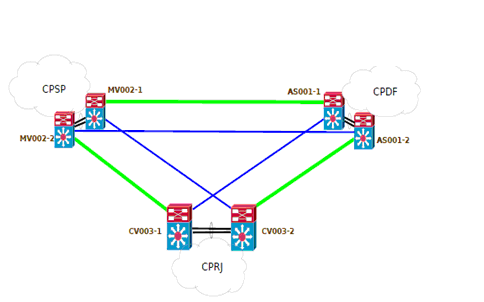
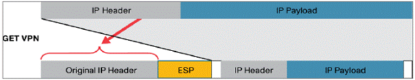
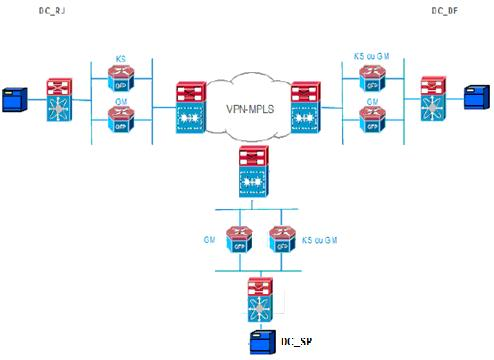
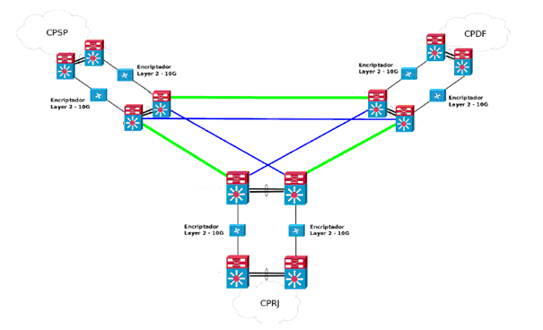
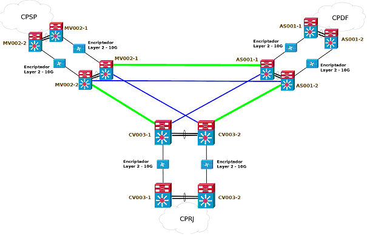

**Soluções para criptografia no backbone da DATAPREV**

* *

*Diego Perini*

*Felipe Arcieri*

*Michel Teixeira*

*Pedro Rozas Moreira*

*15 de maio de 2014*

*DEST/DSIG*

 

**Resumo**

 

            Este artigo descreve superficialmente as soluções
prospectadas que poderão ser usadas para  a implementação da
criptografia no backbone da Dataprev.

 

**Palavras-chave:** *Criptografia,Backbone, GET-VPN, IPSEC*  

 

 

 

**1.Introdução**

 

Os Centros de Processamento da Dataprev são interligados atualmente por
circuitos Gigabit *Ethernet* com taxa de transmissão de 300 Mbps. Os
contratos atuais preveem atualização da taxa de transmissão para até 3
Gbps. Os circuitos são fornecidos por 2 operadoras distintas formando um
triângulo duplo conforme figura abaixo.

 

Figura 1. Topologia lógica de rede do backbone da Dataprev

 

Para manter a comunicação segura e a confidencialidade dos dados
trafegados entre os Centros de Processamento, foram estudadas as
possíveis soluções de criptografia e foi avaliado se estas soluções são
adequadas, escaláveis e resilientes para o ambiente do *backbone*
interno da Dataprev.

Dentre as soluções encontradas e avaliadas, podemos separá-las em 2
grupos:

● Solução de camada 3 (criptografia na camada de rede – IPSEC) (L3);

● Solução de camada 2 (criptografia no enlace) (L2).

 

Foram realizadas Provas de Conceito com os 2 tipos de solução. Seguem
abaixo os fabricantes que apresentaram as soluções e participaram das
PoCs:

● Solução de camada 3: Cisco, com equipamento ASR 1004;

● Solução de camada 2: Safenet, com equipamento SEE 650.

 

            O desafio da prospecção foi identificar uma tecnologia de
criptografia para o backbone que seja confiável, estável e menos
impactante de se integrar no ambiente produtivo da Dataprev.

**           ** O benefício do emprego da criptografia no backbone é
fornecer a confidencialidade dos dados que estão sob responsabilidade da
Dataprev quando estes passam pelos provedores do backbone.

Nas sessões 2 e 3 serão apresentadas as soluções da Cisco e da Safenet,
respectivamente. Na sessão 4 serão feitas considerações a respeito das
duas soluções, incluindo os pontos positivos e negativos de cada
solução, levando em consideração o ambiente da Dataprev e o objetivo a
ser alcançado (criptografia dos enlaces de *backbone*). Finalmente, na
sessão 5, a conclusão deste trabalho com a indicação da solução mais
adequada para a Dataprev. ****

** **

 

** **

** **

**2. Solução Layer 3 – *Group Encrypted Transport Virtual Private
Network* – GETVPN**

 

 

**2.1 Visão** **Geral da Tecnologia.**

 

O *Group Encrypted Transport* VPN da Cisco (GET VPN) introduz o conceito
de um grupo de confiança para eliminar túneis ponto-a-ponto. Todos os
membros do grupo (GMs) compartilham uma associação de segurança comum
(SA), também conhecido como um grupo SA. Isso permite que os GMs possam
descriptografar o tráfego que foi criptografado por qualquer outro GM.
Em redes GET VPN, não há necessidade de negociar túneis IPSEC
ponto-a-ponto entre os membros de um grupo, já que GET VPN é uma solução
“*tunnel-less*”.

A solução GET VPN é baseada tanto em padrões abertos quanto em
tecnologia patenteada pela Cisco, que ajuda a utilizar os benefícios de
redes IP / MPLS roteáveis, quando os equipamentos de camada de rede
envolvidos permitem a ativação desta tecnologia. A solução GET VPN se
baseia em seguir blocos de construção para fornecer a funcionalidade
necessária. São utilizados vários mecanismos no GET-VPV, dentre os quais
podemos elencar:

 

● GDOI (*Group Domain of Interpretation* - RFC 6407)

● Servidores de chave (*Key* *Servers* - KSs)

● GMs (*Group Members*)

● Preservação do cabeçalho IP

● Grupo de associação de segurança

● Mecanismo *Rekey*

** **

GDOI é o protocolo de gerenciamento de chaves do grupo e é usado para
fornecer um conjunto de chaves criptográficas e políticas para um grupo
de dispositivos. Em uma rede GET VPN, o protocolo GDOI é utilizado para
distribuir chaves comuns IPsec para um grupo de *gateways* VPN (GMs) que
precisam se comunicar com segurança. Estas chaves são atualizadas
periodicamente e são redistribuídas em todos os *gateways* VPN, tal
processo é denominado de "*rekey*".

O protocolo GDOI é protegido pela fase 1 do Internet Key Exchange (IKE)
SA. Todos os *gateways* VPN participantes devem autenticar-se ao
dispositivo de fornecimento de chaves (*Key* *Server*) usando IKE. Todos
os métodos de autenticação IKE, como as chaves pré-compartilhadas (PSKs)
e a infraestrutura de chave pública (PKI) são suportados para
autenticação inicial. Depois que os *gateways* VPNs estão autenticados e
munidos com as chaves de segurança adequadas obtidas via IKE SA, o IKE
SA expira e o protocolo GDOI é usado para atualizar as chaves de
segurança dos GMs.

O GDOI possui duas chaves de criptografia diferentes. Uma chave para o
plano de controle do GET VPN, e a outra chave para a criptografia do
tráfego de dados. A chave usada para proteger o plano de controle é
comumente chamada de chave de criptografia de chave (KEK) e a chave
usada para criptografar o tráfego de dados é conhecida como chave de
criptografia de tráfego (TEK). ****

No IPsec tradicional os endereços da extremidade do túnel são usados
como nova origem e destino e o pacote é então encaminhado através da
infraestrutura pública IP. No caso do GET VPN, os pacotes de dados IPsec
protegidos são encapsulados e os endereços IPs de origem e de destino
permanecem inalterados no novo cabeçalho.

 

Figura 2: Preservação do Cabeçalho IP Original - GETVPN

 

As vantagens da preservação do cabeçalho no túnel são: capacidade de
rotear os pacotes criptografados utilizando a infraestrutura de
roteamento da rede subjacente, manutenção do QoS, utilização de MPLS VPN
e a engenharia de tráfego.

**           ** Na Figura 3 pode-se visualizar como ficaria a integração
da solução GET-VPN no backbone  da Dataprev.

 

Figura 3. Topologia lógica da solução GET VPN integrada na rede da
Dataprev.

 

** **

**3. Solução *Layer* ** 2 – *Safenet* *Ethernet Encryptor***

 

**3.1 Visão** **Geral da Tecnologia**

 

O equipamento apresentado foi o *Safenet* *Ethernet Encryptor* SEE 650,
que possui duas interfaces de 10 Gbps em fibra para a criptografia dos
dados e uma interface de 100 Mbps em cobre para a gerência. As
interfaces de 10 Gbps são denominadas como Local (interface voltada para
o lado da rede interna) e *Network* (interface voltada para o lado da
operadora). O SEE 650 possui duas fontes redundantes, uma interface
serial RS-232, uma porta USB e um painel frontal ** que pode ser usado
para realizar as configurações de rede e colocar o equipamento em modo
de ativação, onde é iniciado o processo de geração e assinatura da chave
pública do equipamento.

Os SEEs são gerenciados pelo *Security* *Management Center* (SMC), uma
aplicação Web que é instalada em um servidor, e que pode ser acessada
pelo *browser* através da URL HTTPS://LOCALHOST:8443 localmente ou
HTTPS://IP-SERVIDOR:8443 remotamente. O SMC também é uma CA que assina a
chave pública de cada SEE, e emite o certificado digital para ele.

Uma vez que os SEEs possuem as configurações de rede (IP, máscara e
*gateway*), e o SMC estiver instalado, os processos de ativação dos SEEs
podem ser iniciados. Durante este processo, o SEE deve ser colocado no
modo de ativação através do seu painel frontal, e no SMC deverá ser
informado o IP e a senha do SEE que será ativado. Neste momento o SEE
envia para o SMC a sua chave pública para que ela seja assinada e para a
criação do certificado digital.

Quando os SEEs possuírem as suas chaves assinadas pelo SMC, eles
negociam entre si através de criptografia assimétrica uma chave
simétrica para a criptografia dos dados. A chave simétrica é trocada de
com frequência definida de 1 a 60 minutos.

A solução usa o algoritmo assimétrico RSA para a geração do par de
chaves (pública e privada) dos SEEs, e para estabelecer uma conexão
segura entre eles. Cada SEE é responsável por gerar seu par de chaves. A
chave privada é mantida internamente no SEE, e é apagada no caso de
abertura do equipamento. Os SEEs trocam as chaves públicas entre si, e
eles devem confirmar que essas chaves foram assinadas pela mesma CA. Os
SEEs suportam certificados 1024 bits V1, 2048 bits V2 e x509 V3. A
solução permite trabalhar com uma CA externa, com o protocolo OSCP e
permite o *download* do CRL para a validação do certificado.

Os dados que trafegam pela rede são criptografados através de uma chave
de sessão usando o protocolo AES 256 bits. A chave é estabelecida
através de um canal seguro usando a criptografia assimétrica através das
chaves públicas dos SEEs.

A comunicação IP entre a estação de gerência e o encriptador é
criptografada com uma chave simétrica usando o algoritmo AES 256 bits. A
troca da chave simétrica é baseada no algoritmo *Diffie-Hellman.*

Esta solução pode ser usada de forma ponto a ponto ou multiponto.

Existem três formas de configurar os SEEs:

- *Encrypt* *ALL* – Todo o tráfego é criptografado e encaminhado

- *Discard* *ALL* – Todo o tráfego é descartado

- *Bypass* ** - Nenhum tráfego é criptografado, mas todo tráfego é
encaminhado

A solução permite preservar as informações de VLAN ID, QinQ, MPLS, jumbo
*frames*.

            Na Figura 4 é possível visualizar como ficaria a integração
do criptografador no backbone  da Dataprev.

 

 

Figura 4. Integração do criptografador no *backbone*

 da Dataprev

 

**4. Considerações**

 

Nesta sessão serão apontados os pontos positivos e negativos de cada
solução.

** **

**4.1 ** **Cisco GETVPN**

 

Pontos **positivos** da solução apresentada pela Cisco (L3):

● A solução pode ser estendida no futuro para a Rede de Acesso.
Entretanto, a necessidade de criptografia do tráfego do *backbone* **
com este tipo de solução obriga à um posicionamento do equipamento de
criptografia que não é o ideal, introduzindo muita complexidade à
solução. Caso esta solução de L3 fosse utilizada apenas para a Rede de
Acesso, o equipamento teria o posicionamento ideal (substituindo os
atuais 7200 na função de roteador de concentração de acesso), sendo
transparente ao roteamento da rede;

● A solução permite seleção do tráfego a ser criptografado através de
ACLs;

 

Pontos **negativos** da solução apresentada pela Cisco (L3):

● A implementação é de alta complexidade e disruptiva, pelo fato da
solução participar de todo roteamento de tráfego que entra/sai do CP;

● Com o projeto de implementação de MPLS no *backbone*, a escalabilidade
deste tipo de solução de criptografia fica comprometida, devido à
relação 1 para 1 de VRFs no ASR e VPNs no *Backbone*;

● Devido à necessidade de posicionar o ASR1004 entre o 6500 e o
*Firewall*, todo tráfego que entra/sai do CP passa pelo equipamento de
criptografia, inclusive o tráfego que não será criptografado. Neste
contexto, uma política que define as redes a serem criptografadas deverá
ser precisa. Do contrário, ocorrerão problemas de comunicação entre as
redes que não estiverem mapeadas corretamente;

● Necessidade de manutenção da política que define as redes que serão
criptografias;

● O *bypass* ** da solução é complexo, dependente de intervenção manual
e de risco elevado;

● O IPSEC introduz *overhead* nos pacotes devido à necessidade de
cabeçalho adicional. Esse overhead varia de 5% a 50% em relação ao
tráfego original;

 

**4.2 Safenet Ethernet Encryptor**

** **

Pontos **positivos** da solução apresentada pela Safenet (L2):

● Fácil implementação, pois não existe a necessidade de alterar o
roteamento da rede;

● Gerenciamento, configuração e *bypass* ** da solução são simples;

● Não introduz *overhead* no tráfego criptografado;

● Baixa latência (inferior a 7 μs) no processo de criptografia;

● Quaisquer alterações no roteamento da rede são transparentes para a
solução de criptografia;

● O equipamento pode ser posicionado nos enlaces de *backbone* ** (L2),
de forma que todo o tráfego que se deseja criptografar passará pelo
encriptador. O tráfego que não será criptografado (ex: rede de acesso)
não passará pelo encriptador;

● Preserva as informações de VLAN ID, QinQ, MPLS e jumbo *frames*;

 

Pontos **negativos** da solução apresentada pela Safenet (L2):

● A solução não permite a seleção do tráfego a ser criptografado com
base em endereço L3 (IP);

● A falha de um equipamento terá como consequência imediata a
indisponibilidade dos circuitos que estarão sendo criptografados pelo
mesmo. A disponibilidade do ambiente será dada pelos circuitos
remanescentes, com redução de capacidade, até que seja aplicada a
solução de *bypass* ** (que pode ser executada de forma rápida, em menos
de 1 minuto, por exemplo).

 

**5. Conclusão**

 

Após a realização das provas de conceitos, das referências
bibliográficas e do levantamento dos pontos positivos e negativos de
cada solução levando em consideração os objetivos da Dataprev,
**recomenda-se para solução de criptografia dos enlaces de *backbone* **
a aquisição de solução de Encriptador *Layer* ** 2 com interfaces de
10G.**

Adicionalmente, na topologia presente na Figura 5, propõe-se o modo de
interligação dos equipamentos de criptografia *Layer* ** 2 ao *backbone*
** da Dataprev. Nesta topologia, cada encriptador atuará em 2 *links* de
*backbone*, de forma a poupar recursos financeiros e ao mesmo tempo ser
escalável a 20 Gbps de capacidade de criptografia no *backbone* ** por
CP.

Figura 5. Integração do criptografador no *backbone* da Dataprev

** **

** **

** **

** **

** **

** **

** **

** **

** **

** **

** **

** **

** **

** **

** **

** **

** **

** **

** **

** **

** **

** **

** **

** **

** **

** **

** **

** **

** **

**Referências**

**           **

Troubleshooting GETVPN Deployments (BRKSEC-3051) - Cisco Live 2012

Advanced IPsec with GET VPN (BRKSEC-3011) - Cisco Live 2012 Group
Encrypted Transport VPN (GETVPN) - Cisco Design and Implementation Guide
– Dezembro/2012

RFC 6407 - The Group Domain of Interpretation – Outubro/2011

Data Encryption Performance: Layer 2 vs. Layer 3 Encryption in High
Speed Point-to-Point Networks - RIT Department of Information Technology
– Fevereiro/2009

When To Encrypt At Layer 2 Or Layer 3:
http://www.networkcomputing.com/wan-security/when-to-encrypt-at-layer-2-or-layer-3/229501254
, em 28/03/2014

Safenet Ethernet Encryptor 10G -
http://www.safenet-inc.com/WorkArea/DownloadAsset.aspx?id=8589939056&LangType=1033,
em 28/03/2014

Cisco Vlan Mapping -
http://www.cisco.com/c/en/us/td/docs/switches/lan/catalyst6500
/ios/12-2SX/configuration /guide/book/vlans.html\#wp1044990, em
28/03/2014

