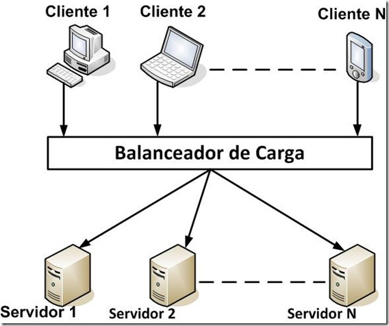
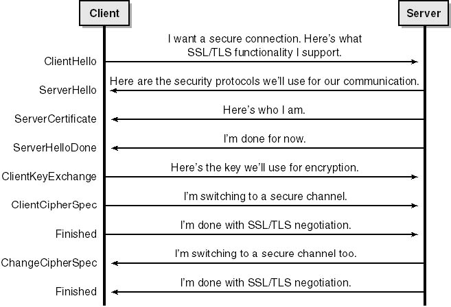
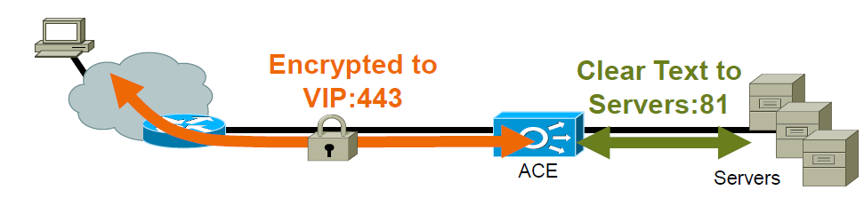
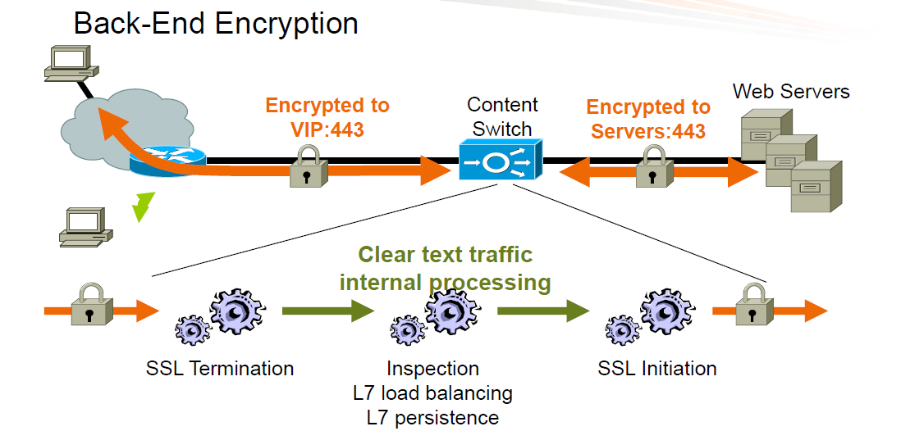

Introdução
==========
O artigo  busca apresentar o recurso de Aceleração SSL( *SSL Offload* ) utilizado em balanceadores de carga, descrevendo suas principais vantagens, 
bem como os passos necessários para sua configuração. 

Desafios
========
A necessidade de segurança e o aumento constante no volume de acesso aos sistemas, tem pressionado os protocolos de criptografia 
a consumirem cada vez mais recursos. A ideia por trás da Aceleração SSL é realizar o processamento diretamente no balanceador de carga através de hardware dedicado, desonerando a carga nos servidores. 

Benefícios
========
As principais vantagens na utilização da aceleração SSL é a utilização mais eficiente dos recursos computacionais e o aumento na perfomance dos servidores. 

Outras vantagens que devem ser consideradas são: 

* Permitir a  monitoração de tráfego criptografado com objetivo de *troubleshooting*.
* Métodos de persistência sofisticados para tráfego criptografado.
* Decisão de balanceamento baseada nos dados de camada 7.
* Facilidade de manutenção dos certificados de segurança devido a consolidação em um único equipamento.

Conceitos 
========
## Balanceamento de Carga ##
Balanceamento de carga é uma solução baseada em rede que permite a distribuição de requisições de um determinado serviço entre servidores que compartilham o mesmo conteúdo. 
Dessa forma, o balanceador evita que o servidor se torne um ponto de falha, aumentando assim a disponibilidade do serviço. 
Por exemplo, quando um serviço é balanceado, existem n servidores respondendo pelos serviços e quando um servidor fica indisponivel as requisições são automaticamente distribuídas para os demais servidores que pertencem ao balanceamento.

O balanceamento tem por objetivo aprimorar a utilização do recurso, aumentando o desempenho, e minimizando a sobrecarga, sendo considerada a forma mais simples e direta para se obter escalabilidade, pois conforme a demanda por determinada aplicação aumenta, basta adicionar mais servidores.

Neste artigo trataremos especificamente o balanceamento de hardware, os procedimentos e configurações descritas são referentes a solução de balanceamento de carga Cisco ACE(Application Control Engine), que é o balanceador em operação na Dataprev.

[Cisco ACE](http://www.cisco.com/c/dam/en/us/products/collateral/interfaces-modules/services-modules/product_data_sheet0900aecd8045861b.doc/_jcr_content/renditions/product_data_sheet0900aecd8045861b-1.jpg)
[Catalyst 6500](http://www.cisco.com/c/dam/en/us/products/collateral/switches/catalyst-6500-series-switches/data_sheet_c78-708665.doc/_jcr_content/renditions/data_sheet_c78-708665_0.jpg)

### Topologia do Balanceador de Carga ###

## O que é *SSL*?  ##
O protocolo *SSL* ( *Secure Sockets Layer* ou Protocolo de Camada de Sockets Segura ), lançado em 1995 pela Netscape Communications, é um protocolo de criptografia projetado para permitir a comunicação pela internet de forma segura, sendo substituído em 1999 pelo seu sucessor, o TLS ( *Transport Layer Security* ou Segurança da Camada de Transporte). O TLS é padronizado pelo IETF, e foi atualizado para a versão 1.2 na RFC 5246 em 2008. Com o objetivo de simplificar a referência à estes protocolos de criptografia utilizaremos o termo *SSL* de forma genérica para se referir aos protocolos SSL e TLS

>*O protocolo SSL provê a privacidade e a integridade de dados entre duas aplicações que comuniquem pela Internet. Isso ocorre através da autenticação das partes envolvidas e da cifra dos dados transmitidos entre as partes. Esse protocolo ajuda a prevenir que intermediários entre as duas pontas da comunicação tenham acesso indevido ou falsifiquem os dados transmitidos.*[SSL (<http://pt.wikipedia.org/wiki/Transport_Layer_Security>)]

### *Handshake SSL*  ###
Toda comunicação segura utilizando SSL precisa realizar o *handshake SSL*, que é uma negociação previa onde as partes trocam  informações:

* A versão SSL/TLS com a qual eles querem trabalhar;
* A lista de métodos de criptografia (simétrico e assimétrico) e de assinatura que todo mundo conhece (com comprimentos de chaves); **[CW]Sugestão:...e de assinatura pública... **
* Métodos de compressão;
* Certificados.

Durante essa fase o cliente e o servidor negociam a melhor criptografia possível entre os protocolos suportados, até encontrar um algoritmo que seja compátivel para ambos.

O *handshake SSL* é a fase que mais demanda recurso computacional devido aos algortimos de chave assimétrica, após essa etapa o canal seguro é estabelecido e as informações são criptografadas através de algoritmos de criptografia baseados em chave simétrica.

A tabela abaixo apresenta alguns métodos de criptografia suportados dependendo da versão e protocolo utilizado:

 Algoritmo  | SSL 2.0  | SSL 3.0 | TLS 1.0 | TLS 1.1 | TLS 1.2
  ----------| ---------| --------|---------|---------|--------
  RSA       | Sim      | Sim     | Sim     | Sim     | Sim    
  DH-RSA    | Não      | Sim     | Sim     | Sim    | Sim
  DHE-RSA  | Não | Sim | Sim | Sim | Sim
  ECDH-RSA | Não | Não | Sim | Sim | Sim
  ECDHE-RSA | Não | Não | Sim | Sim | Sim
  DH-DSS	| Não | Sim | Sim | Sim | Sim
  DHE-DSS | Não | Sim | Sim | Sim | Sim
  ECDH-ECDSA | Não | Não | Sim | Sim | Sim
  ECDHE-ECDSA | Não | Não | Sim | Sim | Sim

### Por que utilizar terminação SSL?
A segurança da informação está cada vez mais presente no dia a dia dos usuários, de forma 
que a criptografia tem se tornado uma necessidade padrão em todos os sistemas. 
O aumento constante dos acessos e dos requisitos de segurança vem consumido uma parcela considerável de *CPU* nos servidores.
Para se ter uma ideia, em pouco tempo as Autoridades de Certificação[CA](<http://pt.wikipedia.org/wiki/Transport_Layer_Security>)] 
permitirão apenas certificados superiores a 2048-bits, o que ocasionará um aumento de sete vezes no processamento da criptografia em relação aos certificados antigos de 1024bit.

Dessa forma, a tendência a médio prazo é que o processamento da criptografia torne-se extremamente oneroso aos servidores, justificando assim a
necessidade pela terminação SSL através de balanceadores com hardware dedicado para tal função.

### Aceleração SSL nos Balanceadores  ###

Os balanceadores de carga em geral possuiem hardware dedicado capaz de tratar a comunicação SSL(assimétrica e simétrica), como é caso do balanceador/switch de conteudo Cisco ACE. 

Há dois tipos de aceleração SSL que podem ser configuradas: Terminação SSL Simples e Terminação SSL Fim a Fim.

#### Terminação SSL Simples ####
Na terminação SSL simples, o balanceador realiza a comunicação SSL com o cliente e repassa o tráfego sem criptografia ao servidor.

Esse modo reduz consideravelmente a carga no servidor, mas sua utilização nem sempre é indicada devido aos requisitos de segurança *fim a fim*.

#### Terminação SSL Fim a Fim ####
Na comunicação SSL fim a fim, o balanceador realiza conexões SSL entre o cliente e o servidor, dessa forma o tráfego fica criptografado por todo caminho. 

A desvantagem é o fato de que necesse modo é necessário tratar o dobro de sessões SSL. Embora o balanceador possua hardware otimizado, existe um número máximo sessões SSL que pode ser tratadas por seg.

Esse modo não apresenta as melhorias de desempenho do modo SSL Simples, mas ainda assim sua utilização possui várias vantagens em relação ao SSL no servidor:

* Permite que o balanceador analise o conteúdo dos pacotes. Ex: Configuração de *rewrites* e persitência por *payload*;
* O handshake SSL é realizado um única vez com o servidor, uma vez que a comunicação é mantida entre o balanceador e o servidor;
* Considerando que a comunicação entre o balanceador e o servidor ocorre em um perimetro mais seguro é possivel utilizar algoritmos de menor consumo de CPU.

Implementando SSL no Balanceador
-------------------------------
A implementação do recurso de aceleração SSL é relativamente simples. Como exemplo, a configuração será explicada em detalhes abaixo para o balanceador Cisco ACE.

## Preparação Inicial ##
Para configurar a aceleração SSL é necessário antes de tudo importar a chave privada (arquivo .key) e o certificado (arquivo .cer) para o balanceador. Esses arquivos deverão ser importados para os dois equipamentos da solução de balanceamento (o módulo Ativo e o módulo *Standby*).

Segue abaixo os passos para realizar tarefa:

1. Configurar um servidor TFTP, FTP, SFTP.
2. Importar os arquivos para o balanceador.
3. Verificar a integridade dos arquivos.
4. Executar o comando crypto import.

#### Importando os arquivos para o balanceador ####
~~~
crypto import non-exportable <ftp> <ip address> <username> <nome do arquivoremoto> <nome do arquivo local>
~~~

crypto import → Comando para importação dos arquivos

non-exportable → Não permite a exportação do arquivo para outro IP, necessário para garantir que o certificado não será exportado ou copiado por terceiros.

< ip address > → Endereço IP do servidor de FTP, TFTP e SFTP<username> → Usuário configurado no servidor FTP, TFTP ou SFTP

< nome do arquivo remoto > → Nome do arquivo no servidor

< nome do arquivo local > → Nome do arquivo no ACE

~~~
Ex: crypto import non-exportable ftp 192.168.30.1 user1 chave_privada.key certificado.cer
~~~
 
Verificando se os arquivos foram transferidos para o ACE

~~~
switch/CLIENTES# show crypto files
Filename File File Expor Key/Size Type table Cert
chave_privada.key 2710 PEM  CERT
certificado.cer 1704 PEM  KEY
~~~

#### Verificando a integridade dos arquivos ####
Para verificar a integridade dos aquivos é necessário informar o nome do arquivo da chave pública e o nome do certificado, respectivamente.

~~~
switch/TESTES# crypto verify chave_privada.key certificado.cer
Keypair in chave_privada.key matches certificate in certificado.cer.
~~~

## Configurando o Balanceador ##
1) Criar uma classe parameter-map ssl com as cifras de criptografia que serão aceitas.

~~~
parameter-map type ssl APRESENTACAO-HOMOLOG-WEB-443-SSL-PARAM
cipher RSA_WITH_RC4_128_MD5 priority 3
cipher RSA_WITH_AES_128_CBC_SHA priority 4
cipher RSA_WITH_AES_256_CBC_SHA priority 5
session-cache timeout 600
~~~

Na configuração acima o balanceador Cisco ACE irá negociar com o cliente o tipo de criptografia e o mecanismo de troca de chaves começando pela maior prioridade.

O comando “session-cache timeout” foi configurado para manter para que o balanceador reutilize a sessão SSL sem que seja necessário um novo *handshake*.

2) Criar a classe proxy SSL, definindo os arquivos de chaves/certificado importados anteriormente.

~~~
ssl-proxy service APRESENTACAO-HOMOLOG-WEB-443-PROXY-SSL
key chave_privada.key
cert certificado.cer
ssl advanced-options APRESENTACAO-HOMOLOG-WEB-443-SSL-PARAM
~~~

3) Incluir na classe proxy SSL os parametros configurados no passo 1.

~~~
ssl-proxy service APRESENTACAO-HOMOLOG-WEB-443-PROXY-SSL
ssl advanced-options APRESENTACAO-HOMOLOG-WEB-443-SSL-PARAM
~~~

O comando “ssl advanced-options” associa os parâmetros de criptografia criados no **item 1** e a troca de chaves conforme mostrado acima.

4) Associar a classe proxy SSL criada no item 2 à policy de balanceamento.

~~~
policy-map multi-match SLB-POLICY
class VIP-APRESENTACAO-HOMOLOG-WEB-443
loadbalance vip inservice
loadbalance policy APRESENTACAO-HOMOLOG-WEB-443-POLICY
loadbalance vip icmp-reply
loadbalance vip advertise
**ssl-proxy server APRESENTACAO-HOMOLOG-WEB-443-PROXY-SSL**
~~~

5) Alterar as portas dos servidores para a porta 80.

~~~
serverfarm host APRESENTACAO-HOMOLOG-IMOWEB-443-FARM
no rserver www808 443
no rserver www809 443
no rserver www810 443
rserver www808 80
weight 50
inservice
rserver www809 80
weight 50
inservice
rserver www810 80
weight 50
inservice
~~~

As portas do servidor serão alteradas para HTTP( TCP/80) pois a comunicação HTTPS será realizada apenas entre o cliente e o balanceador.

6) Definir a persistência para cookie.

~~~
sticky http-cookie HOMOLOG_STICKY APRESENTACAO-HOMOLOG-WEB-443-STICKY
cookie insert
serverfarm APRESENTACAO-HOMOLOG-WEB-443-FARM
~~~

Conclusão
=========
A solução de aceleração SSL é um recurso importante, pois permite a utilização dos recursos de infraestrutura de forma mais eficiente e escalável. Sua utilização agrega diversas vantagens, como melhoria no desempenho das aplicações, facilidade de manutenção dos certificados e aprimoramentos nas funções do balanceamento.
 
Referências
===========
A10 NETWORKS. High Performance, High Capacity 2048/4096-bit SSL Offload. [s.l.:s.n.] Disponível em: <http://www.a10networks.com/resources/files/A10-WP_High_Performance_High_Capacity_2048_4096-bit_SSL_Offload.pdf>. Acesso em: 17 ago. 2014.
NATÁRIO, Rui. Balanceamento de Carga.  [s.l.:s.n.] Disponível em: <http://redes-e-servidores.blogspot.com.br/2011/03/balanceamento-de-carga-i.html>
TRANSPORT LAYER SECURITY. (Trad.) In: COMMUNITY, Wikipedia. Disponível em: <http://en.wikipedia.org/wiki/Transport_Layer_Security>. Acesso em: 16 ago. 2014.
PIZZANI, L.; SILVA, R.C. ABNT 6023 Elaboração de Referências  [s.l.:s.n.] Disponível em: <http://www.biblioteca.btu.unesp.br/Home/Referencias/LuABNT_6023.pdf>. Acesso em: 17 ago. 2014

---
remark: metadados com alguns dados para listar referências bibliográficas. Use quantos identificadores (ID) necessitar para listar as diferentes referências usadas no artigo
references:
- id: ID-Citacao
  title: "Título da referência usada"
  author:
  - family: Sobrenome
    given: Nome parcial (sem o Sobrenome)
  container-title: area de conhecimento ou assunto
  URL: 'http://www.endereço-na-web.com'
  accessed:
    day: dia de acesso
    month: mês de acesso
    year: ano de acesso
  publisher: Editor responsável
  page: páginas usadas
  type: tipo de referencia usada (book, article, article-newspaper, website, thesis etc)
  volume: volume da referência usada
  issue: número da edição ou tiragem
  issued:
    year: ano publicação
    month: mês de publicação
 
---