#### [Diretoria de Infraestrutura de TIC - DIT]
##### [Superintendência de Planejamento e Suporte de TIC - SUPS]
###### [Departamento de Arquitetura Técnica - DEAT]

---

# Artigo técnico de Infraestrutura de TIC

->**Introdução a Apache Cassandra com Java**<-

**Autor(es):**  José Guilherme Macedo Vieira  
**Responsável:** Cícero Vieira

## Sumário

Estamos na era dos bancos de dados NoSQL, que são bancos de dados que surgiram com o intuito de resolver problemas que os bancos relacionais não conseguiam de forma satisfatória. No artigo anterior, Bancos de Dados NoSQL - Aplicações com Persistência Poliglota, foi falado o conceito de NoSQL, quais os bancos se encaixam no conceito de NoSQL, citando inclusive uma série desses bancos que são utilizados por grandes empresas e também foi falado que esses bancos são apenas uma opção para resolver problemas específicos. Os detalhes de cada banco de dados não foram apresentados para não tornar o artigo muito extenso e a partir daí surgiu a motivação para criar esse artigo, com o intuito de aprofundar no NoSQL, tomando como ponto de partida o Apache Cassandra, banco NoSQL utilizado por empresas como Facebook, eBay, Netflix, Aol, Soundcloud, Adobe e até mesmo a NASA.

## Desafios

A ideia é que ao fim do artigo o leitor esta apto a:

- Entender como o Cassandra funciona em detalhes
- Instalar e configurar o Cassandra em uma única máquina
- Construir um modelo de dados para o Cassandra baseado em requisitos pré-definidos
- Entender o básico da linguagem de query do Cassandra a Cassandra Query Language (CQL)
- Codificar uma aplicação Java simples para manipular o modelo de dados definido no Cassandra

## Benefícios e/ou recomendações

Para o leitor o principal benefício é ampliar os horizontes, ao conhecer uma tecnologia ainda pouco utilizada no Brasil e em franca expansão pelo mundo, fazendo com que novos horizontes possam se abrir a partir do conhecimento obtido. Para a DATAPREV, o principal benefício é o amadurecimento do corpo funcional em tecnologias que a empresa ainda não tem domínio, abrindo espaço para que tecnologias modernas que agreguem valor ao negócio da empresa possam ser exploradas. Devido à grande massa de dados e sistemas que a DATAPREV opera e a versatilidade de sistemas NoSQL como o Cassandra, pode levar a empresa a um outro nível de excelência nos seus produtos, com o aumento da disponibilidade, escalabilidade e performance, aumentando assim a satisfação do cliente com o serviço prestado pela empresa.

## Introdução

O Apache Cassandra é um sistema gerenciador de banco de dados distribuído de código aberto e foi desenvolvido no Facebook para funcionalidade de busca na caixa de entrada de mensagens. O sistema foi desenvolvido para suportar grande quantidade de dados distribuída em cluster, fornecendo assim, grande disponibilidade sem um único ponto de falha. Uma das funcionalidades interessantes do Cassandra é a possibilidade de suportar clusters em múltiplos datacenters geograficamente distribuídos, através de uma sincronização assíncrona de dados, permitindo assim, uma baixa latência de operação para todas as aplicações que o utilizam.

O Cassandra é altamente performático e de acordo com a Universidade de Toronto, durante uma pesquisa acerca de sistemas NoSQL em 2012, foi concluído que o Cassandra é o mais escalável de todos os bancos NoSQL, inclusive com a maior vazão em todos os experimentos realizados.

## Quem usa?

Existem várias empresas no mercado que fazem uso do Cassandra como alternativa a bancos relacionais em vários de seus produtos. De forma a assegurar que a tecnologia é utilizada por grandes players no mercado global de tecnologia e por consequência, possui uma maturidade tecnológica para ser adotada na DATAPREV, seguem abaixo, algumas dessas empresas:

- Digg
- Facebook - Utiliza para a caixa de mensagens do Facebook
- Twitter
- Reddit
- Rackspace
- Cloudkick
- Cisco
- SimpleGeo
- Ooyala
- OpenX
- IBM
- HP
- Adobe
- eBay

## Arquitetura do Cassandra

O Cassandra foi projetado tendo em mente a necessidade de processar grandes volumes de dados através de vários nós de um cluster, sem que houvesse um único ponto de falha. Dessa forma, para que o cluster de máquinas não tenha um ponto de falha, o Cassandra foi projetado com uma arquitetura sem mestre, na qual todos os nós do cluster são iguais na rede, através de uma rede ponto-a-ponto.

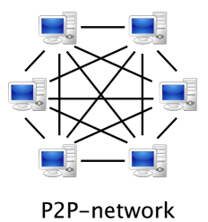

Quando um cliente/aplicação faz uma requisição de leitura/escrita, ela pode ser direcionada para qualquer nó do cluster, uma vez que todos são iguais. O nó que recebeu a requisição vira o coordenador daquela operação em si, atuando como um mestre temporário. Esse nó coordenador, decide que nós do cluster/anel devem receber a requisição de acordo com a configuração do fator de replicação e os avisa através de um protocolo ponto-a-ponto (P2P) chamado Gossip. Se a operação for de escrita um commit log (log de escritas) em cada um desses nós captura essa requisição para assegurar a durabilidade dos dados da operação. A partir daí os nós do cluster que receberam a informação persistem a informação em uma estrutura em memória chamada de memtable e depois em um arquivo no disco rígido chamado de SSTable, quando a memória estiver cheia. É importante notar que todas as escritas realizadas são particionadas e replicadas no cluster.

Periodicamente, o Cassandra realizada um processo de compactação dos dados, no qual consolida as SSTables, descartando informações desnecessárias, como indicadores de colunas deletadas e recria a SSTable com uma estrutura limpa, aumentando assim a performance das operações.

## Modelo de Dados

No Cassandra, a estrutura de dados é baseada no BigTable, o qual foi criado pela Google. Essa estrutura de dados é orientada a linhas e possui algumas similaridades com estruturas relacionais, porém oferece mais flexibilidade. O modelo dados é divido em keyspace, família de colunas, linhas e colunas.

- **Keyspace:** Estrutura similar a um banco de dados relacional. Engloba todas as estruturas internas que fazem o armazenamento dos dados.
- **Família de Coluna:** Similar a uma tabela no banco de dados relacional, entretanto, é mais flexível e dinâmica.
- **Linhas:** Similar a uma linha de tabela no banco relacional. São indexadas através de uma chave.
- **Coluna:** Similar a colunas no banco de dados relacional.

[colocar figura da estrutura de familia de colunas aqui]

É importante salientar que essa similaridade com a estrutura relacional é proposital, havendo inclusive uma linguagem de consulta similar ao SQL para o Cassandra, a qual é chamada de CQL(**C**assandra **Q**uery **L**anguage) e está na versão 3.1. Essa linguagem faz uso de família de colunas como tabelas, keyspaces como se fossem bancos de dados relacionais e colunas como colunas em estruturas relacionais. Dessa forma, a curva de aprendizado é minimizada para desenvolvedores e administradores de dados com conhecimento prévio em SQL. 

## Aplicação Java com Cassandra

Nesta seção será abordada a criação de uma pequena aplicação Java utilizando o Cassandra como armazenamento de dados, fazendo uso da linguagem CQL para criação do modelo de dados, bem como inserções, consultas e deleções, através de um driver Java.

### Configurando o ambiente

A configuração do ambiente é bastante simples e se dá através dos seguintes passos:

- Download e instalação do Python, versão 2.7
- Download e instalação do JDK 1.7.0_60
- Download e instalação do Cassandra
- Download do driver Java

A configuração do ambiente supõe que o leitor tenha conhecimento de instalar e utilizar o Eclipse, bem como configurar um projeto Maven e criar variáveis de ambiente. Esse processo é somente aplicável para o sistema operacional Windows.

### Instalando o Python

Para as ferramentas de manipulação do Cassandra funcionarem, é preciso que o Python 2.7 esteja instalado e configurado corretamente na máquina.

- Baixar o Python 2.7 no link: [https://www.python.org/ftp/python/2.7/python-2.7.amd64.msi](https://www.python.org/ftp/python/2.7/python-2.7.amd64.msi)
- Instalar o arquivo baixado conforme instruções
- Configurar uma variável de ambiente chamada **PYTHONPATH** apontando para o diretório no qual o Python foi instalado no processo anterior
- Adicionar a variável de ambiente **PYTHONPATH** na variável de ambiente **PATH**
- Verificar se o Python foi corretamente instalado ao digitar **python** na linha de comando.

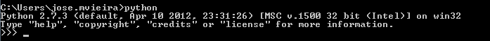

### Instalando o JDK 1.7.0

Para o Cassandra funcionar, uma vez que foi desenvolvido em Java, é preciso instalar o JDK7. Para esse artigo foi utilizada a versão **1.7.0_60**.

- Baixar JDK7 no link: [http://www.oracle.com/technetwork/pt/java/javase/downloads/jdk7-downloads-1880260.html](http://www.oracle.com/technetwork/pt/java/javase/downloads/jdk7-downloads-1880260.html)
- Instalar o **JDK7** através do arquivo baixado
- Criar uma variável de ambiente **JAVA_HOME** apontando para a raiz da instalação do JDK7
- Adicionar na variável de ambiente path o seguinte: **%JAVA_HOME%\\bin**
- Verificar se o JDK foi corretamente instalado ao digitar **java -version** na linha de comando

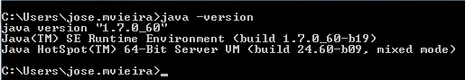

### Instalando o Cassandra

- Download do Cassandra através do link: [http://www.apache.org/dyn/closer.cgi?path=/cassandra/2.0.8/apache-cassandra-2.0.8-bin.tar.gz](http://www.apache.org/dyn/closer.cgi?path=/cassandra/2.0.8/apache-cassandra-2.0.8-bin.tar.gz "Cassandra")
- Extrair o arquivo **apache-cassandra-2.0.8-bin.tar.gz** para uma pasta qualquer e para esse artigo será **C:\\cassandra\\**.
- Inicializar o Cassandra através do arquivo **C:\\cassandra\\bin\cassandra.bat**  

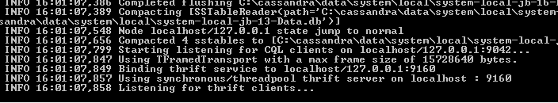

No geral a porta que o Cassandra irá escutar é a 9160 conforme figura acima. Entretanto, essa porta pode ser alterada.

### Iniciando a Codificação do Projeto

Primeiramente é preciso abrir o Eclipse e criar um projeto Maven conforme a figura abaixo:

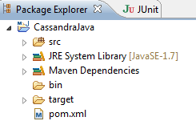

Logo após a criação do projeto é preciso ir no arquivo pom.xml e adicionar a dependência do driver Java para a manipulação do Cassandra:

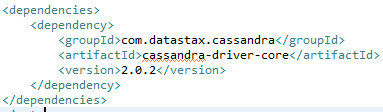

Agora que o projeto está configurado e com as dependências necessárias, é possível iniciar a codificação. Para esse projeto iremos fazer um pequeno serviço de música fictício.

#### Serviço de Música

Neste artigo, iremos codificar um serviço de música social, o qual deve possuir a capacidade de armazenar músicas (título, album, artista, arquivo de áudio), playlists, entre outros. Em um banco de dados relacional, criaríamos uma tabela para armazenar as músicas e outra para as playlists. No Cassandra, a abordagem será bastante parecida, com algumas pequenas diferenças.

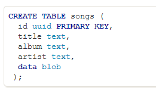

Como informado anteriormente, a linguagem CQL busca utilizar analogias do SQL para a estrutura do Cassandra e as tabelas no CQL são famílias de colunas no Cassandra. Dessa forma, conforme a estrutura do CQL acima, uma família de coluna chamada **songs** será criada de forma a armazenar as músicas. Toda família de colunas possui linhas, as quais são identificadas através de um id, tal qual uma linha numa tabela no modelo relacional. Na família de colunas **songs** o identificador (chave) será um UUID, conforme a figura acima.

Em um banco relacional, **songs** seria uma tabela e **playlists** outra, relacionadas através de uma chave estrangeira em **playlists** referenciando o id na tabela **songs**. Entretanto, no Cassandra o modelo de dados é orientado a agregados e para isso é preciso desnormalizar os dados porque realizar junções em um ambiente distribuído não é performático.

Para representar as **playlists** no Cassandra é preciso criar uma família de coluna chamada **playlist** através da linguagem CQL. O identificador da família de colunas também será composto por um UUID e a ordem da música (song_order). O script na linguagem CQL para a criação da família de coluna ficaria da seguinte forma:

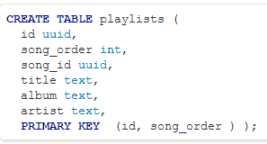

Para criar essas tabelas no Cassandra, primeiramente é preciso criar um keyspace, que como vimos anteriormente, é análogo ao banco de dados no modelo relacional. Para criar esse banco a partir da linguagem CQL utilizando o Java, crie um pacote na pasta **src** do projeto, para esse exemplo será **br.gov.dataprev.cassandra.schema**. Depois disso, crie uma classe Java chamada CriacaoSchema conforme a implementação abaixo:

    package br.gov.dataprev.cassandra.schema;
	
	import com.datastax.driver.core.Cluster;
	import com.datastax.driver.core.Host;
	import com.datastax.driver.core.Metadata;
	import com.datastax.driver.core.Session;
	
	/**
	 * Classe responsável por criar a estrutura do Cassandra para o serviço de músicas
	 * 
	 * @author jose.mvieira
	 *
	 */
	public class CriacaoSchema {
	
		private Cluster cluster; //representação do cluster de máquinas Cassandra
		private Session sessao; //representação da sessão de persistência do Cassandra através da linguagem CQL
	
		
		public CriacaoSchema() {		
			this.connect("127.0.0.1"); //adiciona a máquina local ao cluster e inicializa o cluster
		}
	
		/**
		 * Adiciona um nó ao cluster e inicializa o cluster
		 * 
		 * @param node - O endereço IP do nó que deseja acessar
		 */
		private void connect(String node){
	
			//Adiciona o nó ao cluster e inicializa/monta o cluster
			cluster = Cluster.builder()
					.addContactPoint(node)
					.build();
	
			Metadata metadata = cluster.getMetadata(); //obtém informação a respeito do cluster
	
			System.out.printf("Connectado ao cluster: %s\n", 
					metadata.getClusterName()); //imprime o nome do cluster de máquinas configurado
	
			//Imprime informações sobre todos os nós do cluster
			for ( Host host : metadata.getAllHosts() ) {
				System.out.printf("Datacenter: %s; Host: %s; Rack: %s\n",
						host.getDatacenter(), host.getAddress(), host.getRack());
			}
		}
		
		/**
		 * Cria o keyspace para o serviço de música
		 */
		public void createKeyspace(){
			sessao = cluster.connect(); //conecta ao cluster obtendo uma sessão de persistência
			
			//executa o comando CQL para a criação do keyspace
			sessao.execute("CREATE KEYSPACE IF NOT EXISTS song_service " +
				"WITH REPLICATION = {'class':'SimpleStrategy','replication_factor':1};"); 
		}
		
		/**
		 * Cria as famílias de colunas songs e playlists
		 */
		public void createColumnFamilies(){
			sessao = cluster.connect();
			
			//escolhe o keyspace criado para executar scripts
			sessao.execute("use song_service");
			
			//executa o CQL de criação da família de coluna songs
			sessao.execute("CREATE TABLE IF NOT EXISTS song_service.songs(id uuid PRIMARY KEY," +
					"title text," +
					"album text," +
					"artist text," +
					"data blob);");
			
			//executa o CQL de criação da família de coluna playlists
			sessao.execute("CREATE TABLE IF NOT EXISTS song_service.playlists (id uuid," +
					"song_order int," +
					"song_id uuid," +
					"title text," +
					"album text," +
					"artist text," +
					"PRIMARY KEY  (id, song_order ) );");
		}
		
		public void close() {
			   cluster.close();
		}
	
	
	}

A classe CriacaoSchema é a classe responsável por fazer toda a criação da estrutura básica do banco de dados do Cassandra para esse projeto, ao criar o keyspace e as famílias de coluna. A classe **com.datastax.driver.core.Cluster** é uma representação em Java de um cluster de máquinas configurado com o Cassandra em cada nó. Através dessa classe é possível fazer uma série de operações no cluster, como conectar a um nó específico, adicionar novos nós, obter dados do cluster, entre outros. A classe **com.datastax.driver.core.Session**, por outro lado, é uma representação de uma sessão de banco de dados, através da qual um cliente Java pode realizar operações a nível de dados através da linguagem CQL. Como é possível observar, a classe possui um construtor padrão, o qual faz chamada ao método **connect** da classe, que por sua vez adiciona a máquina local ao cluster do Cassandra, habilitando-a a receber operações através do driver. Por fim temos 3 métodos restantes: **createKeyspace()**,**createColumnFamilies()** e **close()**. Esses 3 métodos são responsáveis por montar o keyspace no Cassandra, adicionar famílias de colunas a esse keyspace criado e por fim fechar a conexão/sessão com o cluster de máquinas respectivamente.

Para executar a criação do schema, crie uma classe chamada SongServiceMain.java, conforme código abaixo:

    package br.gov.dataprev.cassandra.schema;

	public class SongServiceMain {
	
		/**
		 * @param args
		 */
		public static void main(String[] args) {
			
			CriacaoSchema cs = new CriacaoSchema();
			cs.createKeyspace();	
			cs.createColumnFamilies();
			cs.close();
	
		}

	}

Ao rodar essa classe, aparecerá no console a seguinte saída:

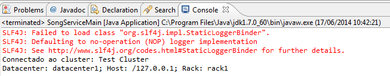

Após a execução da classe, o modelo de dados ficou da seguinte forma:

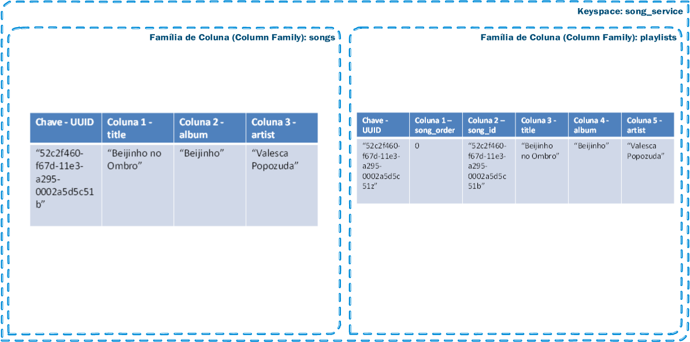

É importante salientar que as "linhas" que possuem as colunas não possuem tamanho fixo, podendo uma linha ter todas as colunas especificadas, outras mais e outras menos. Dessa forma, o tamanho da linha é dinâmico, como se fosse uma linha numa folha de papel. Por exemplo, na figura acima, tem-se uma chave e 3 colunas (title, album e artist) para a família de colunas songs. Entretanto, uma linha poderia ter as 3 colunas, como especificado, ou apenas title e album por exemplo. No Cassandra as colunas não são obrigatórias para todas as linhas.

O próximo passo é criar formas de persistir nas famílias de colunas que foram criadas no Cassandra para esse projeto. Para isso, serão criadas duas classes **SongDAO** e **PlaylistDAO**, as quais serão responsáveis por manipular as famílias de colunas **song\_service.songs** e **song\_service.playlists** respectivamente.

A classe SongDAO deve ser implementada da seguinte forma:

	package br.gov.dataprev.cassandra.schema;
	
	import java.util.UUID;
	
	import com.datastax.driver.core.BoundStatement;
	import com.datastax.driver.core.Cluster;
	import com.datastax.driver.core.Host;
	import com.datastax.driver.core.Metadata;
	import com.datastax.driver.core.PreparedStatement;
	import com.datastax.driver.core.Session;
	import com.datastax.driver.core.utils.UUIDs;
	
	public class SongDAO {
	
		private Cluster cluster; //representação do cluster de máquinas Cassandra
		private Session sessao; //representação da sessão de persistência do Cassandra através da linguagem CQL
		
		public SongDAO() {
			this.connect("127.0.0.1"); //adiciona a máquina local ao cluster e inicializa o cluster
		}
		
		/**
		 * Adiciona um nó ao cluster e inicializa o cluster
		 * 
		 * @param node - O endereço IP do nó que deseja acessar
		 */
		private void connect(String node){
	
			//Adiciona o nó ao cluster e inicializa/monta o cluster
			cluster = Cluster.builder()
					.addContactPoint(node)
					.build();
	
			Metadata metadata = cluster.getMetadata(); //obtém informação a respeito do cluster
	
			System.out.printf("Connectado ao cluster: %s\n", 
					metadata.getClusterName()); //imprime o nome do cluster de máquinas configurado
	
			//Imprime informações sobre todos os nós do cluster
			for ( Host host : metadata.getAllHosts() ) {
				System.out.printf("Datacenter: %s; Host: %s; Rack: %s\n",
						host.getDatacenter(), host.getAddress(), host.getRack());
			}
		}
		
		/**
		 * Salva a música no banco de dados Cassandra.
		 * 
		 * @param title - titulo da musica
		 * @param album - album da musica
		 * @param artist - o artista que fez a música
		 */
		public void saveSong(UUID song_id, String title, String album, String artist){
			
			sessao = cluster.connect();
			
			sessao.execute("use song_service");
			
			//Cria um prepared statement para parametrizar o script
			PreparedStatement preparedStatement = sessao.prepare("INSERT INTO song_service.songs " +
				      "(id, title, album, artist)" +
				      "VALUES (?, ?, ?, ?);");
			
			BoundStatement boundStatement = new BoundStatement(preparedStatement);
			
			//faz o binding dos parâmetros ao statement e executa
			sessao.execute(boundStatement.bind(song_id, title, album, artist));		
			
		}
		
		public void close() {
			   cluster.close();
		}
	
		
	}

E a classe PlaylistsDAO:

	package br.gov.dataprev.cassandra.schema;
	
	import java.util.UUID;
	
	import com.datastax.driver.core.BoundStatement;
	import com.datastax.driver.core.Cluster;
	import com.datastax.driver.core.Host;
	import com.datastax.driver.core.Metadata;
	import com.datastax.driver.core.PreparedStatement;
	import com.datastax.driver.core.Session;
	import com.datastax.driver.core.utils.UUIDs;
	
	public class PlaylistsDAO {
	
		private Cluster cluster; //representação do cluster de máquinas Cassandra
		private Session sessao; //representação da sessão de persistência do Cassandra através da linguagem CQL
		
		public PlaylistsDAO() {
			this.connect("127.0.0.1"); //adiciona a máquina local ao cluster e inicializa o cluster
		}
		
		/**
		 * Adiciona um nó ao cluster e inicializa o cluster
		 * 
		 * @param node - O endereço IP do nó que deseja acessar
		 */
		private void connect(String node){
	
			//Adiciona o nó ao cluster e inicializa/monta o cluster
			cluster = Cluster.builder()
					.addContactPoint(node)
					.build();
	
			Metadata metadata = cluster.getMetadata(); //obtém informação a respeito do cluster
	
			System.out.printf("Connectado ao cluster: %s\n", 
					metadata.getClusterName()); //imprime o nome do cluster de máquinas configurado
	
			//Imprime informações sobre todos os nós do cluster
			for ( Host host : metadata.getAllHosts() ) {
				System.out.printf("Datacenter: %s; Host: %s; Rack: %s\n",
						host.getDatacenter(), host.getAddress(), host.getRack());
			}
		}
		
		/**
		 * Salva a playlist no banco de dados Cassandra.
		 * 
		 * @param title - titulo da musica
		 * @param album - album da musica
		 * @param artist - o artista que fez a música
		 */
		public void savePlaylist(int song_order, UUID song_id, String title, String album, String artist){
			
			sessao = cluster.connect();
			
			UUID id = UUIDs.random();
			
			sessao.execute("use song_service");
			
			//Cria um prepared statement para parametrizar o script
			PreparedStatement preparedStatement = sessao.prepare("INSERT INTO playlists " +
				"(id, song_order, song_id, title, artist, album) "+  
			      				"VALUES (?, ?, ?, ?, ?, ?);");
			
			BoundStatement boundStatement = new BoundStatement(preparedStatement);
			
			//faz o binding dos parâmetros ao statement e executa
			sessao.execute(boundStatement.bind(id, song_order, song_id,  title, artist, album));		
			
		}
		
		public void close() {
			   cluster.close();
		}
	
		
	}

Para utilizar as classes DAO e realmente manipular o banco de dados Cassandra, a classe SongServiceMain.java será alterada para a seguinte codificação:

	package br.gov.dataprev.cassandra.schema;
	
	import java.util.UUID;
	
	public class SongServiceMain {
	
		/**
		 * @param args
		 */
		public static void main(String[] args) {
			
			//Cria o keyspace com as column families
			CriacaoSchema cs = new CriacaoSchema();
			cs.createKeyspace();	
			cs.createColumnFamilies();
			cs.close();
			
			//persiste uma musica na column family song_service.songs
			SongDAO songdao = new SongDAO();
			UUID song_id = UUID.randomUUID();
			String title = "Beijinho no Ombro";
			String album = "Qualquer Coisa";
			String artist = "Valesca Popozuda";
			songdao.saveSong(song_id,title, album, artist);
			songdao.close();
			
			//persiste uma playlista na column family song_service.playlists
			PlaylistsDAO playlistdao = new PlaylistsDAO();
			UUID playlist_id = UUID.randomUUID();		
			playlistdao.savePlaylist(0, song_id, title, album, artist);
			playlistdao.close();
			
			
		}
	
	}

É importante observar que a classe persiste uma música e uma playlist, fazendo uso das respectivas classes DAO. De forma a verificar se realmente os dados estão sendo armazenados no Cassandra, rode a classe acima e posteriormente abra o arquivo **C:\\cassandra\\bin\\cqlsh.bat**. Esse arquivo é responsável por rodar o script de execução da linguagem CQL, de tal forma que é possível executar o CQL diretamente no Cassandra através da linha de comando. Ao abrir o arquivo digite as seguintes instruções:

- **use song_service;** - Seleciona o keyspace song_service para ser utilizado.
- **select * from song_service.songs;** - Essa comando irá listar todas as músicas dentro da column family songs.
- **select * from song_service.playlists** - Essa comando irá listar todas as playlists dentro da column family playlists.

O resultado será o seguinte:

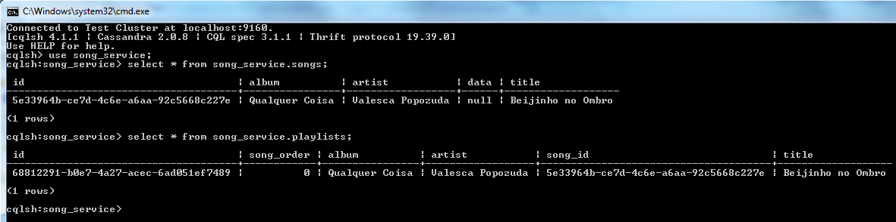

É possível fazer vários tipos de manipulações de dados com a linguagem CQL, tal qual na linguagem SQL. Para um entendimento mais aprofundado da linguagem, é recomendado que se faça uma leitura na referência da linguagem que pode ser encontrada no link: [http://www.datastax.com/documentation/cql/3.1/cql/cql_using/about_cql_c.html](http://www.datastax.com/documentation/cql/3.1/cql/cql_using/about_cql_c.html)

## Conclusão

Manipular o banco de dados Cassandra é bastante fácil, principalmente quando se tem algum conhecimento prévio de SQL e dos conceitos de banco de dados relacionais. Atualmente existem diversos drivers e frameworks para se trabalhar com o Cassandra e o driver da DataStax tem se provado ser um dos mais eficientes e fáceis de se utilizar. Dessa forma, está provado que a curva de aprendizado para um desenvolvedor Java aprender a utilizar o Cassandra é bastante baixa, possibilitando a introdução desse excelente banco de dados em novos projetos e em especial os da DATAPREV.

## Referências

Documentação da Cassandra Query Language - [http://www.datastax.com/documentation/cql/3.1/cql/cql_intro_c.html](http://www.datastax.com/documentation/cql/3.1/cql/cql_intro_c.html)

Documentação do Cassandra 2.0 - [http://www.datastax.com/documentation/cassandra/2.0/cassandra/gettingStartedCassandraIntro.html](http://www.datastax.com/documentation/cassandra/2.0/cassandra/gettingStartedCassandraIntro.html)

Apresentação do JavaTwo em Taiwan - [http://pt.slideshare.net/borisyen/introduce-apache-cassandra-javatwo-taiwan-2012](http://pt.slideshare.net/borisyen/introduce-apache-cassandra-javatwo-taiwan-2012)

