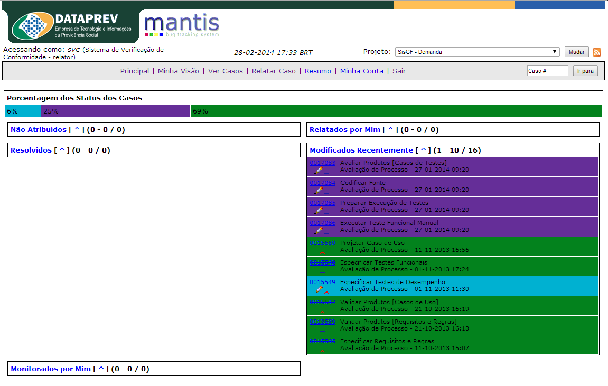
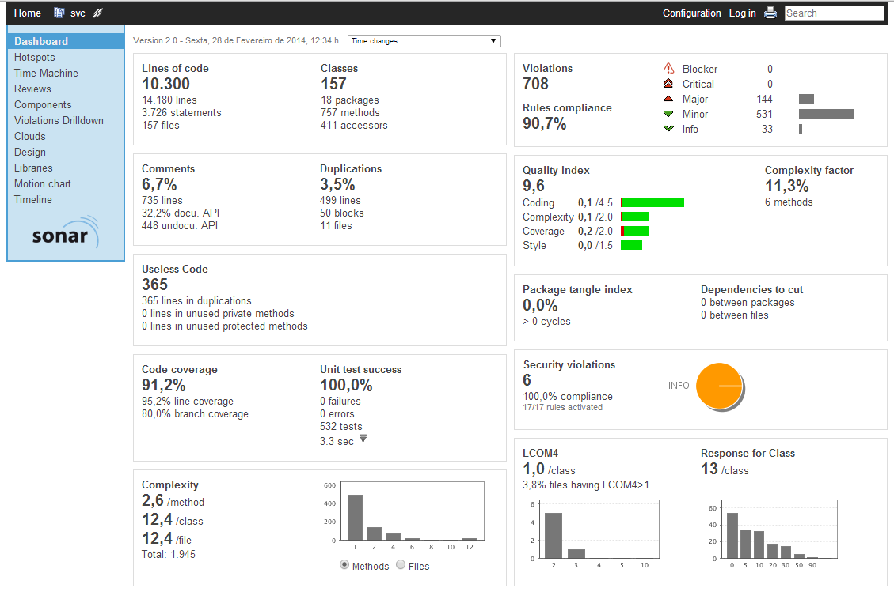
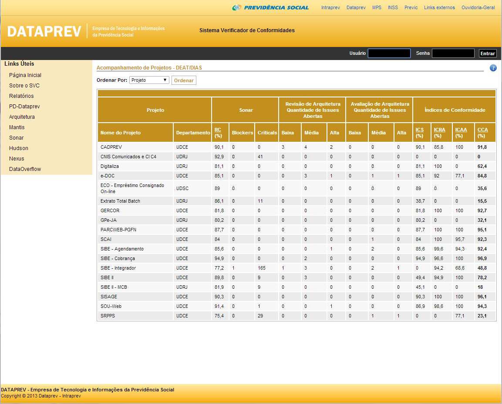
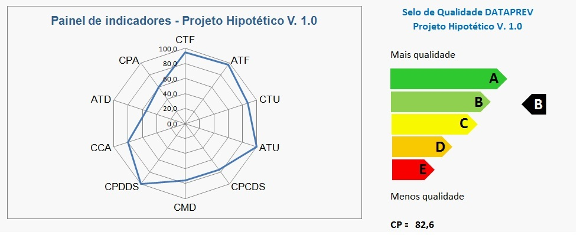

---
remark: metadados para a ser usado pelo parser de conversão para pdf ou odt
date: 28 de fevereiro de 2014
tipo_artigo: Artigo técnico de Infraestrutura de TIC
title: Verificação de Conformidades de Código e Arquitetura
abstract: |
 A verificação de conformidade do código fonte e da arquitetura é uma das maneiras de garantir que a implementação da aplicação está seguindo as regras sugeridas pelas melhores práticas de *design* e arquitetura planejada. Este artigo apresenta o processo de verificação de conformidade de código e arquitetura na Dataprev; como é calculado o indicador da área de arquitetura utilizado na composição do Selo de Qualidade dos projetos em desenvolvimento; e as ferramentas corporativas envolvidas nesse processo.
author:
- affiliation: DEAT/DIAS
  name: Jônatas Carvalho Barroso
responsibility:
- affiliation: DEAT/DIAS
  name: Cícero Soares Vieira
diretoria: 'Diretoria de Infraestrutura de TIC - DIT'
superintendencia: 'Superintendência de Planejamento e Suporte de TIC - SUPS'
departamento: 'Departamento de Arquitetura Técnica - DEAT'
tags:
- Conformidade
- Arquitetura
- Design
- Qualidade
- Processo Desenvolvimento
...

# Desafios

A verificação de conformidade entre a arquitetura planejada e a implementada é um problema importante. Para contribuir com a automatização do processo de manutenção dessa arquitetura, são utilizadas ferramentas de apoio. Este artigo busca apresentar o processo de verificação de conformidade de código e arquitetura na Dataprev e as ferramentas envolvidas nesse processo; e também como é calculado o indicador da área de Arquitetura que compõe o Selo de Qualidade dos produtos em desenvolvimento na Dataprev.

# Benefícios

Através do conhecimento desse processo de conformidade, as equipes envolvidas no desenvolvimento de software podem buscar a melhoria contínua da qualidade do produto.

# Introdução

A demanda por qualidade tem motivado a comunidade para o desenvolvimento de modelos para qualidade de software. Esses modelos estão orientados por duas visões: visão de processo e visão de produto. A **Visão de Processo** trata da avaliação e melhoria dos processos utilizados para o ciclo de vida do software. A **Visão do Produto** trata da avaliação de um produto de software, para verificação de sua qualidade. É a verificação da qualidade arquitetural do produto que será abordada neste artigo.

Um problema recorrente enfrentado durante o desenvolvimento de uma aplicação é certificar que ela foi implementada e continua evoluindo de acordo com a **Arquitetura Planejada**.

Durante a implementação e evolução de um sistema é comum observar desvios da arquitetura definida por causa do desconhecimento por parte dos desenvolvedores, requisitos conflitantes, dificuldades técnicas e as pressões sofridas para o cumprimento do prazo. Esses desvios costumam acumular com o tempo, levando ao fenômeno conhecido como **Erosão Arquitetural**.

Essa erosão indica que o sistema está se degenerando. Isso faz com que os benefícios proporcionados por um bom projeto arquitetural sejam anulados: manutenibilidade, reusabilidade, escalabilidade e portabilidade.

Através de um processo para verificar se a representação de baixo nível de um sistema de software - como o código fonte ou algo similar - está em conformidade com sua arquitetura planejada e com os padrões de desenvolvimento definidos, é possível diminuir os impactos na arquitetura da solução.

# Verificação de Código e Arquitetura

O processo de verificação de conformidades de código e arquitetura contribui para garantir a qualidade do produto e sua adequação aos padrões arquiteturais e de desenvolvimento. Para isso, são aplicados *checklists* para avaliação da arquitetura e revisão do código-fonte. As não-conformidades encontradas nessas avaliações são registradas na ferramenta de *bugtracking*: **Mantis**.

Essa verificação é realizada através de duas tarefas definidas no Processo de Desenvolvimento da Dataprev (**PD-Dataprev**).

1. Na **Avaliação de Arquitetura** é verificado se o conteúdo descrito no Documento de Arquitetura de Software corresponde ao que está implementado. São verificadas as restrições tecnológicas, os casos de uso críticos ou relevantes arquiteturalmente, além das visões arquiteturais. É realizada pelo **Analista de Arquitetura**, juntamente com o **Líder Técnico do Projeto**, no final de cada **Incremento**.

2. Na **Revisão de Arquitetura**, o código fonte e o ambiente de aplicação são verificados para certificar a adequação do produto aos padrões de desenvolvimento de aplicações *online* e *batch*. É realizada pelo **Líder Técnico do Projeto**, juntamente com o **Codificador**, no final da codificação do **Caso de Uso**.

## Ferramentas de Apoio

Algumas ferramentas são utilizadas na Dataprev para contribuir com o processo de verificação de conformidades arquiteturais. São elas: 

### Mantis Bug Tracker

O **MantisBT** é uma ferramenta *open source* utilizada para registrar *bugs* ou problemas encontrados nos produtos ou nos projetos. 

As ocorrências de um produto são registradas no **Mantis Testes**^[Mantis Testes <http://www-testes>], enquanto as ocorrências relatadas pelas áreas de apoio aos projetos são registradas no **Mantis Qualidade**^[Mantis Qualidade <http://www-qualidade>]. 

### Sonar

O **Sonar**^[Sonar <http://www-sonar>] é uma ferramenta que realiza a inspeção contínua do código fonte dos projetos em desenvolvimento. 

Após a realização automática do *build* de cada projeto pelo **Hudson**^[Hudson <http://www-hudson>], uma ferramenta de integração contínua, o código fonte é analisado em busca de violações de diversas gravidades. O Sonar realiza um cálculo, levando em consideração a quantidade de linhas de código da aplicação e as gravidades das violações encontradas, e atribui um índice de conformidade (**Rules Compliance**) ao projeto. 

### Sistema Verificador de Conformidades (SVC)

O **SVC**^[SVC <http://www-svc>] é uma aplicação para registro e acompanhamento de não-conformidades dos projetos em desenvolvimento na Dataprev. Seu objetivo é centralizar os diversos *checklists* da Dataprev em uma única aplicação possibilitando conhecer a situação dos projetos, gerar relatórios para tomada de decisões e saber quais áreas de conhecimento necessitam de maior atenção.

O SVC se integra com o Mantis para registrar as não-conformidades das Avaliações de Arquitetura (Mantis Qualidade) e Revisões de Arquitetura (Mantis Testes); e também com o Sonar, para obter as violações às regras cadastradas para a analise estática do código fonte.

## Selo de Qualidade de Software

"Objetos de concessão do Selo de Qualidade de Software são produtos de software gerados por meio de projetos e/ou manutenção evolutiva - excluindo-se projetos de internalizações e legados com tecnologias em desuso [...]    
É proposta a abordagem incremental partindo de um conjunto de práticas e critérios para os quais são construídos indicadores de software que constituem subsídios para a atribuição de um selo de qualidade aos produtos de software desenvolvidos". - Segundo o relatório consolidado do projeto.

### Indicador de Conformidade de Código e Arquitetura (CCA)

O **CCA** representa, em termos percentuais, o índice de conformidade de um determinado projeto em relação ao cumprimento dos padrões definidos pelo DEAT. É relevante para mensurar a qualidade do código fonte e da arquitetura do projeto durante seu desenvolvimento. A meta de 80% de conformidade deve ser atingida sempre que encerrar um incremento do respectivo Projeto ou antes dele ser disponibilizado em Ambiente de Produção.

A coleta do indicador é realizada automaticamente pelo SVC, sob a responsabilidade da Divisão de Arquitetura da Solução (DIAS). A fórmula para o cálculo é aplicada levando em consideração os seguintes índices:

- **ICRA** (Índice de Conformidade das Revisões de Arquitetura) e **ICAA** (Índice de Conformidade das Avaliações de Arquitetura): A coleta   desses índices é feita pelo SVC e calculado a partir da realização das tarefas **Revisar Arquitetura** e **Avaliar de Arquitetura**, prevista no PD-Dataprev. Os valores são atualizados sempre que for realizada uma dessas tarefas ou quando as não-conformidades registradas nos **Mantis Testes** (Revisão de Arquitetura) e **Mantis Qualidade** (Avaliação de Arquitetura) forem sendo resolvidos. 
- **ICS** (Índice de Conformidade do Sonar): A coleta desse indicador também é feita pelo SVC, que extrai da ferramenta de análise de código **Sonar** os seguintes dados do *dashboard* do respectivo projeto:
  * *Rules Compliance*;
  * Quantidade de violações do tipo *Blocker*; e
  * Quantidade de violações do tipo *Critical*.

O valor desse índice (CCA) para cada Projeto é calculado aplicando a seguinte fórmula:

$$CCA = \frac{((PRA * ICRA) + (PAA * ICAA) + (PS * ICS))}{PRA + PAA + PS}$$
onde:

- **PRA** = Peso (relevância) da Revisão de Arquitetura. Inicialmente o valor do PRA será igual 3, indicando que o ICRA vale 30% da nota final do CCA.
- **PAA** = Peso (relevância) da Avaliação de Arquitetura. Inicialmente o valor do PAA será igual 3, indicando que o ICAA vale 30% da nota final do CCA.
- **PS** = Peso (relevância) do Sonar. Inicialmente o valor do PS será igual 4, indicando que o ICS vale 40% da nota final do CCA.
- **ICRA** = Índice de Conformidade das Revisões de Arquitetura.
- **ICAA** = Índice de Conformidade das Avaliações de Arquitetura.
- **ICS** = Índice de Conformidade do Sonar.

Os índices ICRA e ICAA são calculados a partir das seguintes fórmulas:

$$indice = \frac{(SomaGravidadesItensAvaliados - SomaGravidadesIssuesAbertas)}{SomaGravidadesItensAvaliados}$$
onde:

- Se não foi realizada Revisão de Arquitetura: ICRA = 0;
- Se não foi realizada Avaliação de Arquitetura: ICAA = 0;
- **SomaGravidadesItensAvaliados** = Somatório das Gravidades de todos os Itens Avaliados da respectiva Avaliação: Revisão de Arquitetura ou Avaliação de Arquitetura.
- **SomaGravidadesIssuesAbertas** = Somatório das Gravidades de todas as *Issues* que não foram fechadas da respectiva Avaliação: Revisão de Arquitetura ou Avaliação de Arquitetura.

O índice ICS é calculado a partir da seguinte fórmula:

$$ICS = (RC * ( \frac{(B - Bproj)}{B} ) * (\frac{(C - Cproj)}{C}))$$

onde:

- Se o Projeto não está cadastrado no Sonar: ICS = 0;
- **RC** = *Rules Compliance* calculado pelo Sonar do respectivo projeto.
- **B** = Quantidade Intolerável de Violações para o tipo *Blocker*. Inicialmente sugere-se que este valor seja igual a 1.
- **Bproj** = Quantidade de Violações do tipo *Blocker* do respectivo Projeto.
- **C** = Quantidade Intolerável de Violações para o tipo *Critical*. Inicialmente sugere-se que este valor seja igual a = 20.
- **Cproj** = Quantidade de Violações do tipo *Critical* do respectivo Projeto.

Como a quantidade de violações encontradas pode ser maior que a quantidade máxima permitida, se ICS < 0, então ICS = 0.

# Conclusão

Com a verificação de conformidades sendo realizada, o código fonte e a arquitetura da aplicação em desenvolvimento são revisados, é possível se antecipar aos problemas e aprender com os erros.

# Referências

DATAPREV - Empresa de Tecnologia e Informações da Previdência Social. Dataprev lança selo de qualidade de software. Disponível em: [http://www-dtpnet/content/dataprev-lanca-selo-de-qualidade-de-software](http://www-dtpnet/content/dataprev-lanca-selo-de-qualidade-de-software "Dataprev lança selo de qualidade de software"). Acesso em 06 de março de 2014.

DATAPREV - Empresa de Tecnologia e Informações da Previdência Social. Processo de Desenvolvimento e Manutenção de Software (PD-Dataprev). Disponível em: [http://www-processos/visualizar_artigo.php?idartigo=114&idprocesso=1&idprocesso=1](http://www-processos/visualizar_artigo.php?idartigo=114&idprocesso=1&idprocesso=1 "PD-Dataprev"). Acesso em 06 de março de 2014.

REIAL, Nubia. Selo de qualidade de software DATAPREV: andamento dos trabalhos. Apresentação realizada em Fortaleza, 2013.

DATAPREV - Empresa de Tecnologia e Informações da Previdência Social. Selo de Qualidade: Relatório consolidado. v 4.0. 2003. Disponível em: <http://www-dtpnet/sites/default/files/Selo%20de%20qualidade%20-%20Relat%C3%B3rio%20consolidado%20fase%201(1).pdf>

VILLELA, Ricardo. Conformação arquitetural utilizando restrições de dependência entre módulos. 2009. Dissertação (Mestrado em Ciência da Computação) - Instituto de Informática, Pontifícia Universidade Católica, Minas Gerais.

Ferramenta de verificação de conformidades de código e arquitetura - SVC. Disponível em: [http://www-svc](http://www-svc "Sistema Verificador de Conformidades").

Ferramenta de *bugtracking* de produto - Mantis Testes. Disponível em: [http://www-testes](http://www-testes "Mantis Testes").

Ferramenta de *bugtracking* de processo - Mantis Qualidade. Disponível em: [http://www-qualidade](http://www-qualidade "Mantis Qualidade").

Ferramenta de análise estática de código - Sonar. Disponível em: [http://www-sonar](http://www-sonar "Sonar").
