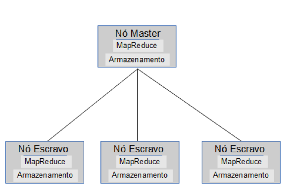
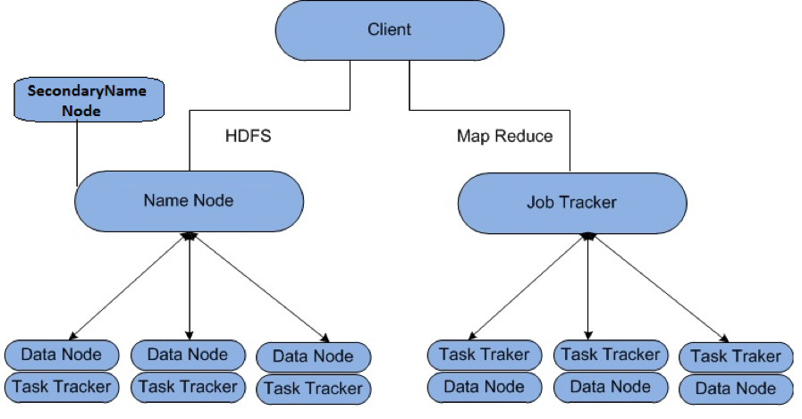
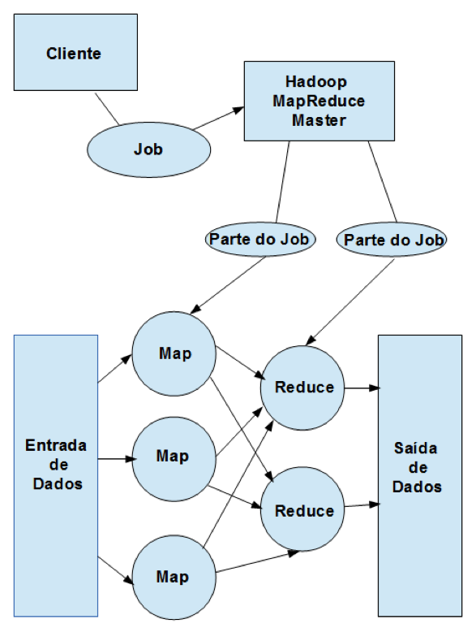
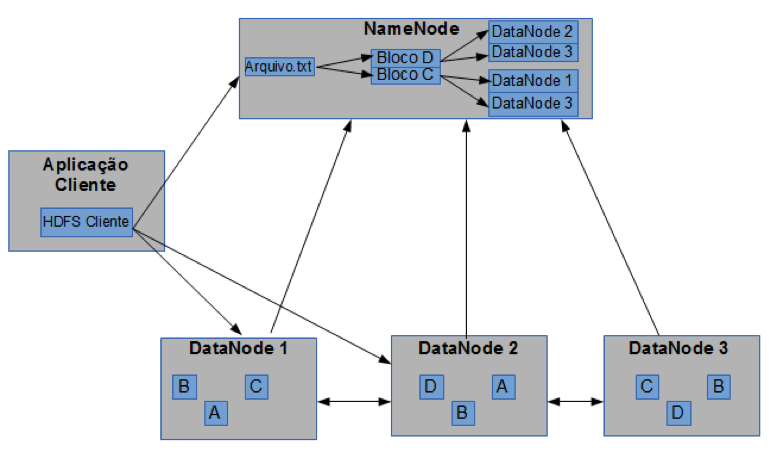
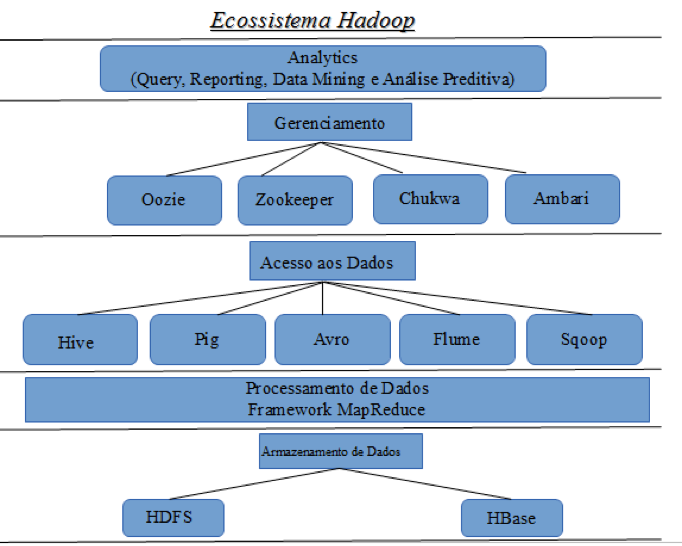
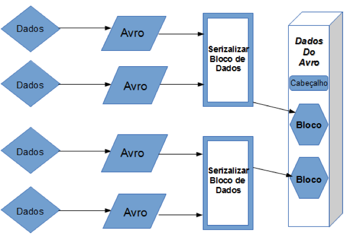

---
date: 31 de março de 2014
tipo_artigo: Artigo técnico de Infraestrutura de TIC
title: Hadoop
abstract: 'O conceito *Big Data* não está relacionado a uma tecnologia mas a uma combinação de novas e antigas tecnologias que ajudam empresas a ganhar vantagem competitiva. O *Big Data* está associado fortemente com três conceitos chamados 3 V: velocidade de geração de dados, crescente volume e variedade desses dados. Essas características fazem com que as abordagens tradicionais para processar dados precisem ser revistas. Portanto, se faz necessário utilizar novos produtos e tecnologias para lidar com desafios apresentados com o *Big Data*. Este artigo tem como objetivo apresentar a ferramenta *Hadoop* e seus componentes, referência em tratar os 3 V mencionados através de programação distribuída.'
author:
- affiliation: DEAT/DIPT
  name: Fernanda Bruno dos Santos
responsibility:
- affiliation: DEAT/DIPT
  name: Bruno Cesar Cardoso Maria
diretoria: 'Diretoria de Infraestrutura de TIC - DIT'
superintendencia: 'Superintendência de Planejamento e Suporte de TIC - SUPS'
tags:
- '*Hadoop*'
- '*Big data*'
- '*NoSQL*'
- '*Cluster*'
- '*MapReduce*'
...

Desafios
========
	
Processar e armazenar grande volume de dados vem sendo feito por muitas empresas há décadas, porém a forma como esses dados são gerados sofreu grande mudança. Sendo assim, alguns desafios na adoção de tecnologias voltadas para *Big Data* são apresentados:

- Tratar dados estruturados e não estruturados, ou seja, dados que não se encaixam em um modelo relacional de dados;
- Lidar com dados de fontes e formatos diversos e
- Lidar com dados que estão em constante crescimento em termos de volume.	

Benefícios
==========

O *Hadoop* foi desenvolvido para tratar dos desafios trazidos pelo *Big Data*. Dessa forma, sua adoção traz como benefícios as seguintes questões:

- Utiliza uma arquitetura de *clusters scale out* de forma a lidar com o crescente volume dos dados, adicionando nós no *cluster* de forma a potencializar o armazenamento e processamento dos dados;
- Para lidar com dados que estão distribuídos e, em sua maioria, não estruturados, o *Hadoop* divide os dados em partes menores e os reparte entre os nós dos *clusters* em uma estratégia conhecida como “Dividir para Conquistar”, acelerando a computação com mínima latência;
- Uso de programação paralela com intuito de distribuir a computação entre os nós e trazer velocidade para as análises;
- Os nós que compõem o *cluster Hadoop* são nativamente tolerantes à falhas, ou seja, a parte dos dados enviada para um nó é replicada em outros nós. Dessa forma se ocorre falha em um nó, ainda é possível realizar processamento através de uma de suas cópias presentes no *cluster* e
- *Hadoop* é um software *open source* e pode ser adquirido sem custos através da página da *Apache Foundation*^[ Apache Software Foundation (<http://www.apache.org>)]. Além disso, ele pode ser utilizado em máquinas do tipo *desktop*, reduzindo custos de implementação.

Introdução
==========

O uso cada vez mais intenso de dispositivos móveis, computação em nuvem e novas tecnologias formaram mundos separados, extensos e incompreensíveis que podem ser chamados de *Big Data*. A expansão das redes sociais e computação ubíqua, permitindo a geração de diversos tipos de dados em tempo real acompanhada do barateamento dos dispositivos de armazenamento fazem com que, cada vez mais, dados sejam gerados com grande variedade, velocidade e volume.

Essas características fazem com que as abordagens tradicionais para processar dados precisem ser revistas. Portanto, esse conceito traz diversos desafios a serem vencidos, bem como uma gama de novas oportunidades a serem exploradas. Neste contexto, o *Hadoop* surge como um grande aliado no processamento e exploração de dados massivos através de computação distribuída. 

Este artigo tem como objetivo apresentar tecnologias envolvidas neste novo cenário, bem como discutir sua aplicabilidade na Dataprev. 

Hadoop
======

O *Hadoop* é uma plataforma que provê tanto armazenamento distribuído como poder computacional. Ele possui uma arquitetura distribuída do tipo mestre escravo que é constituída por um sistema de arquivos distribuído chamado de *Hadoop Distributed File System* (HDFS) para armazenamento de dados e *MapReduce* para realização da computação dos dados. Características intimamente relacionadas ao *Hadoop* são particionamento de dados e computação paralela de grandes volumes de dados. Seu armazenamento e poder computacional são escaláveis através da adição de nós no *cluster Hadoop*. A Figura 1 aponta uma arquitetura em alto nível de um *cluster Hadoop*.

	

Dito isso, é importante mencionar que o *Hadoop* possui cinco tipos de nós, conforme indica a Figura 2, cada tipo atendendo uma demanda específica:

- *NameNode*  
 Ele é o nó principal e único do *cluster* em que todas as operações no HDFS são mantidas por ele. Eles guardam metadados sobre armazenamento dos blocos e replicação, por exemplo. É ponto único de falha e mitiga o risco por escrever seu estado em arquivos em disco.
- *SecondaryName Node*  
 Tem o papel de realizar *merge* periódico dos estados do *NameNode*. Ele roda em um sistema diferente do *NameNode* porque necessita de muita memória para realizar o *merge* dos arquivos e mantém a cópia do *merge* em seu sistema de arquivos local para que seja usado quando o *NameNode* falhar. Este, portanto, não é considerado um substituto direto do *NameNode*, uma vez que não assume o papel do *NameNode* quando este falha.
- *DataNode*  
 Gerencia blocos com dados e realiza a entrega para os clientes. Quando um cliente solicita um dado, o *NameNode* informa em que *DataNodes* o dado está armazenado. Para tal, ele informa regularmente ao *NameNode* a lista de blocos que armazenam os dados. Existem vários no *cluster*.
- *JobTracker*  
 Gerencia tarefas de *MapReduce*. Recebe pedidos de tarefas submetidas por clientes e realiza o agendamento de tarefas de *Map* e *Reduce* nos *TaskTrackers* adequados, lidando com monitoramento dos mesmos de forma que caso haja falha, as tarefas sejam reagendadas para um *TaskTracker* diferente. Existe apenas um por *cluster*.
- *TaskTracker*  
 É o tipo de nó que garante paralelismo. Dispara a criação de *Java Virtual Machine* (JVM) para rodarem tarefas de *Map* e *Reduce*.  Existe grande número por *cluster*.

\pagebreak

Para que o *Hadoop* seja colocado em execução, são oferecidas três formas distintas de configuração, sendo elas:

- *Local*  
O *Hadoop* é configurado, por padrão, para rodar em modo não distribuído como um processo único Java.
- *Pseudo Distributed*  
O *Hadoop* é configurado para rodar no modo *Single Node* de forma que cada *daemon* do *Hadoop* rode em um processo Java separado.
- *Fully Distributed*  
O *Hadoop* em sua configuração *cluster*, ou seja, uma máquina é designada para ser o *NameNode* e outra para ser o *JobTracker* exclusivamente, sendo chamadas de *masters*. O restante das máquinas atuam como *DataNode* e *TaskTracker*, sendo chamadas de *slaves*.

Em termos de composição, o *Hadoop* possui três componentes primários:

- *Hadoop Common*  
Conjunto de bibliotecas e utilitários que suportam os projetos *Hadoop*.
- *Hadoop Distributed File System*  
*Cluster* para armazenamento de dados que facilita o gerenciamento de arquivos entre máquinas (nós).
- *Mecânica MapReduce*  
Um ambiente de processamento de dados paralelo e distribuído de alta performance para implementação do algoritmo de *MapReduce*.

MapReduce
=========

Em relação ao *MapReduce*, ele é caracterizado como um *framework* de computação distribuída que permite paralelizar de forma simplificada tarefas que façam uso de grande volume de dados. Essa simplificação se deve a abstração das complexidades envolvidas nos sistemas distribuídos, permitindo que o programador possa focar em atender as necessidades do problema que se busca resolver.

O entendimento das funcionalidades do *Hadoop MapReduce* deve ser realizado, primeiramente, diferenciando o algoritmo *MapReduce* e a implementação do *MapReduce*. *Hadoop MapReduce* é a implementação do algoritmo desenvolvido e mantido pelo projeto *Apache*&trade; *Hadoop*. É útil pensar sobre a implementação como um mecanismo *MapReduce* já que é exatamente assim que funciona. O *input* é fornecido, o mecanismo converte o *input* em *output* rapidamente e as respostas são obtidas. O processo começa com um usuário solicitando uma rodada de um programa *MapReduce* que continua até que os resultados sejam escritos de volta no HDFS, conforme indica a Figura 3.

O modelo *MapReduce* decompõe o trabalho submetido por um cliente em pequenas tarefas *map* e *reduce* paralelizadas e utilizam o modelo *shared-nothing*, ou seja, levam em consideração que cada nó é independente e auto suficiente, de modo a remover qualquer interdependência que possa incluir pontos de sincronização não desejadas (Holmes, 2012).

HDFS
====

O HDFS, que é o componente de armazenamento do *Hadoop*. Escalabilidade e disponibilidade são conceitos-chave devido a replicação dos dados e tolerância a falhas. O HDFS replica arquivos para um número configurável de vezes, é tolerante tanto a falha de software quanto hardware e automaticamente replica blocos de dados em nós que falharam. A Figura 4 aponta a representação lógica dos componentes do HDFS, que indica o cliente se comunicando com o *NameNode* para tratar de metadados enquanto se comunica com o *DataNodes* para ler e escrever arquivos. O *NameNode* mantém em memória os metadados do sistema de arquivos, como qual *DataNode* gerencia os blocos para cada arquivo.

Ecossistema Hadoop
==================

Os desafios trazidos pelo *Big Data* impulsionaram o desenvolvimento de diversas ferramentas e serviços. O ecossistema *Hadoop* provê uma coleção de ferramentas e tecnologias especificamente criadas para tornar o desenvolvimento, *deploy* e sustentação mais simples. A base para o Ecossistema *Hadoop* é formada pelo *MapReduce* e HDFS, que provêm a estrutura básica para integração de serviços necessária para os requisitos fundamentais dos problemas do *Big Data*.

O Ecossistema *Hadoop* é composto com 5 camadas principais, conforme indica a Figura 5, que são as seguintes: armazenamento de dados, processamento de dados, acesso aos dados, gerenciamento e *analytics*.

Armazenamento de Dados
----------------------

Esta camada está relacionada com o armazenamento de grandes volumes de dados em que não é necessário possuir uma máquina com disco capaz de armazenar todo o volume em questão, sendo possível armazená-los em diversas máquinas interligadas. Esse armazenamento pode ocorrer de duas formas: através do HDFS, [já previamente detalhado](#hdfs), e através de bancos NoSQL, como o HBase.

### HBase

HBase é um banco de dados distribuído e não relacional que utiliza o HDFS como seu armazenamento persistente. Ele é baseado em um projeto *BigTable* do Google&trade; em forma *open source*, sendo integrado com o projeto *Hadoop* de forma que se torna simples ler e escrever dados no banco através de um job *MapReduce* no sistema. Uma vantagem a ser apontada é o fato de o HBase ser um banco colunar, ou seja, todos seus dados são armazenados em tabelas com linhas e colunas de modo similar a um SGBDR. A interseção de uma linha e uma coluna é chamada célula. 

Uma importante diferença entre tabelas do HBase e de SGBDRs é o versionamento. Cada célula inclui um atributo chamado versão, que nada mais é que um *timestamp* que identifica de modo único a célula. O versionamento rastreia mudanças na célula e faz com que seja possível identificar qualquer versão do conteúdo que se faça necessária. O HBase armazena os dados em células em ordem decrescente baseada no *timestamp*, de modo que sejam lidos sempre os dados mais recentes.

É importante observar que a latência de leituras e escritas individuais pode se tornar lenta já que em um sistema distribuído as operações são dependentes do tráfego na rede. Ele atinge seu melhor uso quando é acessado de forma distribuída, ou seja, por vários clientes. Se as leituras e escritas são feitas de forma serializada, é importante pensar em uma estratégia de *cache*.

Processamento de Dados
----------------------

Esta camada está relacionada ao processamento paralelo e distribuído realizado nos dados armazenados no HDFS. Os jobs são submetidos da máquina cliente para o cluster, onde ocorre a divisão do trabalho a ser realizado entre os nós. Após o processamento em cada nó, os resultados obtidos são então consolidados, retornados ou armazenados. Essa camada possui como representante o *MapReduce*, que já foi detalhado na sessão 7.

Acesso aos Dados
----------------

Esta camada tem como objetivo facilitar o acesso à captura, análise e consulta dos dados, inclusive com linguagem de consulta semelhante às utilizadas em banco de dados relacionais. 

### Hive
    
*Apache*&trade; *Hive* é um projeto que se integra ao ecossistema *Hadoop* com o objetivo de prover uma linguagem do tipo SQL para consultar dados armazenados no HDFS e outros sistemas de arquivos que se integram com *Hadoop*. Sabe-se que a maioria das aplicações de *data warehouse* são implementadas utilizando bancos de dados relacionais que utilizam linguagem SQL como forma de consulta. A premissa do Hive é que se pessoas sabem SQL, elas podem aprender a fazer uso do Hive, bem como utilizar sua linguagem própria HiveQL de forma simples.

O foco na consulta do tipo SQL se dá uma vez que ela é uma linguagem familiar para desenvolvedores sendo efetiva, razoavelmente intuitiva para organizar e utilizar dados. A grande questão é que mapear essas operações para a API de baixo nível *Java MapReduce* pode ser desafiador até mesmo para desenvolvedores Java. Hive, através da sua linguagem HiveQL, traduz as queries feitas pelos usuários para jobs *MapReduce*, explorando a escalabilidade do *Hadoop* enquanto apresenta uma abstração em SQL

Hive é composto de três partes. A principal delas é o código Java por si só, em que cada JAR presente implementa um subconjunto de funcionalidades do Hive. A segunda é um serviço chamado *Thrift* que provê acesso remoto de outros processos, sendo que acesso utilizando JDBC e ODBC também são providos. A terceira é uma interface web chamada de *Hive Web Interface* (HWI), que provê acesso remoto ao Hive.

É importante mencionar que Hive também disponibiliza uma interface de linha de comando chamada CLI, sendo esta o modo mais comum de interagir com o Hive. Através dela é possível criar tabelas, inspecionar schemas e realizar consultas em tabelas entre outras possibilidades.

Todas as instalações do Hive necessitam de um serviço de *metastore*, que o Hive utiliza para armazenas os schemas de suas tabelas bem como outros metadados. Por padrão, Hive utiliza um banco de dados embarcado chamado *Derby*, este, porém, pode ser substituído por outro banco de dados a fim de prover mais agilidade ao processamento de consultas (Rutherglen, Wampler, & Capriolo, 2012).

### Pig

Pig é um projeto open source da Apache&trade; que provê um mecanismo para executar fluxo de dados de forma paralela no *Hadoop*. Ele inclui uma linguagem de programação chamada *Pig Latin* para expressar esses fluxos, incluindo operadores para operações tradicionais como *JOIN*, *SORT* e *FILTER*, bem como dar a liberdade para usuários desenvolverem suas próprias funções para ler, processar e escrever dados. Ele pode atuar tanto em um sistema de arquivos local, conhecido como Modo Local, como também no HDFS, conhecido como modo *MapReduce*, que também faz uso do *framework MapReduce*.

A vantagem no uso do Pig e sua linguagem é prover algumas implementações não triviais de operações padrão de dados que em vez de serem escritas em *MapReduce* são escritas em uma linguagem próxima ao SQL. Ao se escrever em *MapReduce*, não há oportunidade do sistema otimizar ou verificar o código do usuário. Já o Pig pode analisar o *script* escrito em *Pig Latin* para entender o fluxo de dados que o usuário descreve. Isso significa que ele pode verificar erros e realizar otimizações, como combinar operações de agrupamento de dados.

De acordo com (Gates, 2011), o uso do Pig pode ser separado em três grandes categorias: processos tradicionais de ETL (*data pipeline*), pesquisa em dados não transformados (*raw data*) e processamento iterativo. A categoria cujo uso é mais acentuado é a *data pipeline*. Um exemplo que pode ser citado é o fato de empresas estarem tratando seus logs, limpando os dados, pre-computando agregações comuns antes de carregar as informações em seu *data warehouse*. Tradicionalmente, queries *ad-hoc* são feitas utilizando linguagem SQL. Mas a pesquisa feita em *raw data*, como logs, dificulta a criação de *schemas*. Sendo assim, o Pig se apresenta como aliado uma vez que opera em situações em que o *schema* é desconhecido, incompleto ou inconsistente.

É importante mencionar que Pig, assim como *MapReduce*, é orientado a processamento *batch*. Isso significa que, se é necessário processar grande volume de dados (giga ou petabytes), Pig é uma boa escolha. Ele espera que sejam lidos todos os registros de um arquivo e escreva todas as saídas do arquivo sequencialmente. Se é necessário que se escreva um conjunto pequeno de registro ou ainda buscar diversos registros em ordens aleatórias, Pig (assim como *MapReduce*) não é uma boa opção.

### Avro

*Apache*&trade; *Avro* é um *framework* de serialização que produz dados em um formato binário compacto que não necessita de geração de código. Esse formato provê suporte para uma variedade de linguagens de programação. 

Avro é fundamentado em *schemas*. Quando os dados são lidos, o *schema* utilizado na escrita está sempre presente. Isso faz com que os dados em conjunto com seu *schema* sejam autodescritivos. Avro utiliza *schemas* em *JSON*^[JavaScript Object Notation (<http://www.json.org>)], de forma que facilita a implementação em linguagens que já possuem bibliotecas *JSON* como Java, C#, C, C++, Python e Ruby.

Em um ambiente que sofre mudanças em curtos períodos de tempo, é possível escrever dados em um arquivo com *schema*, alterar o schema acrescentando campos extras; excluindo campos e renomeando campos, e ainda assim ler arquivos com os *schemas* alterados.

O Avro recebe os dados e utiliza uma biblioteca para convertê-los em um objeto Avro. Esse objeto é, então, serializado com seu *schema*, realizado um processo para criação do bloco de dados serializado. Esse bloco de dados é então comprimido. É importante mencionar que blocos com o mesmo *schema* são colocados em um único arquivo Avro. Esse fluxo pode ser visualizado na Figura 5.

\pagebreak

### Sqoop

Sqoop, que significa *SQL-to-Hadoop*, é uma ferramenta para oferecer a capacidade de extrair dados de fontes de dados não *Hadoop*, transformá-los em um formato usável pelo *Hadoop* e então carregá-los no HDFS, ou seja, um ETL. Enquanto inserir dados no *Hadoop* é crítico para o processamento utilizando *MapReduce*, também se torna crítico retirar dados do *Hadoop* e inseri-los em um armazenamento externo para uso de outras aplicações, sendo esta uma atribuição do Sqoop.

Assim como [Pig](#pig), Sqoop é um interpretador de linha de comando. Você pode digitar comandos Sqoop em um interpretador e eles serão executados um por vez. Existem quatro características chave que são encontradas no Sqoop:

- Importação *Bulk*  
Sqoop pode importar tabelas individuais ou banco de dados inteiros no HDFS. Os dados são armazenados em subdiretórios nativos e arquivos são armazenados no HDFS.
- *Input* Direto  
Sqoop pode importar e mapear SQL diretamente para o Hive e HBase.
- Interação de Dados  
Sqoop pode gerar classes Java para que se possa interagir com os dados de forma programática.
- Exportação de Dados  
Sqoop pode exportar dados diretamente do HDFS em um banco de dados relacional usando tabelas *target* baseada na especificação de um banco de dados *target*.

### Flume

Flume é um projeto da Apache&trade; criado com o objetivo de determinar um padrão simples, robusto, flexível e extensível para coleção, agregação e ingestão de dados de vários sistemas para o *Hadoop*. A premissa para a criação da ferramenta, segundo (Hoffman, 2013), diz respeito ao fato que no HDFS um arquivo existir apenas como um diretório, ou seja, é mostrado como tendo zero de tamanho até que o arquivo seja fechado. Isso significa que se o dado é escrito em um arquivo por um certo período sem que ele seja fechado e a conexão de rede for perdida, o arquivo ficará vazio. Esse fato faz com que seja interessante pensar em se escrever arquivos pequenos com frequência de forma que eles possam ser fechado o mais breve possível. Sendo assim, Flume provê um fluxo de dados em *streaming* de fontes como *log4j*, *appenders* e *syslog*, ou seja, fontes que produzem dados como eventos discretos, para o *Hadoop* (HDFS).

Para realizar seu objetivo, Flume utiliza abstração de *Sources*, *Channels* e *Sinks* para alinhar o fluxo de dados para transportar dados de um ponto para outro. Conforme mostra a Figura 7, *Sources* movem dados para *Channels* que agem como filas que suportam diferentes estratégias. *Sinks* levam eventos do *Channel* e os armazem no HDFS, caso seja assim desejado. 

Vale lembrar que o Flume permite que dados sejam levados não só para o HDFS como também para outros *data stores*. Além disso, é possível implementar *Sources*, *Channels*, *Sinks* e outros componentes customizados, atendendo casos de uso específicos do usuário. Segundo (Sammers, 2012), ele foi especificamente criado o papel do Flume no ecossistema *Hadoop* é realizar a ingestão de dados e para a grande maioria dos casos, isso significa escrever no HDFS, se faz importante que administradores tenham controle de permissão nos arquivos resultantes.

Gerenciamento
-------------

Devido à dificuldade no manuseio e controle das aplicações paralelas e distribuídas, implementa-se a camada de gerenciamento para poder controlar nós do *cluster* e sincronização de processos, por exemplo.

### Oozie

Oozie é uma aplicação desenvolvida pela Apache&trade; utilizada para agendar jobs do *Hadoop*. Ele combina múltiplos jobs em uma única sequência de trabalho lógica, sendo integrado com o *Hadoop* e suportando jobs *MapReduce*, Pig, Hive e Sqoop. Pode ainda ser utilizado para agendar jobs de sistemas específicos como programas Java e *shell scripts*.

Oozie permite que administradores *Hadoop* construam transformações de dados complexas através do uso de múltiplas tarefas. Isso permite maior controle sobre jobs complexos e também torna simples a repetição de jobs em intervalos predeterminados.

Existem três tipos básicos de jobs do Oozie:

- *Workflow Oozie*  
Jobs são Grafos Direcionados Acíclicos (DAG), especificando um sequência de ações a serem executadas.
- *Coordenador Oozie*  
Jobs são *Workflows Oozie* recorrentes que são disparados por disponibilidade de tempo e dados.
- *Bundle Oozie*  
Provê um modo de empacotar coordenadores múltiplos e jobs de *workflow* para gerenciar o ciclo de vida daqueles jobs.

### Zookeeper

Zookeeper é a projeto desenvolvido pela Apache&trade; que tem como objetivo coordenar todos os elementos distribuídos das aplicações no *Hadoop*. Ele tem como características :

- Sincronização de Processos  
Zookeeper coordena a inicialização e parada de múltiplos nós no *cluster*. Garante que todo o processamento é realizado na ordem pretendida. Apenas quando um grupo inteiro de processos é completado o próximo é processado.
- Gerenciamento de Configuração  
Zookeeper pode ser usado para enviar atributos de configuração para qualquer ou todos os nós de um *cluster*. Quando o processamento é dependente de um recurso particular estar disponível em todos os nós, Zookeeper garante a consistência das configurações.
- *Self Election*  
Zookeeper entende a formação do *cluster* e pode indicar um papel de líder para um dos nós. Esse líder gerencia todos os pedidos dos clientes em nome do *cluster*. Se o nó líder falhar, outro líder é eleito entre os nós remanescentes.
- Mensageria Confiável  
Zookeeper oferece uma funcionalidade de *publish/subscribe* que permite a criação de fila que garante a entrega de mensagens até em caso de falha no nó.

### Chukwa

Chukwa é um *framework* para coletar e analisar logs utilizando *clusters Hadoop*. Além disso, ele dispõe de um conjunto de ferramentas para exibir, monitorar e analisar resultados. Ele é escalável pois utiliza o *Hadoop* para armazenamento e processamento e é confiável pois é capaz de tolerar falhas concorrentes sem perder ou deturpar dados.

Chukwa tem quartro componentes principais:

- *Agents*  
Que rodam em cada máquina e enviam dados.
- *Collectors*  
Recebem dados dos Agents e escrevem em um armazenamento estável.
- *Jobs MapReduce*  
Realizam parsing e arquivamento de dados.
- *Hadoop Infrastructure Care Centes* (HICC)  
Interface web para exibir dados.

É importante mencionar que Chukwa é um sistema coletor, ou seja, não é responsável por armazenamento ou processamento. Ele utiliza o HDFS e *MapReduce* para isso sendo responsável por facilitar esse armazenamento e processamento. 

Em relação ao processamento de dados em tempo real, Chukwa foi originalmente construído para atender cenários de processamento de logs em que minutos de latências podiam ser tolerados. Logo, espera-se que as análises sejam feitas de forma periódica e não em tempo real.

### Ambari

Ambari é um *framework* desenvolvido pela Apache&trade; para provisionamento, gerenciamento e monitoração de *clusters Hadoop*. Ambari inclui uma coleção de ferramentas e um conjunto de APIs para ocultar a complexidade do *Hadoop* e simplificar a operação de *clusters*.

Em termos de funcionamento, o Ambari provê um único ponto de controle, atualizando e gerenciando o ciclo de vida dos serviços *Hadoop* com algumas funcionalidades:

- Configuração granular para serviços do *Hadoop* e componentes;
- Instalação de serviços *Hadoop* utilizando assistentes em um número qualquer de *hosts*;
- Diagnóstico avançado para jobs e ferramentas de *troubleshoot*;
- *RESTful* APIs para customização e integração a sistemas e
- Mapas de calor dos *clusters*.

Com as características mencionadas anteriormente, podem ser destacados como benefícios os seguintes pontos em relação às possibilidades dadas aos administradores com a adoção do Ambari:

- Provisão do *Cluster Hadoop*  
*Deploy* e manutenção do hosts simplificada independente do tamanho do *cluster* através de interface Web.
- Gerenciamente do *Cluster*  
Provê ferramentas para simplificar o gerenciamento dos *clusters*. Permite iniciar, parar e testar serviços *Hadoop*, alterar configurações e gerenciar crescimento do *cluster*.
- Monitoração do *Cluster*  
Monitora o ambiente do *cluster*, possibilitando a pré-configuração de alertas para observar comportamento dos serviços *Hadoop* e visualizar dados operacionais através de interface Web. Oferece ainda ferramentas de diagnóstico para visualizar interdependências de jobs e linhas do tempo de tarefas como um modo de ter um visão histórica das execuções.
- Integração com outras aplicações  
Provê *RESTful* API que permite integração com ferramentas existentes.

Analytics
---------

Esta camada é responsável por dar significado aos dados. Para tal, existem três tipos de classes de ferramentas que podem ser usadas de modo independente ou coletivamente por tomadores de decisão para ajudar no problema que se deseja perseguir. As classes são as seguintes:

- Relatórios e *Dashboards*  
Essas ferramentas disponibilizam uma representação da informação de modo amigável para o usuário através do uso de várias fontes. Apesar de ser uma área tradicional no universo da análise de dados, se torna importante que essas ferramentas sejam capazes de acessar novos tipos de banco de dados como o *NoSQL*.
- Visualização  
Essas ferramentas são tidas como o próximo passo na evolução dos relatórios. *Output* dos dados tende a ser altamente dinâmica e interativa. Outra importante distinção entre relatórios e *output* da visualização dos dados é a animação. Usuários de negócio podem observar a mudança nos dados utilizando uma variedade de técnicas de visualização, incluindo mapas de calor e mapas mentais.
- Analytics e Analytics Avançada  
Essas ferramentas alcançam o *data warehouse* e processam os dados para consumo por usuários. Analytics avançada pode explicar tendências ou evento que tem potencial transformativo e único para o negócio. Análise preditiva e análise de sentimento são bons exemplos dessa classe.

Conclusões
==========

Com o levantamento realizado, pode-se notar a gama de possibilidades que o *Hadoop* oferece. Foi vista, também, a variedade de ferramentas disponíveis para tratar os mais diversos problemas, inclusive de forma integrada. É importante mencionar que as ferramentas mencionadas precisam ser avaliadas conforme a necessidade e problemas que buscam solucionar de forma que o ambiente montado seja potencialmente aproveitado e atingindo, deste modo, bons resultados.

A Dataprev poderia se beneficiar com adoção do *Hadoop* dado que lida diariamente com grande volume de informações tanto para acelerar o processamento de grandes consultas de dados bem como através da mineração de dados para encontrar padrões tanto voltados para o negócio, como fraudes e irregularidades, como para monitoração e detecção de padrões de comportamento, como no cenário de logs tanto de seus sistemas quanto de máquinas, se antecipando a falhas e criando situações de contorno.

Referências
===========

Gates, A. (2011). Programming Pig (First Edit.). O’Reilly.

Hoffman, S. (2013). Apache Flume: Distributed Log Collection for Hadoop (First Edit., p. 9). Packt Publishing Ltd.

Holmes, A. (2012). Hadoop in Practice (p. 6). Manning.

Rutherglen, J., Wampler, D., & Capriolo, E. (2012). Programming Hive - Data Warehouse and Query Language for Hadoop (First Edit.). O’Reilly.

Sammers, E. (2012). Hadoop Operations: A Guide for Developers and Administrators (First Edit., p. 163). O’Reilly.

Warden, P. (2011). Big Data Glossary. O’Reilly.

Parecer Técnico - Ecossistema Hadoop - Fernanda Bruno dos Santos
