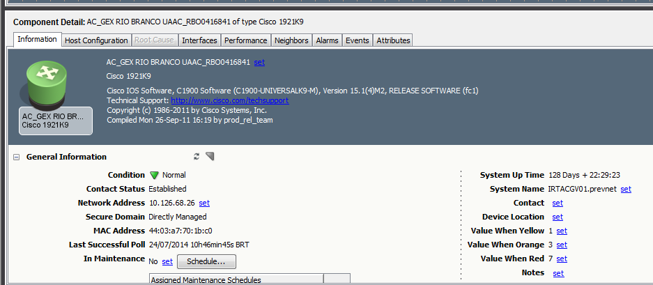
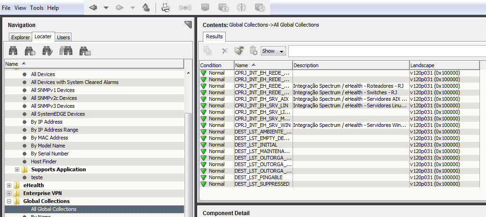
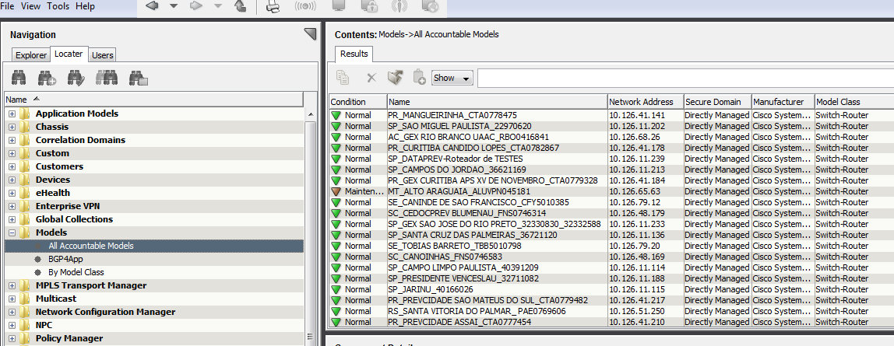

Introdução
==========
   A medida que equipamentos sejam acrescentados em uma empresa e passem a fazer parte de uma rede, estes necessitam ser monitorados. Com um pequeno número de itens estes podem ser monitorados manualmente, mas quando a geografia se estende além de um certo limite físico e/ou além de um certo número de elementos, estes mesmos necessitam de um acompanhamento automático ou seja de monitoração por uma ferramenta que permita que todos os ativos que façam parte da sua rede sejam acompanhados para verificar se houve alguma alteração na topologia com acréscimos e exclusões de itens, assim como identificação das falhas e alertas gerados.

   O Spectrum como ferramenta centralizadora de eventos (chamado broker) é a principal ferramenta da suíte e se integra com outras ferramentas de modo a ter uma visão consistente dos processos que existem na Empresa.
	
   O Spectrum  é basicamente um sistema gerenciador da infraestrutura de uma rede de dados, que monitora os elementos gerenciáveis incluindo dispositivos de rede, servidores e conexões. A informação de Status tais como falha e performance são coletados e armazenados no servidor. O Spectrum de uma forma periódica analisa esta informação para verificar a condição atual da infraestrutura de rede e seus associados. Se uma condição anormal for detectadoa um alerta é gerado e enviado para a console do Spectrum (OneClick). As possíveis causas dos alarmes e soluções são apresentadas no formato nativo do Spectrum ou então podem ser customizados conforme a necessidade e/ou praticidade do cliente.

   O desenho do Spectrum é baseado no modelo cliente/servidor. É constituído por dois servidores, sendo o principal o coletor (SpectroSERVER) onde os dados são armazenados e o outro o servidor da interface Web (OneClick). A aplicação é acessada pelo browser do cliente. O servidor primário SpectroSERVER, é responsável por coletar, armazenar, e processar os dados.
	
   O SpectroSERVER também faz o polling dos elementos gerenciáveis e recebe os alertas da infraesturura. O SpectroServer analisa e armazena esta informação em uma base de conhecimento, e permite o seu acesso pelas aplicações do Spectrum.

   O CA Spectrum  inclui várias aplicações do Cliente. A principal aplicação, OneClick, provê acesso a uma interface gráfica que é usada para monitorar e disparar outras aplicações do cliente. As diversas visões que a console do OneClick provê contêm ícones, tabelas e grafos que representam os diferentes elementos da rede. Estes componentes gráficos mostram a informação do status atual e provê acesso para facilidades específicas. Todos os dados fornecidos pelas aplicações são armazenadas e recuperadas do SpectroSERVER.

Desafios
========
Implementar de forma organizada e padronizada os itens de monitaração por parte do grupo responsável pela sua manutenção.

Benefícios e/ou recomendações
=============================
Este artigo busca orientar os grupos dos CP's do RJ, SP e DF do funcionamento do Spectrum  e mostrar  recursos básicos para a sua correta utilização ao mesmo tempo que pretende uniformizar o entendimento para a correta utilização do Spectrum.

Tópicos do artigo
=================
 
1. Universe
	- Alarms
	- Topology
	- Events
	- Component Detail
	- Alarm Detail
	- Information
	- Host Configuration
	- Interfaces
	- Eventos

2. Descoberta dos Componentes
3. Mapeamento de Topologia
4. Localização de Dispositivos
	- Devices
	- Global Collections
	- Models
	- Ports
	- SANM
5. Correlação de eventos
6. Gerenciamento da mudança de Configuração
7. Estrutura da Dataprev

**1) Topologia Universe**
		
A visão do Universe ajuda a organizar a visão da infraestrutura da  empresa. Provê uma visão topológica dos dispositivos de nível 3 do Modelo OSI(Modelo que explica o funcionamento de uma comunicação entre dois dispositivos dividindo as funcionalidades em 7 Camadas) e suas conexões, e também de nível 2 do modelo OSI e suas conexões, e uma visão detalhada dos atributos associados a um modelo.
	
A visão de mais alto nível na topologia do Universe inclui: CA Spectrum Virtual Network Machine (VNM), grupos de WAN (operadoras), segmentos de rede (LAN), e dispositivos de Camada 3  e suas conexões.

**Painel Navigation**

Este painel é usado para acessar a informação dos diversos elementos da rede de dados. Neste painel podem ser visualizados as seguintes facilidades:

- Alarm views – Relação dos alarmes 
- Topology views – Visões da topologia
- Device lists – Relação dos dispositivos 
- Event views – Relação dos eventos
- Informações detalhadas dos dispositivos
- Containers
- Landscapes (Àrea física/lógica de atuação de cada servidor)
- Aplicações disponibilizadas pela interface OneClick
- Localização de elementos por diversos filtros 
 
Neste painel duas abas são disponíveis para o operador do  OneClick: a aba Explorer e a aba Locater.

\pagebreak

**Painel Component Detail**

No painel Component Detail são identificados os atributos associados a cada dispositivo modelado, tais como interfaces, alarmes e eventos. Pode-se alterar diversos atributos de cada modelo, desde que se tenha o nível de permissão apropriado.

**Alarmes**

1. O Spectrum faz polling (varredura) periódico dos elementos de rede e atualiza o status de cada elemento na base de dados do SpectroSERVER. 
O SPECTRUM gera um alarme baseado em um trap recebido da rede ou quando ele detecta uma mudança de estado em algum elemento da rede, como por exemplo mudança de estado de BGP. Na Console do OneClick, os ícones dos respectivos modelos mudam de verde para outra cor (amarelo, laranja ou vermelho) que indica o nível de severidade do alarme, voltando a cor verde quando a situação se normaliza.

2. O SPECTRUM posta informação específica para cada alarme na aba “Alarm Details” no painel “Component Detail” e na informação do evento do alarme na aba “Events” do Painel “Component Details”.

3.  Os alarmes que o SPECTRUM gera são passados para a aplicação SANM.O SANM permite que seja criado e associado uma política de notificação de alarme para ser processado posteriormente. Essa aplicação pode ser agendada para automatizar o processo de associação das políticas em um determinado horário.

4.  O processo de envio dos alarmes só ocorrem quando o tipo de alarme especificado na política ocorrer.

**2) Descoberta dos Componentes**

A Descoberta de Componentes é feita por se definir modelos na Visão Topológica.Pode-se definir modelos usando uma funcionalidade do OneClick chamado de “Discovery” que automatiza o processo de modelagem. Também pode ser realizado a modelagem manual através de ferramentas que estão disponíveis no OneClick.

   a) Descoberta automática

A descoberta é feita por se incluir a faixa de endereço corresponde à área geográfica dos dispositivos de rede e agendar para que seja feito uma varredura periódica na faixa de endereço, processo este chamado “Discovery”. 

   b) Descoberta manual 

Na descoberta Manual é digitado o endereço IP da interface pela qual o dispositivo irá ser monitorado.

\pagebreak

A visão topológica do Universo representa uma visão real de comos os  elementos estão  conectados no ambiente de infraestrutura. Para se ter outras visões aproveitando os mesmos elementos da visão do mundo real o Spectrum permite que se copie os elementos da visão Universe e se crie as Global Collections. Esta abordagem ajuda a isolar e identificar as falhas no ambiente monitorado pelo OneClick.

Topologia - Global Collections

Use Global Collections para organizar visões específicas da rede que pode incluir vários landscapes (coletores distribuídos fisicamente). Pode-se  também criar e rastrear grupos de elementos de rede, organizações ou serviços que fazem parte da infraestrutura. Global collections possibilita ter uma visão da Infraestruta de TI sob a  perspectiva do usuário.

Exemplo de Coleções: 

a) Atuação de Equipes de suporte responsáveis por manter os equipamentos funcionando separado por áreas de atuação.
 
b) Agrupamento de dispositivos que dão suporte à vários serviços simultaneamente.

c) Mapeamento da infraestrutura que dá suporte a um serviço com os seus respectivos dispositivos.

d) Visualização e acompanhamento de um grupo específico de dispotivos que sejam críticos para o funcionamento da rede ou serviço. Por exemplo Backbone, equipamentos de firewall, switches de distribuição, etc...

\pagebreak

**3) Mapeamento de Topologia**

A topologia nos permite ver a disposição geográfica e/ou lógica de como os diversos dispositivos estão conectados em um determinado “container”. Este container pode ser um agrupamento por estado ou qualquer outro agrupamento definido pelo usuário.

\pagebreak

**4) Localização dos Componentes**

Os itens no Spectrum podem ser pesquisados de diversas maneiras, as mais comuns são:

1. Por Dispositivo. 
- Todos os dispositivos que foram descobertos pelo Spectrum são listados.  Pode-se fazer uma pesquisa restrita, filtrando-se por diversos parâmetros, como por exemplo: versão de SNMP, agente do Spectrum instalado (SystemEDGE), endereço IP, modelo,etc... 

2. Por Global Collection
- Todas as global collection que foram criadas pelo usuário são listadas.

\pagebreak

3. Por Modelos
- Todos os modelos que o agente da CA conseguir descobrir são listados , tais como Switch, Switch-Router, Firewall, Server, etc..

\pagebreak

- Os dispositivos que tem uma interface configurada com BGP também pode ser listados 

4. Por Portas:

- Um modelo no Spectrum é constituído de componentes, chassi e porta fazem parte dos componentes.
As pesquisa por porta podem utilizar vários parâmetros de busca.

\pagebreak

5. Por Alarm Notifier (Notificação de Alarme):

- Todos os Alarm Notifier e as políticas associadas são listadas

**5) Correlação de Eventos**

A correlação de eventos associa um alarme ao evento que o originou, esses eventos mostram com detalhe o significado do alarme e o dispositivo onde ocorreu o alarme, inclusive o status ao longo do tempo.
	

\pagebreak

**6) Gerenciamento de Configuração**

A rede de dados é uma entidade dinâmica, por isso mesmo os dispositivos que fazem parte dela sofrem alterações na sua configuração ao longo do tempo para se adpatar às novas regras, essas alterações podem ser rastreadas para uma futura consulta. O Spectrum armazena essas alterações em um arquivo de configuração e possibilita através da própria aplicação verificar as diferentes configurações ocorridas.

\pagebreak
		

\pagebreak

**7) Estrutura da Dataprev**

\pagebreak

Conclusão
=========
Com a necessidade do uso de uma ferramenta para a monitoração dos ativos de rede na Dataprev, mostrou-se neste artigo uma visão inicial para um primeiro contato por parte dos operadores das Unidades Regionais.

Referências
===========

CA - Computer Associates. "CA Spectrum®Infrastructure Manager - Concepts Guide r9.2", 2010. 

CA - Computer Associates. "CA Spectrum® - Operator Guide r9.2.2", 2012. 

CA - Computer Associates. "CA Spectrum® - Administrator Guide r9.2.1 H07", 2012.
