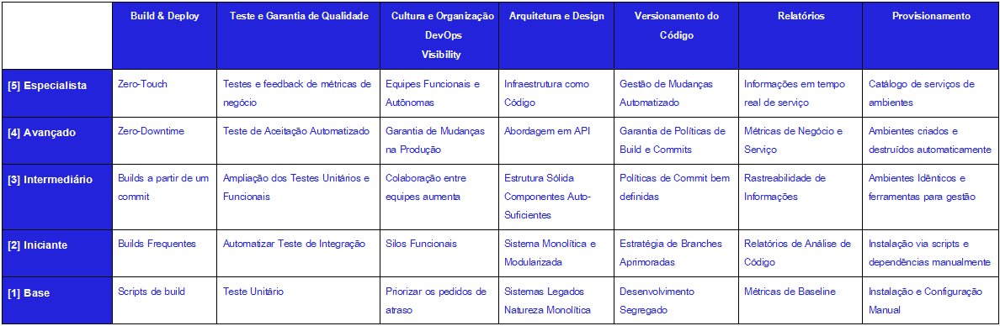

Introdução
==========
  Entregar software em produção é um processo que tem se tornado cada vez mais difícil tanto para a área de desenvolvimento quanto de operações. Ciclos longos 
de teste e divisões entre as equipes de desenvolvimento e de operações são alguns dos fatores que contribuem para este problema. Com o avanço da tecnologia, 
software tem se tornado parte fundamental do a dia de muitas empresas. Ao planejar suas férias em família - agendando quarto em hotéis, comprando passagens de 
avião, realizando transações financeiras, enviando SMS ou compartilhando as fotos de viagem, requerendo algum benefício concedido pelo governo como 
Aposentadoria, Auxílio-Doença ou Salário-Maternidade - você interage com diversos sistemas de software. Quando um desses sistemas está fora do ar, o problema 
não é apenas da empresa que está perdendo credibilidade, mas também dos usuários que não conseguem realizar suas tarefas. Por esse motivo é importante investir 
na qualidade e estabilidade do software desde o momento em que a primeira linha de código é escrita até o momento em que ele está em produção.

  Um sistema não gera lucro ou valor até que seja utilizado por seus usuários. É dito que software não entregue ao cliente é inútil. Mesmo sendo o código mais 
eficiente, a técnica mais performática ou uma funcionalidade brilhantemente executada, mas ele não tem valor se o cliente não o está consumindo em forma de 
serviço. Nesta linha, tem pouco valor uma nova funcionalidade que existe somente no repositório de código-fonte e não foi atualizada ou utilizada em nenhum 
ambiente, quer seja homologação ou produção. Não havendo funcionalidade que o cliente possa interagir,ou seja entrega, podemos dizer que aquele código não 
agregou valor ao produto.

  A expectativa neste artigo é expor a empresa um estudo sobre como adequar um modelo de maturidade de entrega contínua para identificar lacunas em seus 
processos, ferramentas e também a cultura organizacional, sendo esta última considerada como o item de vital importância para acionar as práticas citadas
neste artigo.
 
Desafios
========
O objetivo primário da empresa não é a construção de software em si. A principal razão do trabalho, no entanto, é garantir que o software que se está 
construindo gera valor para os usuários de nosso sistema. A grande pergunta é: se este é o principal motivo do trabalho, o quanto de esforço de fato está sendo 
aplicado para gerar valor para o usuário, ao invés de perder tempo com outras coisas? Por que o código da aplicação é considerado o produto final do trabalho, 
quando na verdade este é apenas um meio para atingir um fim?

Antes de se pensar em questões como programação, arquitetura, bancos de dados, infraestrutura, devemos primeiramente nos perguntar como utilizar o software 
como meio para tornar o cliente mais feliz. Como utilizar a TI para gerar valor para os indivíduos que utilizarão o software? Então, além de observar se o que 
está desenvolvendo possui algum valor para o usuário, verificar constantemente se o esforço empregado em uma feature (funcionalidade) específica não poderia ser
utilizado para desenvolver outra com um benefício ainda maior.
  Para gerar produtos de sucesso, devemos entender as necessidades mais fundamentais de nossos usuários. Kent Beck, criador do Extreme
Programming (XP), argumenta que o sucesso em um projeto de software se resume a um "sucesso técnico". Ele argumenta que devemos ter certeza que o produto: 

1. Possui valor de negócio;
2. Vai ao encontro dos objetivos do negócio;
3. Serve às necessidades de negócio. 
  
  O XP defende prática denominada Deploy Diário (Daily Deployment), em que uma nova versão do software deve entrar em produção todo dia. Para Beck, qualquer
lacuna entre o que está na máquina de um desenvolvedor e o que está no ambiente de produção é um risco. Esse risco ocorre, pois um desenvolvedor pode estar 
aplicando esforço de forma ineficiente, visto que ele não sabe se funcionalidades recém-desenvolvidas atendem adequadamente às necessidades dos usuário. Existem
vários desafios, tanto de caráter técnico quanto humano, em se realizar deploys frequentes no ambiente de produção.
  
Martin Fowler afirma que deploys frequentes em produção são valiosos, pois permitem enviar funcionalidades rapidamente aos usuários, para receber
feedback mais rápido quanto a essas features, e para tornar os usuários mais colaborativos durante o ciclo de desenvolvimento.
  Porém o desafio está em atingir a maturidade para fazer deploys frequentes na produção. Com isso, para este amadurecimento, saber quais passos são necessários
para a otimização de algumas áreas da empresas diminuindo a lacuna entre as mesmas. O modelo de maturidade direciona quais atividades e áreas de atuação devem 
ser aprimoradas para reduzir o tempo de ciclo e minimizar os riscos. 
   
 
Benefícios e/ou recomendações
=============================
Entrega Contínua abrange uma grande área e pode ser muito separadora – eliminando silos específicos aos cargos, criando equipes voltadas aos serviços, 
capacitando as equipes a tomarem suas próprias decisões, entregando software com mais frequência, aumentando o nível de automação, etc. Por que introduzir tais 
mudanças drásticas em um negócio que está indo “bem” do jeito que está?
  
No entanto, à medida que as empresas amadurecem e crescem, elas têm a tendência de se tornar menos ágeis; elas levam mais tempo para produzir mudanças e mais 
problemas são descobertos mais tarde no ciclo de entrega. A cultura da organização também muda, as pessoas estão menos preocupadas com o sucesso geral do projeto
e menos preocupadas ainda com a utilidade do produto para os usuários finais. Em vez disso, a visão delas torna-se míope. A empresa ainda está ganhando dinheiro,
mas os vários departamentos tornaram-se impedimentos um para o outro em vez de facilitadores.
Dentre outros benefícios se destacam também:

1. Aumentar a capacidade do cliente comunicar o quão o software atende às suas necessidades.
2. Permitir loops de feedback do cliente para com a equipe de desenvolvimento de forma muito mais rica e rápida.
3. Auxiliar os usuários a descobrirem se o seu pedido original está de acordo com o que de fato eles precisam.
4. Aumentar rapidamente a confiança pelo lado do cliente por se entregar as funcionalidades prometidas.
5. Ajudar o cliente a ganhar uma melhor compreensão do sistema.
6. Aumentar o feedback de questões técnicas a respeito de aspectos não funcionais do sistema, como desempenho e qualidade do serviço.
7. Aumentar a flexibilidade do negócio.
8. Auxiliar e manter os desenvolvedores focados.
9. Diminuir o risco de cada entrega, pois a diferença de código da versão atual e a anterior é menor e, portanto, é mais fácil identificar a origem de algum
possível erro, caso este ocorra.
	
 Um dos benefícios do modelo é considerar que a empresa pode apresentar qualquer nível de maturidade, seja projeto, área, departamentos e outros.
 Desta forma a alta gestão teria como ferramenta o modelo de maturidade de entrega contínua, para apoiar nas decisões e planejamentos futuros da empresa.
 A ideia é equilibrar o conhecimento entre as áreas da empresa, adotando os moldes da entrega contínua, para que o esforço empregado atinja as necessidades dos 
clientes.  

  
Entrega Clássica
=======================================================================

  Metodologias de desenvolvimento de software evoluíram, porém o processo de transformar ideias em código ainda envolve diversas atividades como: levantamento 
de requisitos, design, arquitetura, implementação e teste. Os métodos ágeis de desenvolvimento de software surgiram no final da década de 90 propondo uma nova 
abordagem para organizar tais atividades. Ao invés de realizá-las em fases distintas – modelo conhecido como processo em cascata – elas acontecem em paralelo o 
tempo todo, em iterações curtas. Ao final de cada iteração, o software se torna mais e mais útil, com novas funcionalidades e menos bugs, e o time decide junto 
com o cliente qual a próxima fatia a ser desenvolvida.

  Assim que o cliente decide que o software está pronto para ir ao ar e o código é colocado em produção, os verdadeiros usuários começam a usar o sistema. Nesse
momento, diversas outras preocupações se tornam relevantes: suporte, monitoramento, segurança, disponibilidade, desempenho, usabilidade, dentre outras. Quando o
software está em produção, a prioridade é mantê-lo rodando de forma estável. Em casos de falha ou desastres, o time precisa estar preparado para reagir de forma
proativa e resolver o problema rapidamente. Devido à natureza dessas atividades, muitos departamentos de TI possuem uma divisão clara de responsabilidades entre
o time de desenvolvimento e o time de operações. Enquanto o time de desenvolvimento é responsável por criar novos produtos e aplicações, adicionar 
funcionalidades ou corrigir bugs, o time de operações é responsável por cuidar desses produtos e aplicações em produção. O time de desenvolvimento é incentivado
a introduzir mudanças, enquanto o time de operações preza pela estabilidade.

  À primeira vista, esta divisão de responsabilidades parece fazer sentido. Cada equipe possui objetivos e formas de trabalho diferentes. Enquanto o time de 
desenvolvimento trabalha em iterações, o time de operações precisa reagir instantaneamente quando algo dá errado. Além disso, as ferramentas e o conhecimento 
necessário para trabalhar nessas equipes são diferentes. O time de desenvolvimento evolui o sistema introduzindo mudanças. Por outro lado, o time de operações
evita mudanças, pois elas trazem um certo risco à estabilidade do sistema. Cria-se então um conflito de interesse entre essas duas equipes. Uma vez que o 
conflito existe, a forma mais comum de gerenciar essa relação é através da criação de processos que definem o modo de trabalho e as responsabilidades de cada 
equipe. De tempos em tempos, a equipe de desenvolvimento empacota o software que precisa ir para produção, escreve documentação explicando como configurar o 
sistema, como realizar a instalação em produção e repassa a responsabilidade para o time de operações. É comum o uso de sistemas de controle de tickets para 
gerenciar a comunicação entre as equipes assim como a definição de acordos de nível de serviço (service-level agreements ou SLAs) para garantir que os tickets 
sejam processados e respondidos em um tempo adequado. Essa passagem de bastão – também conhecida em inglês pelo termo hand-off – cria um gargalo no processo de 
levar código do desenvolvimento e teste para produção. É comum chamar esse processo de deploy em ambiente de produção. 

  Com o passar do tempo, o processo tende a se tornar mais e mais burocrático, fazendo com que a frequência de deploys diminua. Com isso, o número de mudanças 
introduzidas em cada deploy tende a acumular, aumentando também o risco de cada deploy e criando o ciclo vicioso. Esse ciclo vicioso não só diminui a habilidade
da empresa de responder rapidamente a mudanças no negócio, como também impacta etapas anteriores do processo de desenvolvimento. A separação entre os times de 
desenvolvimento e de operações, o hand-off de código existente entre eles e a cerimônia envolvida no processo de deploy acabam criando o problema conhecido como
"a Última Milha".

  A última milha se refere à fase final do processo de desenvolvimento que acontece após o software atender todos os requisitos funcionais mas antes de ser 
implantado em produção. Ela envolve várias atividades para verificar se o que vai ser entregue é estável ou não, como: testes de integração, testes de sistema, 
testes de desempenho, testes de segurança, homologação com usuários (também conhecido como User Acceptance Tests ou UAT), testes de usabilidade, ensaios de 
deploy, migração de dados etc.

  É fácil ignorar a última milha quando a equipe está produzindo e demonstrando funcionalidades novas a cada uma ou duas semanas. Porém, são poucas as equipes 
que de fato fazem deploy em produção ao final de cada iteração. Do ponto de vista do negócio, a empresa só terá retorno no investimento quando o software 
estiver realmente rodando em produção. O problema da última milha só é visível quando se toma uma visão holística do processo. Para resolvê–lo é preciso olhar 
além das barreiras impostas entre as diferentes equipes envolvidas: seja a equipe de negócios, a equipe de desenvolvimento ou a equipe de operações.

Princípios da Entrega Contínua
==========================================

Criar um processo de confiabilidade e repetitividade de entrega de versão.
  Entregar um versão de software deve ser fácil, porque foi testado cada parte do processo centenas de vezes antes. Deve ser tão simples quanto apertar um botão.

  A repetitividade e confiabilidade derivam desses 2 princípios: automatizar quase tudo e manter tudo o que você precisa para compilar, configurar, implantar e 
  testar a aplicação dentro de um sistema de controle de versão.

  Implantar um software em última instância envolve três coisas:

  - Fornecer e gerenciar o ambiente em que a aplicação executará (configuração de hardware, software, infraestrutura e sistemas externos).
  - Instalar a versão correta da aplicação nesse ambiente.
  - Configurar a aplicação, incluindo qualquer dado ou estado que a aplicação exija.
  Deve-se fazer a implantação da aplicação em produção usando um processo completamente automatizado a partir do sistema de controle de versão. A configuração 
  da aplicação também deve ser um processo automatizado, e os scripts e dados necessários, mantidos em um sistema de controle de versão ou banco de dados. 

#### Automatize quase tudo ####
  Há algumas coisas impossíveis de se automatizar. Testes exploratórios dependem de profissionais experientes; demonstração para representantes da comunidade de
  usuários não podem ser feitas por computadores; aprovações para propósitos de conformação à regulamentação ou a padrões depende de intervenção humana. 
  Entretanto, a lista de processos que não podem ser automatizados é menor do que se pensa. Em geral, todo o processo de compilação deve ser automatizado até o 
  ponto em que sejam necessárias direção ou decisões humanas. Isso também vale para o processo de implantação e, de fato, para todo o processo de entrega. 
  Testes de aceitação podem ser automatizados, upgrades ou downgrades do banco de dados também podem e mesmo configurações de rede e firewall. Você deve 
  automatizar tudo o que puder.
  

#### Mantenha tudo sob controle de versão ####
  Tudo que é necessário para compilar, configurar, implantar, testar e entregar uma versão de sua aplicação deve ser mantido em algum tipo de sistema de 
  versionamento. Isso inclui documentação, scripts de testes, casos de testes automatizados, scripts de configuração de rede, scripts de implantação, criação de
  banco de dados, atualizações e inicialização, configuração da plataforma tecnológica, bibliotecas, ferramental, documentação técnicas e assim por diante. 
  Tudo isso deve estar sob controle de versão, e as versões relevantes devem ser identificáveis para cada compilação. Isso significa que o conjunto deve ter 
  algum identificador único, como o número da compilação ou o número do item de mudança no controle de versão.
  Qualquer membro novo do time deve poder sentar-se em sua nova estação de trabalho, realizar um check-out da versão atual do software no sistema de versionamento
  e executar um comando único para compilar e implantar a aplicação em um ambiente acessível, incluindo a estação de trabalho local.
  Também deve ser possível ver qual versão da aplicação está instalada em cada ambiente, e de quais versões do código e da configuração ela veio.
  
#### Se é difícil, faça com mais frequência e amenize o sofrimento ####
  Entrega normalmente é um processo sofrido. Se isso acontece em seu projeto, faça entregas toda vez que alguém submete uma nova versão do código, e faça isso 
  desde o começo do projeto. Se testar é um processo é difícil que ocorre logo antes da entrega da versão, não deixe para o fim. Em vez disso, teste 
  continuamente desde o início do projeto.
  Se entregar é algo penoso, tenha como objetivo fazer isso sempre que uma mudança passar pelos testes automatizados. Se você não pode entregar para os usuários
  reais toda vez, use um ambiente similar ao de produção depois de cada nova versão. Se criar a documentação da aplicação é difícil, faça isso a cada nova 
  funcionalidade em vez de deixar para o fim. Crie documentação para cada parte da funcionalidade que satisfaz os princípios de entrega,e automatize o que puder.
  Dependendo do nível de prática, o esforço para atingir esse ponto pode ser considerável, e ao mesmo tempo você precisa entregar o software. Tenha objetivos
  intermediários, como uma versão interna em intervalos de algumas semanas ou, se já está fazendo isso, toda semana. Progressivamente aproxime-se do ideal - 
  mesmo passos pequenos têm grandes benefícios.
  
#### A qualidade deve estar presente desde o início ####
  Esse princípio é o último mencionado nesta seção - melhoria contínua - são copiados sem vergonha alguma do movimento lean. "Construa com qualidade desde o 
  início" era o lema de W. Edwards Deming que, entre outras distinções, foi um dos pioneiros do movimento lean. Quanto mais cedo você conseguir identificar 
  defeitos, mais barato é para corrigi-los. E é ainda mais barato corrigi-los se eles sequer entrarem no controle de versão.
  As técnicas de integração contínua, cobertura extensiva de testes automatizados e implantação automatizada, têm como objetivo identificar defeitos o mais cedo
  possível no processo de entrega (uma aplicação do princípio de amenizar o sofrimento o mais rápido possível). O próximo passo é corrigi-los. Um alarme de 
  incêndio torna-se inútil se todo mundo ignorar. Times de entrega devem ser disciplinados o suficiente para corrigir defeitos assim que forem encontrados.
  Teste não é uma fase, e certamente não deve vir depois da fase de desenvolvimento. Se os testes forem deixados para o fim, será tarde demais e não haverá 
  tempo para corrigir os defeitos. Segundo, os testes também não são de responsabilidade, pura ou mesmo principal, dos testadores. Todos no time de entrega são 
  responsáveis pela qualidade em todos os momentos.

#### Pronto quer dizer versão entregue ####
  Uma funcionalidade só está pronta quando está entregando valor aos usuários. Isso é parte da motivação da prática de entrega contínua.
  Para alguns times de entrega ágeis, "pronto" significa entrega de uma versão em produção. Essa é a situação ideal para um projeto de desenvolvimento de 
  software. Entretanto, nem sempre é prático usar isso como uma medida "pronto". Pode demorar um pouco até que a entrega inicial de um sistema esteja em um 
  estado em que usuários externos reais possam se beneficiar dela. Então, vamos voltar à segunda melhor opção e dizer que uma funcionalidade está "pronta" quando
  foi demonstrada com sucesso e experimentada pelos usuários do sistema, em um ambiente similar à produção.
  Não existe "80% pronto": algo está pronto ou não. É possível estimar o trabalho necessário para que algo esteja pronto - mas serão sempre estimativas. Usar 
  estimativas para determinar o trabalho que ainda precisa ser feito resulta em recriminações e apontar de dedos quando se descobre que esse cálculo está, como 
  invariavelmente acontece, errado.
  Não é possível que uma única pessoa faça tudo que falta para que algo esteja pronto. É necessário um número maior de pessoas na equipe trabalhando em conjunto 
  para que a tarefa seja concluída. Por isso é importante que todos - testadores, pessoal de operação, pessoal de suporte e desenvolvedores - trabalhem juntos 
  para entregar.

#### Todos são responsáveis pelo processo de entrega ####
  Em um contexto ideal, todos dentro da empresa estão alinhados com seus objetivos e trabalham em conjunto para atingi-los. Em última instância, uma equipe 
  falha ou tem sucesso como um time e não como indivíduos. Entretanto, em muitos projetos, a realidade é que os desenvolvedores entregam seu trabalho por baixo 
  da porta para os testadores. Os testadores, por sua vez, fazem a mesma coisa com os times de operações no momento da entrega de versão. Quando algo dá errado,
  as pessoas perdem mais tempo culpando umas às outras do que corrigindo os defeitos que inevitavelmente surgem em tal abordagem.
  Conseguir colocar esse princípio em prática pode exigir trabalho duro durante um bom tempo para quebrar as barreiras entre os silos que isolam as pessoas em 
  papéis diferentes.
  Comece juntando todos os envolvidos no início do processo e garanta que eles têm oportunidade de se comunicar com frequência. Quando as barreiras começarem a 
  cair, a comunicação deve ser contínua, mas você deve buscar esse objetivo de forma incremental. Inicie um sistema em que todos possam ver rapidamente o estado 
  da aplicação, suas condições, as várias compilações, que testes passaram e o estado dos ambientes que foram implantados. Esse sistema deve garantir que as 
  pessoas possam fazer seu trabalho, tal como a implantação de ambientes sob seu controle.
  Esse é um dos princípios centrais do movimento DevOps. O movimento DevOps está centrado no mesmo objetivo que é: encorajar uma colaboração maior entre todos 
  os envolvidos no processo de entrega de software de valor com maior confiança e rapidez.

#### Melhoria Contínua ####
  A primeira entrega de versão de uma aplicação é o primeiro estágio em seu ciclo de vida. Todas as aplicações evoluem, e haverá mais entregas. É importante que
  o processo de entrega também evolua com elas.
  O time completo deve se encontrar rapidamente e fazer uma retrospectiva sobre o processo de desenvolvimento. Isso significa que ele deve refletir sobre o que 
  funcionou bem, o que não funcionou, e discutir ideias sobre como melhorar as coisas. Alguém deve ser nomeado como responsável pela ideia e garantir que ela 
  seja realizada. Então, na próxima vez em que o time se encontrar, essas pessoas devem reportar sobre o que foi feito. Isso é conhecido como o ciclo de Demming:
  planejar, executar, verificar e agir.
  É essencial que todos na organização estejam envolvidos com esse processo. Permitir que haja feedback somente dentro dos silos e não entre todos é uma receita 
  para o desastre: leva a otimizações localizadas em vez de otimização geral - e, em última instância, dedos apontados para os outros.

Atividades
======================= 

Gerência de Configuração
------------------------
  Gerência de configuração se refere ao processo pelo qual todos os artefatos relevantes ao seu projeto, e as relações entre eles, são armazenados, recuperados,
modificados e identificados de maneira única. A estrategia de gerência de configuração determinará como é gerenciado todas as mudanças que ocorrem dentro do
projeto. É registrado a evolução de seus sistemas e aplicações. Determinará também a forma como seu time colabora - uma consequência vital, mas muitas vezes
ignorada, de qualquer estratégia de gerência de configuração.
  É evidente uma boa gerência de configuração para um projeto. É isso que possibilita o restante das atividades descritas a seguir. Se não há todos os artefatos
do projeto em um sistema de controle de versão, não irá usufruir todos os benefícios compreendidos neste artigo.
Para garantir que se tenha uma boa estratégia para gerência de configuração, é necessário que todas as afirmativas sejam positivas nas seguintes questões:
- Consigo reproduzir exatamente qualquer um dos meus ambientes, incluindo versões específicas do sistema operacional, configurações de rede, plataforma de
software, aplicações instaladas e suas configurações?
- Posso facilmente realizar mudanças incrementais nesses itens individuais e implantá-las em quaisquer dos meus ambientes ou em todos eles?
- Posso facilmente identificar quais foram as mudanças ocorridas para um ambiente específico e rastreá-las para ver quando e por que a mudança foi feita, e quem
a fez?
- Eu posso satisfazer todos os requisitos de conformidade a regulamentações aos quais estou sujeito?
- Qualquer membro da equipe pode facilmente obter a informação de que precisa e fazer as mudanças que precisam ser feitas? Ou a estratégia impede entrega 
eficiente e leva a um tempo maior de ciclo e a feedback reduzido?

Controle de versão de código fonte
----------------------------------
  Um controle de versão tem basicamente dois objetivos. Em primeiro lugar, ele deve guardar a cada versão de cada arquivo armazenado nele e garantir acesso a
ele. Tais sistemas também fornecem uma forma de associar metadados - isto é, informação que descreve os dados armazenados - a cada arquivo ou grupo de arquivo.
Em segundo lugar, ele permite que equipes distribuídas no tempo e no espaço colaborem. Porque o controle de versão é necessário? 
  É fundamental guardar toda a informação requerida para recriar os ambientes de testes e de produção nos quais a aplicação é executada. Isso deve incluir
informação de configuração para a plataforma na qual a aplicação roda e para o sistema operacional, que inclui arquivo de DNS, configurações de firewall e assim
por diante. No mínimo, é preciso de tudo o que for necessário para recriar os binários e os ambientes nos quais a aplicação é executada. 
  O objetivo é armazenar de maneira controlada tudo o que você pode mudar em qualquer ponto do ciclo de vida do projeto. Isso permite que se recupere um
snapshot exato do estado do sistema como um todo, do ambiente de desenvolvimento ao de produção, em qualquer ponto da história do projeto. Também é útil guardar
os arquivos de configuração dos ambientes de desenvolvimento, porque isso permite que todos na equipe usem as mesmas configurações. Analistas devem guardar
documentos de requisitos; testadores devem guardar os scripts de teste e seus procedimentos; e gerentes de projeto devem guardar os plano de versão, gráficos de
progresso e logs de análise de risco. Os desenvolvedores devem usá-lo para código, é óbvio, mas também para testes, scripts de bancos de dados, arquivos de 
compilação e implantação, documentação, bibliotecas e arquivos de configuração da aplicação, para o compilador e todas as ferraments relacionadas, e assim por 
diante - de modo que um novo membro da equipe possa começar do zero. Em resumo, todos os membros da equipe devem guardar todos os documentos e arquivos de forma
organizada e que faça sentido relacionados ao projeto em controle de versão.

 
Planejamento de versão
----------------------
  Essa atividade é inicada quando uma mudança é feita no código podendo ou não fazer parte de uma versão. Analisando a mudança fica a dúvida se deve ou não
implantar a versão. Todo processo de compilação, implantação e testes que aplicamos a mudança valida se ela pode ou não fazer parte de uma versão. O processo
nos dá confiança que a mudança é segura. Verifica-se essa pequena mudança na nova funcionalidade, correção ou ajuste no sistema.
  Apesar de qualquer mudança gerar um artefato que teoricamente pode ser entregue aos usuários, não deve ser assim. Qualquer mudança deve ser verificada de
acordo com sua finalidade para isso. Se o produto resultante é livre de defeito e segue os critérios de aceitação estabelecidos pelo cliente, ele então pode
ser entregue.
  As liberações de cada versão são distintas considerando as fases a seguir:
  Pré-alfa - Versões chamadas milestone. Incluem conjuntos específicos de funções, que são entregues tão logo a funcionalidade esteja implementada.
  Alfa - Nesta fase, os desenvolvedores geralmente realizam testes unitários. Validações adicionais são feitas com testes funcionais e de integração por uma 
  equipe específica de testes.
  Beta - Geralmente inicia-se quando não há mais funcionalidades a serem implementadas no software. O foco na versão beta é reduzir impactos aos usuários, 
  geralmente incorporando testes de usabilidade. O processo de liberação de uma versão beta é chamado liberação beta e, tipicamente, é sua primeira divulgação 
  pública, fora dos limites da organização que o desenvolve. As versões beta são muito utilizadas como demonstrações dentro da organização e para clientes 
  externos.
  Versão Candidata - Refere-se a uma versão com potencial para ser o produto final, pronta para ser lançada a menos que algum bug sério apareça. Neste estágio 
  de estabilização do produto, todas as funcionalidades encontram-se especificadas, implementadas e testadas através de uma ou mais fases beta sem a ocorrência 
  de bugs sérios.
  Versão Final - Esta é a fase em que o produto é considerado "vivo" — é a versão final. Tal versão é tida como muito estável e relativamente livre de bugs, 
  com uma qualidade aceitável para todos os usuários finais.
  
  
 

Auditoria
---------
  Auditorias servem como instrumentos que visam garantir que a empresa está seguindo regulamentações estabelecidas. A seguir, seguem algumas estratégias que são consideradas como itens
essencias em governança:
- Garantir que somente as pessoas com as permissões adequadas tenham acesso a ambientes "privilegiados".
- Criar e manter um processo eficiente de gestão de mudanças em ambientes privilegiados.
- Exigir aprovação da gerência antes que sejam feitas implantações.
- Exigir que cada processo, da compilação à entrega, seja documentado.
- Criar barreiras de autorização para garantir que as pessoas que as pessoas que podem criar o software não sejam capazes de implantá-lo em ambientes de 
  produção como uma proteção contra potenciais intervenções maliciosas.
- Exigir que cada implantação seja auditada para ver exatamente quais mudanças estão sendo feitas.
Estratégias como essas são essenciais em organizações sujeitas a regulamentação e podem levar a reduções drásticas de tempo de queda e defeitos. Entretanto,
elas também têm uma reputação ruim, porque é muito fácil implementá-las de maneira que torna as mudanças difíceis. Entretanto, o pipeline de implantação torna
possível garantir que essas estratégias sejam seguidas de maneira simples ao mesmo tempo em que capacitam um processo eficiente de entrega.
  Muitas empresas insistem que documentação é central no processo de auditoria, porém há controvérsias. Um papel que diz que você fez algo de certa maneira não
é uma garantia de que você realmente fez tal coisa. O mundo de consultoria é cheio de histórias de pessoas que passaram (por exemplo) por auditorias ISO 9001
entregando um monte de papéis que "provam" que implementaram a certificação e treinando seu pessooal para dar as repostas corretas aos inspetores.
  Documentação também tende a ficar desatualizada. Quanto mais detalhado um documento, mais rápido ele fica desatualizado. E quando ele difere do que está 
acontecendo, as pessoas não se incomodam mais em atualizá-lo. Todo mundo já ouviu esta conversa pelo menos uma vez: Operado: "Eu segui o processo de implantação
que você me mandou por e-mail no mês passado, mas ele não funciona". Desenvolvedor: "É que nós mudamos o processo de implantação. Você precisa copiar esses
novos arquivos e mudar a permissão X". Ou pior, "Isso é estranho. Vou ver o que está acontecendo..." seguido de horas tentando entender o que mudou e como fazer
a implantação.
  Scripts automatizados são documentação do processo que funcionam. Ao exigir seu uso, você garante que eles estejam sempre atualizados e que o processo foi 
executado exatamente como você queria.
  Muitas vezes é necessário conseguir rastrear o histórico de mudanças do que está em produção voltando às versões que foram usadas para produzir a implantação.

Integração para automação do processo de compilação
----------------------------------------------------
  É necessário conseguir executar seu processo de compilação a partir da linha de comando. É possível começar um simples programa que diz ao IDE como compilar
a aplicação e rodar os testes, ou pode usar usar um sistema de múltiplos estágios que chamam outros scripts para fazer seu trabalho. Qualquer que seja o mecanismo,
deve ser possível para qualquer pessoa compilar, testar e instalar a aplicação de maneira automatizada a partir da linha de comando.
  O ideal é que se tenha também scripts que possam ser executados a partir da linha de comando sem depender do IDE. Apesar de controverso, há algumas razões para
isso: 
- Capacidade de executar o processo de compilação automaticamente em seu ambiente de integração contínua, de modo que ele possa ser auditado quando algo der
errado.
- Os scripts devem ser tratados da mesma forma que o resto do código. Devem ser testados e refatorados continuamente para que estejam limpos e fáceis de entender.
É impossível fazer isso com processo gerado pelo IDE. Isso se torna mais importante a medida que o projeto se torna mais complexo.
- Isso torna o processo de entender, manter e depurar o processo de compilação mais fácil, e permite maior colaboração com o pessoal de operação.

Testes (Automação de testes de aceitação)
-----------------------------------------
  A atividade de teste de aceitação é realizada geralmente por um restrito grupo de usuários finais do sistema. Esses simulam operações de rotina do sistema de
modo a verificar se seu comportamento está de acordo com o solicitado. É possível executar testes de aceitação de forma automatizada? A reprodução dos testes
pode ser feita automaticamente, sem a necessidade de uma pessoa executar todos os passos manualmente a cada vez que tiver que retestar uma funcionalidade. Vale
lembrar que, automatizados ou não, os testes de aceitação devem ser baseados em casos de teste elaborados pelo cliente, porque só o dono de negócio pode decidir
se a funcionalidade está adequada para seu uso.
  Testar o produto permite verificar e validar se o desenvolvimento do mesmo está convergindo para o idealizado pelo cliente. Quanto antes as divergências 
forem encontradas, mais barato é corrigi-las. O teste de aceitação é particularmente importante porque sua execução é feita na própria interface do software, 
validando o sistema para o cliente da maneira que ele será usado.
  O conjunto de testes de aceitação de uma aplicação de  tanto garante que ela entrega o valor de negócio esperado como a protege de regressões e defeitos que
quebram funções preexistentes da aplicação.
  Teste de aceitação podem detectar problemas mais sérios, que testes de unitários e de componentes, por mais abragentes que sejam. Automatizar os testes de 
aceitação é menos custoso, pois a complexidade de se executar os testes manualmente é alta e a reprodução dos mesmos torna-se crítico.
    

Implantação
-----------
  São considerados os seguintes princípios para a atividade de implantação e gestão do ambientes:
  - O estado desejado da infraestrutura deve ser especificado por meio de configuração sob controle de versão.
  - A infraestrutura deve ser autônoma, isto é, deve corrigir a si mesma até chegar ao estado desejado de forma automática.
  - Ter ciência do estado atual da infraestrutura por meio de instrumentação e monitoramento.
  Embora a infraestrutura deva ser autônoma, é essencial  que ela seja simples de recriar, de modo que, no caso de falhas de hardware, por exemplo, seja rapida-
mente possível de reestabelecer uma nova configuração conhecida. Isso significa que o provisionamento de infraestrutura deve ser um processo automatizado.
  Alguns intens devem ser considerados para reduzir o risco de implantação:
  - O sistema operacional e sua configuração, tanto para para ambientes de testes como para produção.
  - O ferramental de middleware e sua configuração, incluindo servidores de apliação, serviços de mensagens e banco de dados.
  - Software de infraestrutura, como repositório de controle de versão, serviços de diretório e sistemas de monitoramento.
  - Pontos de integração externos, como sistemas e serviços externos.
  - Infraestrutura de rede, como roteadores, firewalls, switches, DNS, DHCP e assim por diante.
  - O relacionamento entre a equipe de desenvolvimento da aplicação e a equipe de gerenciamento de infraestrutura.
  O último item é de grande importancia, pois os demais pontos se torne mais fáceis de serem aplicados, quando as equipes conseguem trabalhar juntas 
  para resolver problemas.
  É vital que essa atividade seja automatizada. No entanto deve-se utilizar uma ferramenta correta quando estiver automatizando a implantação, não uma linguagem
de programação para esta atividade. Já existem inumeras ferrametas dedicadas em automatizar esta atividade.
  As abordagens manuais de implantação por meio de ferramentas com GUI's são sujeita a erros e tem uma documentação que está sempre errada e desatualizada. Sendo
também muitas vezes, cada implantação é um exercício de memória e entendimento do sistema para a pessoa que está realizando, e é principalmente a erros. 
     

Modelo de Maturidade de Entrega Contínua
========================================

Um modelo de maturidade para gerência de configuração e entrega de versão
  Ao discutir o tópico de governança, é muito útil ter uma visão clara do objetivos de mudanças organizacionais. Será apresentado um modelo que ajuda a identificar em que ponto uma
empresa está, em termos de maturidade de seus processos e práticas, e define uma progressão que ela pode usar para melhorar.
  Particulamente, tomamos o cuidado de abordar todos os papéis envolvidos na entrega de software em uma empresa e como eles trabalham em conjunto.

Como usar o modelo e maturidade
O principal objetivo do modelo é melhorar sua organização. Os resultados desejados são:
- Tempo de ciclo reduzido, de modo que você consiga entregar valor mais rápido e aumentar seu lucro.
- Esforço reduzido, de modo que você possa melhorar sua eficiência e gastar menos em suporte.
- Previsibilidade aumentada do ciclo de vida de entrega de software para tornar o planejamento mais eficaz.
- Capacidade de adotar e manter uma atitude de observância com qualquer regime de regulamentação a que você esteja sujeito.
- Capacidade de determinar e gerenciar os riscos associados com a entrega de software efetivamente.
- Custos reduzidos por meior de melhor gestão de risco e menos problemas na entrega de software.

  O modelo de maturidade pode agir como um guia para ajudá-lo a alcançar todos esses objetivos. Recomendamos, como sempre, que /você
aplique o ciclo de Deming - Planejar, Executar, Verificar e Agir.

1 - Use o modelo para classificar a maturidadeda da gerência de configuração e entrega de versão de sua organização. Você pode descobrir que diferentes
partes de sua organização têm níveis diferentes em cada uma das categorias.
2 - Escolha uma área de foco em que a imaturidade é particularmente complicada. Mapeamento de cadeia de valor (Value Stream Mapping) pode ajudar a 
identificar as áreas que precisam de melhoria. Este artigo ajudará a entender o que cada melhoria traz para a organização e como implementá-la. Também
é preciso deicidir quais melhorias fazem sentido para sua organização, estimar os custos e benefícios e priorizar. Também é preciso definir os critérios
de aceitação para especificar os resultados esperados e como serão medidos, para que você possa decidir se a mudança foi bem-sucedida.
3 - Implemente as mudanças. Primeiro, crie um plano de implementação. Provavelmente é melhor começar com uma prova de conceito. Se esse for o caso,
escolha uma parte da organização que realmente está com dificuldades - essas pessoas terão a melhor motivação para implementar mudanças, e é lá que você
verá as mudanças mais significativas.
4 - Uma vez que as mudanças tenham sido feitas, use os critérios de aceitação que criou para medir se elas tiveram os efeitos desejados. Faça uma
retrospectiva com todos os envolvidos para definir quão bem foram executadas e quais são as potenciais áreas de melhoria.
5 - Repita esses passos e construa seu conhecimento. Execute melhorias de maneira incremental e ao longo de toda a organização.

Com as definições e esclarecimento das seções anteriores, podemos perceber que preparar a empresa para as mudanças é um desafio. O entendimento que a empresa utilizando os princípios e métodos poderá ter mais agilidade na entrega e na inovação do negócio. As questões referentes ao “por quê?” já foram abordadas, porém o “como?” será apresentado nesta seção.

As atividades de desenvolvimento e implantação se software não é trivial e com isso o processo é na maioria das vezes longo e trabalhoso, envolvendo muitas pessoas, departamentos e obstáculos que podem fazer o esforço necessário para implantar a entrega contínua.

O questionamento de como fazer uma empresa se transformar, é a “ponte de ligação” entre nivelar os projetos e identificar as lacunas das atividades através de um modelo de maturidade de   entrega contínua.

Normalmente as empresas não tem um nivelamento entre os projetos e nem entre as disciplinas referentes a entrega contínua. Por isso, se analisarmos as condições de cada projeto, provavelmente observaremos que existem projetos em níveis de maturidade bem diferentes.

O modelo de maturidade visa dar estrutura e compreensão para alguns dos aspectos, que precisamos considerar ao adotar a entrega contínua na empresa. O objetivo do modelo é destacar algumas categorias essenciais, e nos dar uma compreensão de como a empresa está madura. Esta avaliação nos dará uma boa base para o planejamento da implantação da entrega contínua.

O modelo encontrado na literatura[Ref. Art 3/ 4/ 5] descreve cinco níveis de maturidade:

1. Base [Processos que não podem ser repetidos, poucos controlados e reativos]
2. Iniciante [Processo documentado e parcialmente automatizado]
3. Intermediário [Processos Automatizados aplicados ao longo de todo o ciclo de vida da aplicação]
4. Avançado [Processos Medidos e Controlados]
5. Especialista. [Foco em Melhoria de Processo]
 
O modelo também define algumas categorias que representam os principais aspectos a considerar na implementação da Entrega Contínua. 
Cada categoria tem a sua própria progressão maturidade, mas normalmente a empresa  amadurece gradualmente ao longo de várias categorias, já que estão ligados e se afetam mutuamente.

Encontramos na literatura[Ref. Art 3 / 4 / 5] uma variação para a quantidade de categorias, segue abaixo algumas que consideramos indispensáveis:

1. Build e Deploy
2. Teste e Garantia de Qualidade 
3. Cultura e Organização / DevOps / Visibility 
4. Arquitetura e Design
5. Versionamento de Código
6. Informações/indicadores/Relatório
7. Provisionamento

Segue abaixo o correlacionamento entre nível e categorias:

Build e Deploy
--------------  

No *nível básico*, você terá uma base de código que é a versão controlada e scripts de build são regularmente executados em um servidor de integração dedicado. O processo de implantação é manual ou semi-manual com algumas partes com scrpits caseiros e rudimentarmente documentado de alguma forma.

*Nível iniciante* introduz builds frequentes e feedback mais rápido tendo artefatos facilmente arquivados para facilitar o gerenciamento de dependência. A criação de Tag e versionamento de compilações é estruturado, mas o processo de implantação é manual e está gradualmente sendo padronizado através de documentação, scripts e ferramentas. 

No nível intermediário, os builds são acionados a partir de um commit, amarrando este commit específico a uma compilação específica. As tags e versionamentos de compilações são automatizadas e o processo de implantação é padronizado para todos os ambientes. 
Artefatos de entrega são construídos apenas uma vez e são projetados para ser capaz de ser implantado em qualquer ambiente.
O processo de implantação padronizada também incluirá uma base para implanta banco de dados automatizados (migrações) da maior parte das alterações do banco de dados, e as alterações de configuração de tempo de execução de script. Um canal de transmissão básica está no local cobrindo todas as etapas de controle de origem da produção.

Na fase avançada, pode também tornar-se necessário dimensionar o build de várias máquinas em processamento paralelo e para ambientes específicos. Técnicas de zero-downtime Deploys são importantes no processo automatizado e obter uma melhor flexibilidade e reduzir riscos e custos fazer uma entrega. Neste nível, você também pode explorar técnicas para automatizar mudanças no banco de dados mais complexas e migrações de banco de dados. Desta forma evitando as rotinas manuais para atualização do banco de dados.
 
Práticas de especialistas irá incluir Zero Touch na implantação contínua de produção. Isso significa que a cada commit será direcionado para a implantação na produção completamente automático. Outra prática especialista está levando a infraestrutura como código e virtualização ainda mais e tornando o processo de construção produzem não apenas artefatos de implantação, mas as máquinas virtuais completas que são promovidos pelo pipeline todo o caminho para a produção de substituir os já existentes.
 
 Teste e Garantia de Qualidade
-------------------------------

Na nível básico do modelo de maturidade, a equipe de desenvolvimento normalmente pratica testes unitários o ambiente de teste é na máquina do desenvolvedor. Neste nível também existe já teste manual de integração, que geralmente é feito por um departamento separado que conduz períodos de teste longos e pesados após o desenvolvimento.

O nível iniciante começa gradualmente à automatizar os testes de integração que anteriormente manuais, sendo assim o feedback se torna mais rápido para os testes de regressão. Esses testes, devem ser implantado e testado em um ambiente dedicado que conterá as dependências necessárias para a execução. 

Nível intermediário se espera a ampliação do escopo dos testes unitários e funcionais, que inclui maior cobertura do componente de testes de unitário, mas vai ter implementações "mocked" de suas dependências externas, por exemplo, banco de dados ou outros serviços de back-end. 
Estes testes são especialmente valiosos quando se trabalha em uma arquitetura baseada em componente ou quando bons testes de integração são difíceis de se implementar ou demasiado lento para ser executado com frequência. Neste nível, inicia-se gradualmente automatizando partes do teste de aceitação.
 
No nível avançado, os testes de aceitação são automatizados e critérios de aceitação estruturados a partir dos requisitos. Isto significa que nenhum teste de aceitação será manual e o incluirá alguns testes exploratórios que realimenta testes automatizados para melhorar constantemente a cobertura de teste e qualidade. Com correlacionamento da cobertura de teste com a mudança na rastreabilidade, pode-se começar a praticar o testes baseado em risco.

No nível especialista o valor de negócio esperado de mudanças se torna mais natural quando a empresa, a cultura e as ferramentas atingiram um certo nível de maturidade e feedback de métricas de negócio. 
Desta forma a implementação de um novo recurso também deve incluir uma maneira de verificar o resultado esperado no negócio, certificando-se que as métricas relevantes são obtidas da aplicação. O entendimento de entrega do produto deve ser estendido para uma analise do impacto que a nova implantação teve.
 

Cultura e Organização / DevOps / Visibility
--------------------------------------------

O *nível básico* de cultura e organização de uma empresa é priorizar os pedidos de atraso, existe processo definido e que é rudimentarmente documentado e desenvolvedores estão praticando commits frequentes no controle de versão como se fosse backup de código. 

O *nível iniciante* as equipes baseadas em projetos e iniciativas de criar limites entre o papel de testador e de desenvolvedor. As solicitações do cliente são consolidados por equipe e basicamente métodos ágeis são adotados, porém não existe muita colaboração entre as equipes.

O *nível intermediário* a colaboração entre as equipes aumenta, tendo perfis de DBA, Gerente de Configuração, Operador e outros fazendo parte da equipe ou como consultor da equipe. Vários processos consolidados e todas as mudanças, bugs, novos recursos, correções emergência, etc, seguem o mesmo caminho para a produção.

O *nível avançado* a equipe terá a competência e confiança de ser responsável por mudanças e entregas na produção. Nesta etapa os mecanismos de melhoria contínua estão em vigor e conjunto de ferramentas dedicadas está configurado para servir outras equipes, melhorando as ferramentas de automação. 
Neste nível, as entregas de funcionalidade podem não ter correlação com as implantações, o que dá ao projeto um diferente papel. 
Um projeto pode-se concentrar em produzir requisitos para um ou múltiplas equipes e quando todos ou nenhum dos mesmos tiverem verificado e implantado na produção. O projeto pode planejar e organizar a entrega vigente dos usuários separadamente. Esta separação é interessante para otimizar a flexibilizar o  empacotamento e entrega de funcionalidades e ao mesmo tempo dar tempo para a equipe de desenvolvedores que não tem que empilhar solicitações de alterações e esperar por novas entregas. 

O *nível especialista*  algumas organizações optam por fazer um esforço maior em relacionar equipes funcionais e autônomas. Com o tempo de entrega extremamente curto e um pipeline, essas organizações têm a confiança para adotar uma rigorosa estratégia roll-forward de falhas de produção.

 
Arquitetura e Design
--------------------

O *nível básico* de arquitetura e design se caracteriza por ter um ou mais sistemas legados da natureza de monolítica em termos de desenvolvimento, construção e entrega. Neste nível a empresa tem diversas tecnologias, mas já consolidando tecnologia e plataforma, isso é importante para obter o melhor valor do esforço gasto em automação.

No *nível iniciante*, a estrutura monolítica do sistema é abordada através da divisão do sistema em módulos. Módulos para dar uma melhor estrutura para o desenvolvimento, construção e implantação, mas geralmente não são individualmente entregáveis como componentes. 
Desta forma se conduz naturalmente a abordagem API, conseguindo descrever dependências internas e também influenciam a aplicação de uma abordagem estruturada no gerenciamento de bibliotecas de terceiros. Neste nível, a importância de controle de versão para alterações em banco de dados também se revelará.

No *nível intermediário* resultará em uma arquitetura sólida para a entrega contínua e quando adotar técnicas de desenvolvimento em que Branch by Abstraction e Feature hidding com a finalidade de minimizar branches em repositórios e colocar em prática a verdadeira Integração Contínua. 
Neste nível o trabalho com a modularização irá evoluir para identificar e quebrar os módulos em componentes auto-suficientes e implantáveis separadamente. Nesta fase, também será natural migrações dispersas, gestão de aplicação por demanda e controle de versão da configuração da aplicação tratando como parte da aplicação, tal como qualquer outro código.

No *nível avançado*, você terá que dividir todo o sistema em componentes de auto-contidos e adotar uma rigorosa abordagem baseada em API para inter-comunicação. Desta forma cada componente pode ser implantado e entregue individualmente. 
Uma arquitetura madura baseada em componente, onde cada componente é uma unidade entregavel e auto-suficiente com valor do negócio. Sendo assim pode-se fazer pequenas e frequentes entregas em ciclos extremamente curtos. A este nível, é fácil para a empresa experimentar entregas rápidas de novos recursos, monitorar e verificar os resultados de negócios esperados;

No *nível especialista*, a empresa está evoluindo a arquitetura baseada em componente e reduzindo o máximo possível a infraestrutura compartilhada e tratando a infra como código e integrando com a camada de aplicação. O resultado é um sistema que é totalmente reprodutível da gestão do código fonte até a entrega. 
Fazer isso permite que você reduza um monte de complexidade e custo em outras ferramentas e técnicas para, por exemplo recuperação de desastres que serve para assegurar que o ambiente de produção é reprodutível. Em vez de ter um processo separado de recuperação de desastres é simplesmente acionado  a última versão de entrega do Pipeline. Isto, juntamente com a virtualização proporciona extrema flexibilidade na criação de ambientes de teste e de produção com o mínimo de esforço manual.

Versionamento de código
-----------------------

No *nível básico* gerenciamento de configuração de software é quando são utilizadas para branches na medida certa. Mesmo que isso signifique uma estratégia de branch direcionada segregar o desenvolvimento em categorias como desenvolvedor ou funcionalidades. Esta estratégia raramente faz merges para trazer o código das branches para a linha de desenvolvimento principal e tem tendencias desta integração não ocorrer.    
 
No *nível iniciante* os sinais amadurecimento na estratégia de branches é quando a abordagem é utilizadas com períodos mais curtos e onde os merges são mais frequentes e usados sem receio pelos desenvolvedores. Desta forma o objetivo de trazer todos as branches para a linha principal já ocorre com segurança.  

No *nível intermediário* é quando as politicas de commit estão bem definidas, sendo assim os commits estão associados as tarefas ou atividades permitindo ter alguma visão de rastreabilidade. Nesta fase, os desenvolvedores vão começar a ter a maturidade de não utilizar o versionador de código com uma backup, mas garantir que cada commit e a entrega de uma atividade verificada e testada. 

No *nível avançado* a empresa implementa a verificação de commits comprometendo-se não permitir alterações indevidas por qualquer desenvolvedor. Esta abordagem por der implementada pelo o Servido de Integração Contínua que irá assumir o papel de barreira. Isso é um benefício desejado para evitar quebra de builds excessivos pelos desenvolvedores.

No *nível especialista* utiliza-se de todo metadado contido na ferramenta de controle de versão integrada com o sistema de gestão de mudança, gerando automaticamente notificações de entregas, relatórios de analise de rastreabilidade para cada build e entrega.
 

Informações/Indicadores/Relatório
----------------------------------

No *nível base* nesta categoria é importante estabelecer, do processo atual, algumas métricas de *baseline*. Desta forma a empresa teria uma referência para medir e monitorar. Neste nível geralmente é feito manualmente e sob demanda. As métricas interessantes podem, por exemplo ser de tempo do ciclo, tempo de entrega, o número de entregas, número de correções de emergência, número de incidentes, o número de recursos por entregas, bugs encontrados no teste de integração e etc. 

No *nível iniciante* você começa a medir o processo e acompanhar as métricas para uma melhor compreensão de onde são necessárias melhorias e se os resultados esperados de melhorias são obtidas. Relatórios nesta fase incluem a análise estática de código e qualidade. Os relatórios que podem ser programados para que os últimos relatórios fiquem sempre acessíveis para facilitar as decisões necessárias para melhorias. 

No *nível intermediário*  é o nível de automação, que requer um modelo de informação comum que padroniza o significado dos conceitos e como eles estão conectados. Este modelo irá normalmente dar respostas a perguntas como; o que é um componente ?; como são os requisitos relativos a alterações e componentes? 
Quando este modelo é estabelecido não só você pode automatizar construção, teste e implantação ainda mais, mas você também pode construir com a rastreabilidade de informações, gerando automaticamente informações como notas de entrega e planos de testes. Informações automáticas e feedback sobre eventos de implantação tornando-se natural e armazenar relatórios históricos referentes a builds e entregas trarão transparência. Isso dá a gestão da informação como ajustar o processo e otimizar. 

No *nível avançado*, com praticas de entrega frequente, as ferramentas, produtos e serviços estarão maduros o suficiente para, coletar métricas de negócio e até a criação de um serviço para obter informações em tempo real. Neste nível, os gráficos em tempo real e outros relatórios normalmente também incluem as tendências ao longo do tempo. Como complemento à análise de código e relatórios de cobertura de testes unitários. Neste nível inicia-se a abordagem da cobertura do teste dinâmicos e testes de integrações automáticas. 

No *nível especialista* esta categoria inclui a melhoria do serviço de informações em tempo real para fornecer serviço dinâmico informações e dashboards personalizados. Como resultado disto, você também pode começar a referência cruzada de relatórios correlacionando por métricas de diferentes fronteiras organizacionais.
Esta informação permite ampliar a perspectiva de melhoria contínua e mais fácil verificar os resultados esperados de negócios de mudanças.

Provisionamento
---------------

No *nível base* a instalação e configuração do software é manual para middleware, databases, aplicações, servidores e etc.

No *nível iniciante* a instalação é através de scripts por servidor para cada componente. O ambiente de sistemas operacional e dependências configurados manualmente.

No *nível intermediário* os ambientes são idênticos e ferramentas são utilizadas para provisionar e configurar os servidores.

No *nível avançado* os ambientes são criados e destruídos a partir de um aperto de botão.

No *nível especialista* um portal com um catálogo de serviços disponíveis para criar ambiente.  

Na literatura foi abordado que as categorias tem tendência de expandir na horizontal. Este desenvolvimento natural ocorrerá quando as categorias forem melhor exploradas e amadurecidas pela empresa.   

Os níveis não são etapas rígidas e obrigatórias que precisam ser passadas em sequência, mas deve servir de base para a avaliação e planejamento. No entanto, é importante analisar o nível de maturidade geral da empresa e ter em mente quais mudanças deve-se priorizar entre as categorias anteriormente citadas.

Modelo de Maturidade 

Desvios de Entrega Contínua
===========================

  A seguir alguns costumes considerados como anti-padrões e impeditivos que contrariam a adoção da Entrega Contínua em uma empresa:

Implantar a versão de software de forma manual:

* Existe uma documentação minuciosa e detalhada que descreve os passos a serem seguidos para realizar a implantação do software.
* É necessário executar testes manuais para confirmar que a aplicação está rodando adequadamente em produção.
* A equipe recebe ligações frequentes para explicar o motivo pela qual a implantação não funcionou no dia de lançamento.
* Frequentemente, ocorrem correções no processo de release da aplicação no dia de entrega.
* Releases que demoram muito, isto é, mais que alguns poucos minutos para concluir.
* Máquinas que pertencem a um cluster/grade computacional possuem alguma diferença em sua configuração.
* A geração do release é geralmente imprevisível
* Indivíduos constantemente têm que "virar a noite" posterior do release, tentando descobrir como fazê-lo funcionar.

 
Realizar deploy em um ambiente similar à produção apenas após a conclusão do desenvolvimento:

* Só houve envolvimento por parte dos Testers no ambiente de desenvolvimento da aplicação.
* O pessoal de operações só é envolvido no processo quando se deseja implantar o sistema no ambiente de homologação.
* Um servidor de homologação parecido com o ambiente de produção é tão caro que ninguém tem acesso a ele.
* Ninguém da equipe nunca se preocupou em preparar um servidor similar à produção para a homologação de software.
* Existe pouca colaboração entre a equipe de desenvolvimento (Devs) e a equipe que de fato realizaça a implantação em produção (Ops).

Configurar o ambiente de produção de forma manual ao invés de automatizada:

* Apesar de diversas implantações com sucesso no ambiente de homologação, o deploy em produção acaba falhando.
* A equipe de operações leva um bom tempo para preparar um ambiente para lançamento da aplicação
* Não é possível voltar a uma configuração anterior completa do sistema. Isto inclui todas as configurações no ambiente, como a situação do sistema operacional,
servidor de aplicações, servidor web, banco de dados, etc.
* Servidores em clusters possuem diferentes versões de sistemas operacionais, bibliotecas, etc.
* A configuração do sistema é realizada ao modificar diretamente de forma manual o ambiente de produção.

  Uma aplicação pode ser decomposta em quatro partes: código executável, configuração, ambiente de execução e dados. Qualquer alteração em alguns destes
componentes deve disparar um processo automatizado de compilação, construção, testes e implantação desta versão em algum ambiente (homologação ou produção),
visto que qualquer alteração em alguma destas partes pode afetar o comportamento da aplicação como um todo.

 

Conclusão
=========
 Tanto a missão quanto a visão da empresa preza pelo provimento de soluções de tecnologia da informação e da comunicação para que se possa realizar uma 
eficiente gestão das informações previdenciárias, trabalhistas, sociais e de registros civis da população brasileira.  É importante considerar o trabalho 
desenvolvido por profissionais experientes na área de desenvolvimento de software que acarretou no que hoje é conhecido por Entrega Contínua. A entrega 
contínua é mencionada como um dos princípios no Manifesto Agil (declaração de princípios que fundamentam o desenvolvimento ágil de software): "Nossa maior 
prioridade é satisfazer o cliente, através da entrega adiantada e contínua de software de valor". Sendo assim, será possível considerar sobre esse
ponto de vista que há relevância em utilizar o que é tratado em entrega contínua para auxiliar a compreensão e o comportamento dos processos de TI com as
necessidades de negócio.

  A princípío, deve-se encontrar as funcionalidades mais valiosas para se desenvolver um processo de descoberta constante durante todo o ciclo de vida da 
aplicação. Para isso é importante que o usuário, ao utilizar a última versão disponível da aplicação, forneceça feedback para a equipe de desenvolvimento, a 
respeito de quais mudanças devem ocorrer.

  A proposta do modelo contido neste artigo é apresentar que uma sequência de etapas entre o commit e alteração de código até o release da aplicação deve ser 
predominantemente automatizado e que diversas técnicas podem ser utilizadas em cada uma destas etapas para ganhar confiabilidade.

  Apesar da empresa considerar um alto grau de complexidade para a implantação da entrega contínua, o modelo de maturidade serve como uma ferramenta para 
auxiliar a condução dos processos e seus respectivos colaboradores, prezando pela melhoria contínua de todos os envolvidos, seja da área de negócio, 
desenvolvimento, testes e operações.

  Cada empresa é única e tem seus próprios desafios específicos quando se trata de mudar a maneira como as coisas trabalho, como a implementação de Entrega 
Contínua. Este modelo de maturidade lhe dará um ponto de partida e uma base para o planejamento da transformação da empresa. Depois de avaliar a empresa de 
acordo com o modelo que você precisa para definir as metas e identificar quais práticas dará a organização os melhores resultados. É preciso considerar os 
impactos resultantes da rejeição às práticas de entrega contínua pelas áreas da empresa. O importante para decidir sobre uma estratégia de implementação é
começar com pequenos acertos no processo existente para melhorar uma coisa de cada vez. Um projeto típico de implementação de Entrega Contínua terá habilidades 
e competências de acordo com as categorias e práticas do modelo de maturidade, a fim de implementar uma plataforma sólida de ferramentas, métodos e práticas que 
a organização possa continuar a crescer e melhorar.

  A prática da entrega contínua pode também ser definida como a habilidade de se manter uma versão do software atualizada e pronta para entrar em produção
durante todo o ciclo de vida do projeto. Esta prática pode ser muito útil para se reduzir o lead time, permitindo que uma versão seja implantada em produção a
qualquer momento.

  O objetivo principal deste artigo foi introduzir o extenso tema de entrega contínua que compreende todas as áreas da empresa, abordando alguns desdobramentos
desta prática bem como conceitos relacionados.

Referências
===========

Livros:

1. DevOps na prática: entrega de software confiável e automatizada.
2. A Virada da Previdência Social – Como acabaram as filas nas portas das Agências
3. Entrega Contínua – Reliable Software Releases Through Build, Test, and Deployment
4. Continuous Delivery, Martin Fowler -  http://martinfowler.com/delivery.html

Artigos:

1. DevMedia (http://www.devmedia.com.br/conceitos-basicos-sobre-metodologias-ageis-para-desenvolvimento-de-software-metodologias-classicas-x-extreme-programming/10596)
2. 8 Principles Continuous Delivery (http://java.dzone.com/articles/8-principles-continuous)
3. Andreas Rehn, Tobias Palmborg, Patrik Boström - http://www.infoq.com/articles/Continuous-Delivery-Maturity-Model
4. Aslan Brooke - http://www.infoq.com/br/news/2013/04/entrega-continua-inovacao
5. Continuos Delivery Maturity Model - Praqmatic Software Developement - http://www.praqma.com/sites/default/files/img/cdmaturity_paper.pdf

Documentos:

1. Ambiente de Integração Contínua – Guia de Utilização (Autor Flávio Augusto)