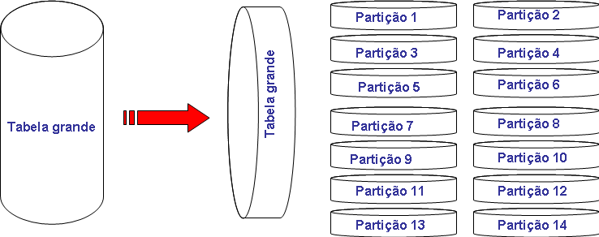

---
date: 19 de maio de 2014
tipo_artigo: Artigo técnico de Infraestrutura de TIC
title: 'Boas práticas para particionamento de estruturas no Oracle 11g'
abstract: 'Neste artigo será abordado um conjunto de boas práticas para o particionamento de tabelas e índices no Oracle 11g. Também serão abordadas as diversas técnicas e extensões do particionamento, algumas exclusivas do Oracle 11g, e seus respectivos cenários de aplicação.'
author:
- affiliation: DEQI/DIMC
  name: Tiago Marra
responsibility:
- affiliation: DEQI/DIMC
  name: Luiz Gomes
diretoria: 'Diretoria de Infraestrutura de TIC - DIT'
superintendencia: 'Superintendência de Planejamento e Suporte de TIC - SUPS'
departamento: 'Departamento de Qualidade da Infraestrutura de TIC - DEQI'
tags:
- SGBD Oracle 
- Particionamento 
- Desempenho 
- Performance
- Otimização
...

Desafios
========

Consolidar e descrever as boas práticas atuais do particionamento para o SGBD Oracle bem como analisar e detalhar as diferentes técnicas de particionamento disponíveis.

Benefícios e/ou recomendações
=============================

Este artigo poderá ser utilizado como um guia ou referência rápida para o particionamento ou reparticionamento de estruturas no Oracle 11g.


Introdução
==========

O particionamento de estruturas (tabelas e índices) no Oracle é uma funcionalidade que vem evoluindo desde o Oracle 8.0 (lançado em 1997). Seguindo o princípio de dividir e conquistar, esta técnica consiste em dividir grandes tabelas ou índices em partições menores. O particionamento é transparente para o usuário e aplicação, mantendo uma visão lógica unificada dos dados.



Pré Requisitos para utilizar o particionamento no Oracle 11g

- Banco de dados Oracle Enterprise Edition;
- Licença Oracle Partitioning (ela não vem junto com o banco de dados);
- A funcionalidade Oracle Partitioning deve estar ativada.


Verificando se um banco de dados Oracle possui o particionamento ativado

Caso a query abaixo retorne 'TRUE', o particionamento está ativado:

```sql
SQL> SELECT * FROM v$option WHERE parameter='Partitioning';
```


Alguns exemplos de quando particionar

- Tabelas
    - Estruturas acima de 2 GB já devem ser consideradas candidatas ao particionamento. 
    - Tabelas que sejam propensas a grande crescimento. 
    - Tabelas que possuam dados históricos que sejam pouco acessados ou não possam ser alterados.  
    - Quando o conteúdo da tabela precisa ser distribuído entre diferentes storages. 

- Índices:
    - Quando operações de manutenção, como reconstrução do índice (rebuild), levam muito tempo para serem concluídas e por isso torna-se necessário executar estas operações em apenas partes dos dados do índice sem indisponibilizar ou precisar tratar a estrutura inteira, economizando tempo e recursos.                 


Vantagens
==========

- **Gerenciamento**: o particionamento permite que operações de manipulação e manutenção de dados tais como cargas, criação e reconstrução de índices e backup/recovery sejam executadas no nível da partição e não na tabela inteira. Cada partição é tratada individualmente e tem suas próprias características de armazenamento, backup e etc. Isto reduz drasticamente o tempo e complexidade de tarefas administrativas.

- **Desempenho**: a performance de consultas SQL em uma tabela particionada é diretamente beneficiada. Uma vez que uma consulta SQL obtém vantagem do particionamento, somente uma ou determinadas partições da tabela serão acessadas ao invés da tabela inteira o que contribui para redução da contenção de I/O e tempos de resposta mais rápidos.

- **Disponibilidade**: o particionamento aumenta a disponibilidade. Uma vez que as partições são independentes entre si, se uma tabela ou índice são particionados, tarefas administrativas podem ser realizadas apenas na partição necessária. Além de reduzir o tempo de manutenção, as outras partições do objeto permanecerão disponíveis (online), enquanto somente a partição que necessita da intervenção permanecerá indisponível (offline).

- **Redução de custos**: o particionamento pode reduzir drasticamente o custo total da propriedade dos dados. Com uma abordagem de “arquivamento em camadas”, mantém online nas camadas mais caras as informações importantes e mais acessadas e as informações mais antigas, nos dispositivos de baixo custo.

Particionamento por Faixa e Intervalo (range/interval partitioning)
===================================================================

É útil quando os dados podem ser facilmente divididos em faixas de valores. Como por exemplo dados organizados por data. Cada partição da tabela representa sua respectiva faixa de valores, e apenas dados que atendam a esses valores poderão ser inseridos dentro daquela específica partição. Particionamento por Intervalo é uma extensão do particionamento por Faixa, introduzida no Oracle 11g, no qual a partir de um determinado ponto as partições são criadas automaticamente e definidas por este intervalo conforme novos dados são inseridos na tabela.

O script abaixo cria uma tabela de vendas para o período de dois anos, 2005 e 2006, com oito partições e os meses distribuídos de forma trimestral entre essas partições. Os dados são distribuídos usando como chave do particionamento a coluna s_salesdate. Partições futuras são criadas automaticamente utilizando um intervalo mensal.

Exemplo 1:

\setstretch{1}

```sql
CREATE TABLE salestable
  (s_productid  NUMBER,
   s_saledate   DATE,
   s_custid     NUMBER,
   s_totalprice NUMBER)
PARTITION BY RANGE(s_saledate)   /*Campo chave do particionamento.*/

INTERVAL(NUMTOYMINTERVAL(1,'MONTH'))  /*Definição de como serão os 
intervalos de futuras partições. */

STORE IN (tbs1,tbs2,tbs3,tbs4) /*Futuras partições serão armazenadas 
nestas tablespaces especificadas, de maneira circular.*/

(PARTITION sal05q1 
 VALUES LESS THAN (TO_DATE('01-APR-2005', 'DD-MON-YYYY'))
 TABLESPACE tbs1,   /*Esta partição só aceita registros 
 anteriores a 01/04/2005 e será armazenada na tablespace tbs1.*/

  PARTITION sal05q2 
  VALUES LESS THAN (TO_DATE('01-JUL-2005','DD-MON-YYYY'))
  TABLESPACE tbs2,   /*Esta partição só aceita registros 
  anteriores a 01/07/2005 e será armazenada na tablespace tbs2.*/

  PARTITION sal05q3 
  VALUES LESS THAN (TO_DATE('01-OCT-2005', 'DD-MON-YYYY'))
   TABLESPACE tbs3,

  PARTITION sal05q4 
  VALUES LESS THAN (TO_DATE('01-JAN-2006', 'DD-MON-YYYY'))
   TABLESPACE tbs4,

  PARTITION sal06q1 
  VALUES LESS THAN (TO_DATE('01-APR-2006', 'DD-MON-YYYY'))
  TABLESPACE tbs1,

  PARTITION sal06q2 
  VALUES LESS THAN (TO_DATE('01-JUL-2006', 'DD-MON-YYYY'))
  TABLESPACE tbs2,

  PARTITION sal06q3 
  VALUES LESS THAN (TO_DATE('01-OCT-2006', 'DD-MON-YYYY'))
  TABLESPACE tbs3,

  PARTITION sal06q4 
  VALUES LESS THAN (TO_DATE('01-JAN-2007', 'DD-MON-YYYY'))
  TABLESPACE tbs4);
```
\setstretch{1.5}

Particionamento por Hash (hash partitioning)
============================================

Algumas vezes não é óbvio em qual partição os dados devem residir, embora a chave de particionamento possa ser identificada. Ao contrário de agrupar dados similares, pode ser desejável distribuir esses dados de maneira uniforme mas que não correspondam a uma regra de negócio. No particionamento por Hash, uma linha da tabela é alocada em determinada partição baseada no resultado de um algoritmo de hash que tem como parâmetro a chave do particionamento. Este método é utilizado quando a intenção é distribuir os dados randomicamente e balanceadamente entre as partições, o que pode melhorar a performance evitando gargalos de I/O.

Para distribuir os dados de maneira otimizada no particionamento por Hash, a chave do particionamento, deve ser uma coluna ou combinações de colunas que são únicas (unique) ou quase únicas. Uma chave primária é sempre uma boa escolha. Também é importante definir um número par de partições como por exemplo: 2,4,8 e etc.

No particionamento por Hash, apenas predicados de igualdade ou que utilizam IN na cláusula WHERE, tiram proveito do sistema de particionamento. Ou seja, queries que não contenham estes predicados com a chave do particionamento vão percorrer todas partições da tabela sempre.  

No exemplo abaixo, é criada uma tabela de vendas com quatro partições do tipo hash utilizando o id do produto como chave do particionamento. Consultas que acessarem esta tabela em busca de um único produto (WHERE s_productid = 1) ou uma listagem de produto (WHERE s_productid IN (1,2,3,4,5,6)), acessarão somente as partições necessárias para recuperar as informações requisitadas pela consulta.

Exemplo 2:

\setstretch{1}

```sql
CREATE TABLE sales_hash
  (s_productid  NUMBER,
   s_saledate   DATE,
   s_custid     NUMBER,
   s_totalprice NUMBER)

PARTITION BY HASH(s_productid) /* Definição do campo chave 
do particionamento por Hash. */ 
( PARTITION p1 TABLESPACE tbs1
, PARTITION p2 TABLESPACE tbs2
, PARTITION p3 TABLESPACE tbs3
, PARTITION p4 TABLESPACE tbs4);
```
\setstretch{1.5}

Particionamento por Lista (list partitioning)
=============================================

Devemos utilizar o particionamento por Lista quando temos um conjunto bem definido de valores pelos quais podemos mapear os dados em partições da tabela. No exemplo abaixo, todos os clientes dos estados de Oregon e Washington são armazenados em uma partição e os clientes de outros estados são armazenados em partições diferentes. Consultas que utilizem como filtro a região, acessarão somente a partição ou as partições necessárias obtendo assim um ganho na performance.

Exemplo 3:

\setstretch{1}

```sql
CREATE TABLE accounts
( id             NUMBER
, account_number NUMBER
, customer_id    NUMBER
, branch_id      NUMBER
, region         VARCHAR(2)
, status         VARCHAR2(1)
)

PARTITION BY LIST (region) /* Definição do campo chave do particionamento 
por Lista. */
( PARTITION p_northwest VALUES ('OR', 'WA')
, PARTITION p_southwest VALUES ('AZ', 'UT', 'NM')
, PARTITION p_northeast VALUES ('NY', 'VM', 'NJ')
, PARTITION p_southeast VALUES ('FL', 'GA')
, PARTITION p_northcentral VALUES ('SD', 'WI')
, PARTITION p_southcentral VALUES ('OK', 'TX'));
```
\setstretch{1.5}

Diferente do particionamento por Faixa e Hash, para o particionamento do tipo Lista não é suportado mais de uma coluna como chave do particionamento. Se uma tabela é particionada utilizado o método de lista, a chave do particionamento só pode consistir em apenas uma única coluna.

Particionamento Composto (composite partitioning)
=================================================

Particionamento composto permite obter benefícios do particionamento em duas dimensões, combinando diferentes técnicas de particionamento. Primeiro, a tabela é particionada pelo primeiro método de distribuição de dados e depois cada partição é subdividida em subpartições, utilizando um segundo método de distribuição de dados. Todas as subpartições juntas, de determinada partição, representam um subconjunto lógico dos dados. Por exemplo, uma tabela particionada pelo método composto faixa-hash, primeiro é particionada por faixa e depois cada partição individual é subparticionada utilizando a técnica de particionamento hash.

As técnicas de particionamento composto disponíveis são:

- Particionamento por Faixa-Hash
- Particionamento por Faixa-Lista
- Particionamento por Faixa-Faixa
- Particionamento por Lista-Hash
- Particionamento por Lista-Lista
- Particionamento por Lista-Faixa
- Particionamento por Hash-Hash (somente disponível no Oracle 11g release 2)

O script abaixo cria uma tabela que armazena doações em diferentes moedas. A tabela é particionada seguindo o método de particionamento composto Lista-Faixa. As doações primeiramente são particionadas pelo método Lista, utilizando o campo moeda (currency) como chave do particionamento e depois são categorizadas e subparticionadas por faixas em small, medium e high dependendo do montante e utilizando o campo amount como chave do subparticionamento.

Exemplo 4:

\setstretch{1}

```sql
CREATE TABLE donations
( id             NUMBER
, name           VARCHAR2(60)
, beneficiary    VARCHAR2(80)
, payment_method VARCHAR2(30)
, currency       VARCHAR2(3)
, amount         NUMBER
) PARTITION BY LIST (currency)

SUBPARTITION BY RANGE (amount)
( PARTITION p_eur VALUES ('EUR')
  ( SUBPARTITION p_eur_small VALUES LESS THAN (8)
  , SUBPARTITION p_eur_medium VALUES LESS THAN (80)
  , SUBPARTITION p_eur_high VALUES LESS THAN (MAXVALUE)
  )

, PARTITION p_gbp VALUES ('GBP')
  ( SUBPARTITION p_gbp_small VALUES LESS THAN (5)
  , SUBPARTITION p_gbp_medium VALUES LESS THAN (50)
  , SUBPARTITION p_gbp_high VALUES LESS THAN (MAXVALUE)
  )

, PARTITION p_aud_nzd_chf VALUES ('AUD','NZD','CHF')
  ( SUBPARTITION p_aud_nzd_chf_small VALUES LESS THAN (12)
  , SUBPARTITION p_aud_nzd_chf_medium VALUES LESS THAN (120)
  , SUBPARTITION p_aud_nzd_chf_high VALUES LESS THAN (MAXVALUE)
  )

, PARTITION p_jpy VALUES ('JPY')
  ( SUBPARTITION p_jpy_small VALUES LESS THAN (1200)
  , SUBPARTITION p_jpy_medium VALUES LESS THAN (12000)
  , SUBPARTITION p_jpy_high VALUES LESS THAN (MAXVALUE)
  )

, PARTITION p_inr VALUES ('INR')
  ( SUBPARTITION p_inr_small VALUES LESS THAN (400)
  , SUBPARTITION p_inr_medium VALUES LESS THAN (4000)
  , SUBPARTITION p_inr_high VALUES LESS THAN (MAXVALUE)
  )

, PARTITION p_zar VALUES ('ZAR')
  ( SUBPARTITION p_zar_small VALUES LESS THAN (70)
  , SUBPARTITION p_zar_medium VALUES LESS THAN (700)
  , SUBPARTITION p_zar_high VALUES LESS THAN (MAXVALUE)
  )

, PARTITION p_default VALUES (DEFAULT)
  ( SUBPARTITION p_default_small VALUES LESS THAN (10)
  , SUBPARTITION p_default_medium VALUES LESS THAN (100)
  , SUBPARTITION p_default_high VALUES LESS THAN (MAXVALUE)
  )
) ENABLE ROW MOVEMENT;
```

\setstretch{1.5}

A funcionalidade ROW MOVEMENT foi habilitada ao final do script. Ela especifica se o banco de dados pode ou não movimentar uma ou mais linhas (registros) entre as diferentes partições da tabela. A necessidade do ROW MOVEMENT geralmente é ocasionada por uma alteração (update) no valor do campo chave do particionamento. Este recurso deve ser utilizado com cuidado pois, caso habilitado, tem impacto direto na performance uma vez que executa operações adicionais de inserção e exclusão de dados.

Abaixo segue um exemplo de um erro ocasionado por uma atualização no campo chave do particionamento com a funcionalidade ROW MOVEMENT desabilitada:

\setstretch{1}

```sql
ERROR at line 1:
ORA-14402: updating partition key column would cause a partition change

Sintaxe para habilitar o ROW MOVEMENT:
SQL> ALTER TABLE <table_name> ENABLE ROW MOVEMENT;
```
\setstretch{1.5}

Extensões de particionamento no Oracle 11g
===========================================

Além do particionamento por Intervalo, já abordado anteriormente neste artigo, duas outras novas extensões do particionamento merecem destaque:

Particionamento REF
-------------------

O Oracle Database 11g permite particionar uma tabela aproveitando um relacionamento pai-filho existente. A estratégia de particionamento da tabela pai é herdada pela tabela filho sem a necessidade de armazenar as colunas de chave de particionamento da tabela pai na tabela filho. Sem o Particionamento REF seria necessário duplicar todas as colunas de chave de particionamento da tabela pai para a tabela filho para poder aproveitar a mesma estratégia de particionamento. O Particionamento REF permite particionar naturalmente as tabelas conforme o modelo de dados lógicos sem necessidade de armazenar as colunas de chave de particionamento, reduzindo assim a sobrecarga manual de desnormalização e economizando espaço.

Exemplo 5:

\setstretch{1}

```sql
/* Definição da tabela pai. */

CREATE TABLE orders (
   order_id    NUMBER PRIMARY KEY,
   order_date  DATE NOT NULL, / * Coluna chave do particionamento 
da tabela pai.*/
   customer_id NUMBER NOT NULL,
   shipper_id  NUMBER)

 PARTITION BY RANGE (order_date) /*Particionamento por Faixa pelo
 campo order_date. */
 (PARTITION y1 VALUES LESS THAN (TO_DATE('01-JAN-2006', 'DD-MON-YYYY')),

   PARTITION y2 VALUES LESS THAN (TO_DATE('01-JAN-2007', 'DD-MON-YYYY')),

   PARTITION y3 VALUES LESS THAN (TO_DATE('01-JAN-2008', 'DD-MON-YYYY')));

/* Definição da tabela filho */
 CREATE TABLE order_items (
   order_id    NUMBER NOT NULL,
   product_id  NUMBER NOT NULL,
   price       NUMBER,
   quantity    NUMBER,
   CONSTRAINT order_items_fk FOREIGN KEY (order_id) REFERENCES orders)

 PARTITION BY REFERENCE (order_items_fk);     /* Definição do
particionamento por referência da tabela pai para a tabela filho,
utilizando a constraint de fk como parâmetro. */
```

\setstretch{1.5}

Graças ao particionamento por referência, não é necessário duplicar a coluna order_date na tabela filho (order_items) para que a mesma estratégia de particionamento seja aproveitada da tabela pai.

Particionamento baseado em coluna virtual
------------------------------------------

Nas versões anteriores do Oracle, só era possível particionar uma tabela se a chave de particionamento existisse fisicamente na tabela. A utilização de colunas virtuais, remove essa restrição e permite que a chave de particionamento seja definida por uma expressão, utilizando uma ou mais colunas existentes na tabela, e armazenando a expressão apenas como metadados. Não é incomum ver colunas sendo sobrecarregadas com informações, por exemplo, um ID de conta de 10 dígitos pode incluir informações da agência da conta nos três primeiros dígitos. A tabela
CONTAS contendo uma coluna ID_CONTA pode ser estendida com uma coluna virtual (derivada) AGENCIA_CONTA obtida a partir dos três primeiros dígitos da coluna ID_CONTA, que se torna a chave de particionamento dessa tabela. O Particionamento baseado em coluna virtual é suportado em todas as estratégias básicas de particionamento.

O exemplo abaixo, cria a tabela Users que é particionada pelo método lista utilizando como chave do particionamento uma coluna virtual (first_letter) derivada da primeira letra do campo do nome do usuário (username):

Exemplo 6:

\setstretch{1}

```sql
CREATE TABLE users (
  id           NUMBER,
  username     VARCHAR2(20),
  first_letter VARCHAR2(1)     /* Coluna virtual, gerada a partir da
primeira letra do campo username. */
    GENERATED ALWAYS AS
      (
        UPPER(SUBSTR(TRIM(username), 1, 1))
      ) VIRTUAL
)

PARTITION BY LIST (first_letter)   /* A coluna virtual gerada é
utilizada como chave do particionamento por lista. */
(
  PARTITION part_a_g VALUES ('A','B','C','D','E','F','G'),
  PARTITION part_h_n VALUES ('H','I','J','K','L','M','N'),
  PARTITION part_o_u VALUES ('O','P','Q','R','S','T','U'),
  PARTITION part_v_z VALUES ('V','W','X','Y','Z')
);
```

\setstretch{1.5}

Comandos SQL a serem evitados
==============================

Existem diversos casos em que o otimizador não consegue obter vantagem do sistema de particionamento da tabela. Um dos mais comuns é quando existe uma função em cima de uma coluna chave do particionamento. Tomando como exemplo o particionamento por Hash, método bastante utilizado atualmente na Dataprev, será mostrado abaixo alguns comandos SQL que ignoram o particionamento, degradando a performance da consulta.

A tabela auditorias é particionada pelo método Hash em 16 partições e utiliza o campo id_pessoa_fisica como chave do particionamento.

Para as duas consultas abaixo, como o particionamento é por *Hash* e nenhuma delas utiliza operador de igualdade (=) ou IN no predicado, o particionamento é ignorado pelo Oracle ocasionando degradação da performance:

\setstretch{1}

```sql
SQL> SELECT pf.id_pessoa_fisica
           FROM auditorias_pf pf
           WHERE pf.id_pessoa_fisica BETWEEN 1 AND 3;

SQL> SELECT pf.id_pessoa_fisica
           FROM auditorias_pf pf
           WHERE pf.id_pessoa_fisica >= 2;
```

\setstretch{1.5}

A consulta abaixo, ilustra outro caso em que o particionamento é ignorado. Agora, independente do tipo do particionamento:

\setstretch{1}

```sql
SQL> SELECT pf.id_pessoa_fisica
           FROM auditorias_pf pf
           WHERE TO_CHAR(pf.id_pessoa_fisica) = 2;
```

\setstretch{1.5}

Em linhas gerais, não se deve utilizar funções implícitas ou explícitas em colunas particionadas. Se suas consultas utilizam chamadas a funções deste tipo, considere utilizar um particionamento baseado em coluna virtual para melhor performance.

Particionando dados do tipo LOB
================================

Dados não estruturados, como imagens e documentos, que são armazenados em colunas do tipo LOB, também podem ser particionados. Quando uma tabela é particionada, os dados residem nas tablespaces de suas respectivas partições. As colunas do tipo LOB, podem ser armazenadas em uma tablespace própria. Esta técnica é bastante útil pois permite que dados do tipo LOB sejam armazenados separadamente dos dados principais. Isto é benéfico se esses dados principais sofrem bastante atualizações
mas os dados LOB não. Por exemplo, o registro de um empregado pode conter uma foto, que é improvável que mude com muita frequência. Entretanto, os dados pessoais do empregado, como endereço, departamento, gerente e etc, podem ser alterados com certa frequência. Esta abordagem também significa que dispositivos de armazenamentos mais baratos podem ser utilizados para abrigar os dados LOB e dispositivos mais rápidos e caros podem ser utilizados para armazenar o restante dos dados do empregado.

Estatísticas incrementais para objetos particionados
=====================================================

Tabelas são particionadas, normalmente, por serem muito grandes. Gerar estatísticas globais para objetos extensos é uma tarefa demorada. Estatísticas globais são as mais importantes mas também são as que levam mais tempo para serem coletadas porque para isso é necessário um full table scan. Entretanto, no Oracle 11g este problema foi resolvido com a introdução de estatísticas globais incrementais. Este recurso, permite que novas estatísticas sejam geradas apenas para novas partições da
tabela. É recomendado habilitar a coleta incremental quando os dados são inseridos em novas partições e as partições antigas permanecem estáticas ou são pouco alteradas. Para utilização das estatísticas incrementais, as seguintes condições devem ser verdadeiras:

-    O valor do parâmetro 'INCREMENTAL' da tabela particionada deve estar configurado para 'TRUE'. (O default é 'FALSE'). 
-    O valor do parâmetro 'PUBLISH' da tabela deve estar configurado para 'TRUE'. (O default é 'TRUE').
-    A coleta de estatísticas da tabela deve ser feita com o valor 'AUTO_SAMPLE_SIZE' para o parâmetro 'ESTIMATE_PERCENT'. (O default é 'AUTO_SAMPLE_SIZE').
-    A coleta de estatísticas da tabela deve ser feita com o valor 'AUTO' para o parâmetro 'GRANULARITY'. (O default é 'AUTO').

Para descobrir os valores atuais da tabela para os parâmetros 'INCREMENTAL' e 'PUBLISH', utilize as queries abaixo:

\setstretch{1}

```sql
SQL> SELECT DBMS_STATS.GET_PREFS('INCREMENTAL','<schema_name>'
   ,'<table_name>') FROM dual;

SQL> SELECT DBMS_STATS.GET_PREFS('PUBLISH','<schema_name>'
   ,'<table_name>') FROM dual;
```

\setstretch{1.5}

Os comandos abaixo, configuram os parâmetros 'INCREMENTAL' e 'PUBLISH' conforme os requisitos:

\setstretch{1}

```sql
SQL> EXEC DBMS_STATS.SET_TABLE_PREFS ('<schema_name>','<table_name>',
    'INCREMENTAL','TRUE');

SQL> EXEC DBMS_STATS.SET_TABLE_PREFS ('<schema_name>','<table_name>',
     'PUBLISH','TRUE');
```

\setstretch{1.5}

Se os valores padrões dos parâmetos 'ESTIMATE_PERCENT' e 'GRANULARITY' foram alterados, utilize os comandos abaixo:

\setstretch{1}

```sql
SQL> EXEC dbms_stats.set_table_prefs('<schema_name>','<table_name>',
     'GRANULARITY','AUTO');

SQL> EXEC dbms_stats.set_table_prefs('<schema_name>','<table_name>',
     'ESTIMATE_PERCENT',DBMS_STATS.AUTO_SAMPLE_SIZE);
```

\setstretch{1.5}

Feito isso, ao contrário de percorrer toda a tabela como antes, o Oracle gerará novas estatísticas apenas para novas partições e atualizará as estatísticas globais da tabela apenas com os dados das partições afetadas.

Supervisor de Partição (Partition Advisor)
==========================================

A partir do Oracle Database 11g release 2, o SQL Access Advisor foi aprimorado para gerar recomendações de particionamento baseado na análise de desempenho de consultas SQL. Com essa extensão, os clientes podem receber recomendações específicas para um particionamento mais eficiente e observar os possíveis ganhos na performance caso as orientações sejam implementadas.

O supervisor de partição pode ser acessado a partir do Enterprise Manager:

Instância do banco de dados > Advisor Central > Supervisores de SQL > Supervisor de Acesso SQL

Particionamento de índices
===========================

Tabelas particionadas, como qualquer outra tabela, podem ser indexadas para melhor desempenho. É possível indexar a tabela inteira (índice global) e indexar as partições (índice local). Ao criar um índice global, deve-se escolher entre criar um índice particionado global ou um índice não particionado global.

- Índices Locais: são índices criados em cada partição da tabela. Este índice é particionado seguindo os mesmos critérios de particionamento da tabela. Não é possível adicionar ou remover partições neste índice. As partições do índice são criadas ou removidas automaticamente conforme novas partições são inseridas ou removidas da tabela. Um índice local não precisa incluir a chave do particionamento na lista de colunas indexadas. Por serem mais fáceis de administrar, índices locais são comumente utilizados em ambientes de data warehouse (OLAP).

- Índices Não Particionados Globais: é um índice que abrange a tabela inteira. É o índice comum utilizado em tabelas não particionadas. Em um índice não particionado global, manutenção e disponibilidade são sacrificadas em nome da performance transacional. Por este motivo, este tipo de índice tende a ser mais utilizado por aplicações OLTP.

- Índices Particionados Globais: assim como um índice não particionado global, um índice global abrange a tabela inteira mas são particionados utilizando outros métodos e chaves de particionamento diferentes dos da tabela a que pertencem. Índices globais só podem ser particionados pelos métodos de faixa ou hash. Por exemplo, uma tabela pode estar particionada pelo método lista e ter um índice global particionado por faixa.

Abaixo seguem algumas regras gerais para auxiliar na escolha de um índice

1. Se a chave do particionamento da tabela é um subconjunto dos campos do índice, o índice local é recomendado. Se este não é o caso, verifique se a regra 2 se aplica.

2. Se o índice é unique e não contém a chave de particionamento da tabela, o índice global é recomendado. Se este não é o caso, verifique se a regra 3 se aplica.

3. Se a prioridade é facilidade e eficiência na manutenção do índice, o índice local é recomendado. Se este não é o caso, verifique se a regra 4 se aplica.

4. Se a aplicação é OLTP e os usuários necessitam de um tempo de resposta rápido, um índice global é recomendado. Se o ambiente é OLAP e os usuários estão mais interessados em resultados analíticos, um índice local é recomendado.

Manutenção de índices em tabelas particionadas
-----------------------------------------------

Por default, as operações abaixo realizadas em partições de tabelas deixam automaticamente seus respectivos índices inutilizáveis (UNUSABLE):

\setstretch{1}

```sql
ADD (HASH)
COALESCE (HASH)
DROP
EXCHANGE
MERGE
MOVE
SPLIT
TRUNCATE
```

\setstretch{1.5}

Índices precisam ser reconstruídos (rebuild) toda vez que as atividades de redefinição de dados acima são executadas na tabela pai. Estes índices podem ser mantidos colocando a cláusula UPDATE INDEXES ao final das operações SQL.

Exemplo:

```sql
SQL> ALTER TABLE <table_name> <partition_specification> UPDATE INDEXES
```

Duas vantagens na atualização automática de índices:

- O índice é atualizado com a operação na tabela pai, dessa forma não é necessário que seja reconstruído depois da operação DDL na tabela.

- O índice permanece disponível e online durante a operação, não afetando aplicações.

Algumas considerações ao utilizar atualização automática de índices (UPDATE_INDEXES):

- Operações de DDL na partição levarão mais tempo porque índices antes marcados como UNUSABLE serão atualizados. É recomendado utilizar a atualização automática de índices quando o tamanho da partição é menos que 5% do tamanho da tabela.

- Operações como DROP, TRUNCATE e EXCHANGE não serão tão rápidas como antes, é recomendado fazer uma medição dos tempos da operação DDL com a atualização automática dos índices contra o tempo de rebuild manual de todos os índices da tabela após uma alteração.

Conclusão
=========

**Desafios e decisões importantes ao iniciar um particionamento**.

Não há uma receita de bolo para definir estratégias de particionamento. Tudo dependerá do ambiente e do negócio. Um sistema de particionamento bem implementado melhora significativamente a performance do banco de dados, simplifica e agiliza tarefas administrativas e aumenta a disponibilidade de ambientes críticos. Seguem abaixo os principais pontos que devem ser levados em conta ao iniciar um processo de particionamento:

- Custo da licença opcional do particionamento (por processador)
- Definição do número de partições 
- Definição da chave do particionamento e se esta será composta por uma ou várias colunas
- Escolha do tipo de particionamento (lista, hash, faixa, composto e etc) 
- Quais tabelas particionar
- Utilizar tabelas particionadas com índices particionados ou não particionados
- Quais consultas ou operações são realizadas na tabela a ser particionada 
- Como e com que frequência é feita a carga ou expurgo de dados da tabela 

Referências
===========

[http://docs.oracle.com/cd/E11882_01/server.112/e25523/partition.htm](http://docs.oracle.com/cd/E11882_01/server.112/e25523/partition.htm)

[http://docs.oracle.com/cd/E11882_01/server.112/e25523/partition.htm#CACFECJC] (http://docs.oracle.com/cd/E11882_01/server.112/e25523/partition.htm#CACFECJC)

[http://docs.oracle.com/cd/E11882_01/server.112/e25523/partition.htm#BABCIFJI] (http://docs.oracle.com/cd/E11882_01/server.112/e25523/partition.htm#BABCIFJI)

[http://docs.oracle.com/cd/E11882_01/server.112/e25523/partition.htm#CACJFBEB] (http://docs.oracle.com/cd/E11882_01/server.112/e25523/partition.htm#CACJFBEB)

[http://docs.oracle.com/cd/E11882_01/server.112/e25523/partition.htm#i460833] (http://docs.oracle.com/cd/E11882_01/server.112/e25523/partition.htm#i460833)

[http://docs.oracle.com/cd/E11882_01/server.112/e25523/partition.htm#BABJIGAI] (http://docs.oracle.com/cd/E11882_01/server.112/e25523/partition.htm#BABJIGAI)

Baer, Hermman. Partitioning in Oracle Database 11g. Disponível em: <(http://www.oracle.com/technetwork/database/enterprise-edition/partitioning-11g-whitepaper-159443.pdf)>. Acesso em: maio 2014.

[http://docs.oracle.com/cd/E11882_01/server.112/e16541/part_avail.htm#CACGFIGJ] (http://docs.oracle.com/cd/E11882_01/server.112/e16541/part_avail.htm#CACGFIGJ)

[http://docs.oracle.com/cd/E11882_01/server.112/e16541/part_avail.htm#CACHHFHH] (http://docs.oracle.com/cd/E11882_01/server.112/e16541/part_avail.htm#CACHHFHH)

[https://support.oracle.com/epmos/faces/DocumentDisplay?_afrLoop=806953551049286&id=1319225.1&_afrWindowMode=0&_adf.ctrl-state=2kgju6bhd_173] (https://support.oracle.com/epmos/faces/DocumentDisplay?_afrLoop=806953551049286&id=1319225.1&_afrWindowMode=0&_adf.ctrl-state=2kgju6bhd_173)


