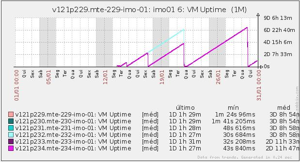

 
Introdução
==========
 
O item 3.06 do Plano de Ação 2014 foi proposto como uma iniciativa de melhora da disponibilidade dos principais sistemas mantidos pela Dataprev. Seu teor consiste na padronização e implementação da estratégia de replicação de sessões web como forma de tornar transparente para usuários finais eventuais indisponibilidades nos servidores de aplicação dos sistemas contemplados pela solução.

Nesse contexto, neste artigo são abordados diferentes tópicos associados com a implementação de uma solução de replicação de sessões web para os sistemas IMO e SD, foco da tarefa 3.06.01.04. São discutidas características, benefícios, restrições e limitações da solução, assim como requisitos e recomendações para as aplicações e ambiente de execução para que a solução funcione bem e da melhor maneira possível.
 
Desafios
========
 
Para compreender os problemas e desafios em torno da habilitação de um serviço de replicação de sessões sobre aplicações como IMO e SD, antes é preciso fazer uma breve revisão sobre arquiteturas modernas de aplicações web de larga escala.

Arquitetura de aplicações web modernas de larga escala
------------------------------------------------------------------

Um dos principais artifícios usados para se projetar aplicações web de larga escala consiste na disponibilização de réplicas de cada um dos elementos da solução. Essa arquitetura de elementos redundantes visa manter o oferecimento do serviço dentro dos limites estipulados (SLAs^[Service Level Agreements]) ao mesmo tempo em que potencialmente aumenta-se a disponibilidade do serviço. Ou seja, elementos redundantes significam mais recursos computacionais para atender mais demanda dentro dos mesmos níveis de serviço. Ao mesmo tempo, viabilizam o aumento da disponibilidade do serviço, uma vez que réplicas podem atender de forma momentânea a carga extra desviada de alguma outra réplica que, por algum motivo, parou de funcionar. Via de regra, cada elemento envolvido no oferecimento do serviço deve possuir algum tipo de redundância (a menos que seja possível continuar oferecendo o serviço sem ele). O objetivo é que não existam pontos únicos de falha dentro da arquitetura da solução.

Os elementos que compõem a solução arquitetural final podem ser divididos em dois tipos: aqueles que não possuem estado associado ao oferecimento do seu serviço (elementos stateless), e aqueles que possuem algum tipo de estado associado ao oferecimento de seu serviço (elementos stateful). Um exemplo de elemento arquitetural normalmente stateless são as réplicas da camada de negócio de uma aplicação web^[Na prática, é possível que camadas de negócio sejam implementadas de forma stateful, não há restrições sobre isso. A afirmação do texto refere-se às práticas e ao histórico da Dataprev quanto  ao projeto de aplicações.]. A cada chamada recebida nessa camada, algum trabalho é executado e o resultado retornado. Cada requisição é independente das demais. Por outro lado, o melhor exemplo de um elemento arquitetural normalmente stateful são as réplicas da camada de apresentação^[Mais uma vez o texto refere-se às práticas e ao histórico da Dataprev no projeto de aplicações. É possível que camadas de apresentação sejam construídas de forma stateless, apesar disso não ser comum na Dataprev.]. Se nessa camada for feito uso de tecnologias stateful, ou caso os desenvolvedores utilizem o artifício da sessão web para guardar informações, então requisições futuras que chegarem nessa camada provavelmente dependerão de dados armazenados na sessão web em requisições anteriores. Essas novas requisições apresentarão algum tipo de falha caso não encontrem o estado que esperam.

Tolerância a falhas
----------------------

Tolerância a falhas é um termo amplo. Assim, vamos focar em como a aplicação como um todo se comporta quando réplicas de seus elementos, por algum motivo, falham. Vamos discutir isso no contexto dos dois tipos de elementos discutidos anteriormente: os stateless e os stateful.

Quando uma réplica de algum elemento stateless falha não é um grande problema. Basta detectar que houve uma falha, de alguma forma encaminhar a carga que normalmente iria para aquela réplica para outras réplicas ainda disponíveis, restaurar a réplica falha e rebalancear as requisições mais uma vez. Como não existe estado nesse tipo de elemento, do ponto de vista do cliente que invoca um serviço stateless, não faz diferença qual réplica irá atender sua chamada. Na verdade, mesmo que nenhuma réplica chegue a falhar, é possível que cada uma das requisições de um mesmo cliente seja encaminhada para réplicas aleatórias, sem prejuízo ao resultado final.

O problema torna-se mais complicado quando um elemento stateful falha, tornando-se indisponível. Nesse caso, todo um estado de conversação foi criado e evoluído ao longo das requisições que chegavam ao componente stateful a partir de um(a) mesmo cliente/origem. Se o componente stateful falha, novas requisições passam a ser encaminhadas para outras réplicas do mesmo componente que ainda estão disponíveis. Porém, o estado que existia anteriormente, e que será necessário pelas requisições futuras, não existe na nova réplica, por que ele se perdeu quando a réplica original parou de funcionar. Isso acontece por que, normalmente, esse estado é armazenado de forma local à replica. Por isso, as novas requisições falham.

Dessa maneira, a recuperação de elementos arquiteturais stateful envolve não apenas a detecção de falha e remanejamento de requisições entre outras réplicas ainda disponíveis. Ela envolve também a preservação de todo o estado que havia na réplica falha e sua posterior restauração nas novas réplicas antes que requisições desviadas passem a ser atendidas.

Falhas em camadas de apresentação
-------------------------------------------

Tomando-se como base as aplicações desenvolvidas pela Dataprev, camadas de apresentação são, além do foco deste trabalho, o melhor exemplo de componentes stateful em arquiteturas de aplicações web. A depender das tecnologias utilizadas e/ou das práticas de programação empregadas na criação da camada de apresentação, esta camada pode fazer uso intenso da sessão web (ou sessão http) para armazenar estado associado com as ações dos usuários no sistema. A gestão de sessões web é um serviço oferecido pelos servidores de aplicação e seu escopo, por padrão, limita-se a apenas o próprio servidor. Ou seja, toda sessão web criada num certo servidor, apenas existe e é visível naquele servidor. E esta é a causa do problema em caso de falha no servidor de aplicação onde se executa essa camada. Caso esse servidor pare de funcionar, suas sessões web tornam-se indisponíveis. Quando seu tráfego for redirecionado para outros servidores, as sessões web do servidor original não existirão nos novos servidores. A consequência mais comum disso é que usuários, logo após a falha do servidor que os atendia, deparam-se com uma tela de erro e precisam navegar de volta para a página inicial da aplicação e reiniciar seu trabalho.

Como lidar com falhas na camada de apresentação
-----------------------------------------------------------

Existem duas linhas de ações que podem ser discutidas nesse tópico. A primeira linha consiste em evitar que falhas em servidores de aplicação de camada de apresentação sejam um problema. Ou seja, falhas em servidores de aplicação de camada de apresentação são um problema justamente por causa da característica stateful normalmente presente na construção dessa camada. Além disso, o fato desse estado ser oferecido de forma local pelo servidor de aplicações também é um fator complicador. Assim, se essa camada puder ser construída de forma stateless ou se ela, desde seu projeto, for desenhada para usar algum tipo de memória compartilhada para o armazenamento de estado, então os problemas discutidos anteriormente deixam de existir.

A segunda linha consiste em encontrar soluções sobre como lidar com o problema após ele acontecer. Ou seja, se não for possível (re)escrever camadas de apresentação stateless, é preciso encontrar maneiras de tornar a falha transparente para os usuários da aplicação. Nesse caso, as soluções mais promissoras são as que utilizam a estratégia de replicação de sessões web. Essa estratégia consiste em manter cópias atualizadas de cada sessão web de cada servidor de aplicação, mas em elementos arquiteturais (processos, máquinas virtuais, máquinas físicas, redes, datacenters, etc) diferentes. Assim, caso um servidor de aplicações de camada de apresentação falhe, existe pelo menos uma cópia de segurança de suas sessões web que podem ser restauradas quando sua carga for redirecionada para outros servidores de aplicação.

Delimitação dos desafios
------------------------------

Dada a contextualização anterior, o foco desse artigo é descrever como a estratégia de replicação de sessões web pode ser usada para evitar os problemas associados com indisponibilidades nas réplicas de servidores de aplicação rodando camadas de apresentação que fazem uso de técnicas e/ou tecnologias stateful. Ainda, são discutidos os problemas e soluções envolvidos na adaptação das aplicações IMO e SD para uso de um serviço de replicação de sessões. Essa adaptação possui desafios particulares devido ao fato de que nenhuma das duas aplicações foi construída sobre características arquiteturais que favoreçam o uso de um serviço de replicações de sessões.
 
Benefícios e/ou recomendações
=============================
 
O uso de uma solução de replicação de sessões web tem o potencial de tornar transparente para usuários finais eventuais falhas que causem a indisponibilidade de servidores de aplicação rodando réplicas de camadas de apresentação.
 
Tópicos do artigo
=================
 
Ao longo desse artigo serão discutidos desde a motivação pelo uso de replicação de sessões até as recomendações pontuais feitas aos projetos IMO e SD para que estes possam fazer um uso adequado do serviço. Nas próximas seções serão apresentadas todas as análises e experimentos que levaram às recomendações finais.
 
Premissas e panorama atual da dataprev
------------------------------------------------
 
Algumas premissas podem ser assumidas neste artigo a partir dos resultados e orientações contidos na NT “Aplicações em nuvem com o Infinispan ”. Os principais pontos daquele documento que foram usados como base para o inicio deste trabalho foram:

- Uso da versão 6.2 do JBoss EAP como sendo a versão recomendada deste servidor de aplicações para uso do serviço de replicação de sessões web
- Uso do Infinispan embarcado no JBoss EAP 6.2 como middleware principal para o serviço de replicação de sessões
- Configuração das aplicações para fazer uso da replicação de sessões web
- Uso de alguma versão 2.x do JSF
- Adaptações no uso de CDI de forma a evitar referências nulas após a restauração da sessão
- O cluster de aplicações deve ser distinto do cluster de armazenamento de sessões web. Ou seja, as sessões replicadas não ficam armazenadas nos mesmos processos/servidores onde rodam as réplicas da camada de apresentação, mas sim num cluster externo dedicado para este fim
- Utilização do JBoss Data Grid para implementação do cluster dedicado ao armazenamento de sessões web replicadas 
- Uso do mod_cluster para balanceamento de carga no cluster
- Uso de algum perfil baseado nos perfis HA ou FULL-HA do JBoss EAP
- Uso de algum socket group baseado nos grupos HA-SOCKETS ou FULL-HA-SOCKETS do JBoss EAP
 
### Infraestrutura de hospedagem de aplicação ###
 
A Dataprev utiliza para a sustentação das aplicações IMO e SD, assim como para a maioria das aplicações hospedadas em seus data centers, um arranjo de infraestrutura onde um conjunto de servidores de aplicação fica permanentemente ligado à disposição dos usuários daquela aplicação. O número e a configuração desses servidores de aplicação foram estabelecidos tomando-se como base o maior workload passado conhecido para cada aplicação. Ou seja, a infraestrutura é dimensionada para suportar a maior carga normalmente aguardada para cada sistema, mesmo que essa carga aconteça apenas em curtos picos de demanda. Em situações excepcionais, existe o remanejamento de recursos entre aplicações. Por exemplo, se é sabido que em certo período do mês a demanda pelo sistema A cresce bastante enquanto que outros sistemas, nesse mesmo período, possuem demandas regulares e baixas, é comum que recursos computacionais de outros sistemas sejam remanejados temporariamente para suportar a carga do sistema A. Após esse momento de pico, os recursos voltam a ser remanejados para a distribuição original. 

O ponto mais importante sobre a forma como a Dataprev sustenta suas aplicações é que não existe, ainda, elasticidade dos recursos computacionais alocados para a operação de aplicações. Em ambientes elásticos os recursos computacionais são adicionados ou removidos em resposta imediata ao aumento ou à redução da carga sobre uma certa aplicação. Essa abordagem é extremamente eficaz tanto no quesito financeiro quanto no quesito desempenho, uma vez que apenas os recursos exatos necessários para manter o SLA do sistema estão ligados a cada momento, e esses recursos são diretamente proporcionais à demanda instantânea. 
Atualmente na Dataprev, entretanto, os recursos são alocados de forma estática tomando-se como base o maior pico previsto de carga para cada aplicação. Mesmo quando existe remanejamento de recursos isso é feito de forma antecipada à chegada da carga. Essa estratégia é mais antiga e menos eficaz que a estratégia anterior. Porém, bem mais simples de ser implementada.

Estatísticas do problema na Dataprev
--------------------------------------------

#### Incidência de falhas em ambiente de produção ####
 
Como forma de se compreender qual seria o impacto que a solução de replicação de sessões web teria sobre a saúde das aplicações IMO e SD, foi feita uma pesquisa a partir de dados coletados e disponibilizados pelo Zabbix. Mais especificamente, foram pesquisados gráficos de uptime das aplicações IMO e SD em ambiente de produção entre os meses de janeiro e julho de 2014.

O objetivo dessa pesquisa foi buscar nos gráficos de uptime um padrão que sugerisse a ocorrência do tipo de falha que poderia ser ocultado dos usuários finais pela solução de replicação de sessões web. O padrão esperado consistia em ver, numa distribuição aleatória, algumas réplicas de camada de aplicação ficando indisponíveis enquanto outras continuavam ativas.

Os gráficos coletados a partir do Zabbix são apresentados a seguir.

Antes de se prosseguir com a análise dos gráficos é importante ressaltar que nos gráficos não ficam claros os horários exatos em que os servidores de aplicação tornam-se indisponíveis. Essa informação seria particularmente importante pois eventos que acontecem fora do horário comercial não são relevantes para essa análise. Além disso, chama-se atenção aqui para o fato de que as legendas dos gráficos mencionam apenas o IMO. Entretanto, os gráficos de uptime são idênticos para IMO e SD. A provável causa disso é que os sistemas sejam implantados juntos na mesma instância de servidor de aplicação.

Isto posto, a análise dos gráficos sugere que eventos que causam a reinicialização de servidores de aplicação são frequentes. Esses eventos são ilustrados nos gráficos sempre que alguma linha toca o eixo x. Entretanto, a maior parte desses eventos atinge todos os servidores de aplicação ao mesmo tempo. Esse padrão não é compatível com a ocorrência de uma falha, mas sim com uma reinicialização premeditada. Apenas pela análise desses gráficos, entretanto, não é possível saber o motivo da reinicialização, que pode ser desde a implantação de uma nova versão das aplicações, até uma tentativa de se sanitizar as aplicações por meio de uma reinicialização completa. As indisponibilidades mostradas nos gráficos que coincidem com o padrão de falha esperado são bem menos frequentes. Um resumo das falhas conhecidas por meio dos gráficos anteriores é mostrado na Tabela [tabela-falhas].

+---------------------+-------------------------------+---------------------+
| Mês                 |    Total de reinicializações  |    Possíveis falhas |
+---------------------+-------------------------------+---------------------+
|Janeiro/2014         |              6                |         1           |
+---------------------+-------------------------------+---------------------+
|Fevereiro/2014       |              2                |         0           |
+---------------------+-------------------------------+---------------------+
|Março/2014           |             12                |         2           |
+---------------------+-------------------------------+---------------------+
|Abril/2014           |              4                |         1           |
+---------------------+-------------------------------+---------------------+
|Maio/2014            |             15                |         3           |
+---------------------+-------------------------------+---------------------+
|Junho/2014           |             10                |         0           |
+---------------------+-------------------------------+---------------------+
|Julho/2014           |              8                |         1           |
+---------------------+-------------------------------+---------------------+
|Total                |             57                |         8           |
+---------------------+-------------------------------+---------------------+
[Contabilização de quedas de servidores de produção de IMO e SD][tabela-falhas]

A análise possível sobre os dados anteriores sugere que os eventos que representam possíveis falhas de interesse deste trabalho acontecem numa frequência pequena, mas consistente. Cerca de 12% de todos os eventos que causaram reinicialização de servidores de aplicação em IMO e SD no período analisado podem vir a ser eventos que poderiam ter suas consequências ocultadas dos usuários finais pelo uso da solução de replicação de sessões web.

#### Sticky sessions como solução paliativa ####

A Dataprev faz uso do recurso de sticky sessions em seus sistemas. O uso de sticky sessions não está, a priori, diretamente relacionado com o problema/solução da falha de requisições http devido à indisponibilidade de uma réplica de servidor de aplicação de camada de apresentação. Entretanto, hoje ele é amplamente utilizado na Dataprev como forma de evitar um problema correlato. Sem o uso de sticky sessions, requisições consecutivas de um mesmo usuário seriam redirecionadas para diferentes réplicas de servidores de aplicação de camada de apresentação. A consequência disso é exatamente a mesma da falha de uma réplica de camada de apresentação: perda do estado da atividade do usuário.

Para evitar esse problema, sticky sessions fazem com que o servidor de aplicações que atendeu a primeira requisição de um usuário seja o mesmo enquanto o usuário estiver usando o sistema (ou seja, enquanto aquela sessão de conversação entre usuário e sistema estiver ativa). Assim, como todas as requisições do usuário caem sempre no mesmo servidor, elas sempre encontram a sessão web daquele usuário e as falhas não acontecem.

Sticky sessions não resolvem, entretanto, o problema discutido na Seção 2. Caso um servidor de aplicações que já está servindo um certo conjunto de usuários falhe, as requisições desses usuários serão redirecionadas para outras réplicas ainda disponíveis. Como as sessões web eram armazenadas e mantidas de forma local na réplica que falhou, o estado de todos esses usuários é perdido e eles precisam iniciar novamente seu trabalho. Dessa forma, a falha é visível para os usuários finais.

Funcionamento baixo nível da Replicação de sessões web
------------------------------------------------------

O funcionamento alto nível e os casos de uso da estratégia de replicação de sessões web já estão bem apresentados na NT “Aplicações em Nuvem com o Infinispan ”. Vamos focar aqui então em algumas minúcias do funcionamento de uma solução de replicação de sessões. Esse conhecimento sobre o funcionamento baixo nível da solução é fundamental para as orientações, recomendações e conclusões ao logo desse documento.

O gerenciamento de sessões web é uma funcionalidade padrão de qualquer servidor de aplicações. A implementação padrão desse serviço em qualquer servidor de aplicações consiste em manter em memória todas as sessões web de usuários ativos num determinado momento. Esses dados ficam na memória até que usuários façam logout na aplicação ou até que as sessões expirem devido à inatividade dos usuários. Esse gerenciamento padrão cuida apenas das sessões web abertas no próprio servidor de aplicações. Ou seja, ela funciona bem e é suficiente para aplicações pequenas e de baixa criticidade.

A estratégia de replicação de sessões web consiste numa abordagem para fazer com que sessões web abertas num certo servidor de aplicações sejam, de alguma forma, conhecidas e/ou compartilhadas entre todas as demais réplicas daquela mesma aplicação ou camada de aplicação. Sua habilitação consiste em substituir no servidor de aplicações a implementação padrão do gerenciamento de sessões web de forma local, por uma outra implementação, mais sofisticada e capaz de tornar cada sessão web criada numa sessão de escopo global no cluster de réplicas. Como se trata de uma mudança interna no servidor de aplicações, essa mudança é (quase) transparente para as aplicações (esse assunto é melhor discutido ao longo da Seção 6).

Para implementar seu serviço de replicação de sessões, o JBoss EAP 6.2 utiliza dois elementos chave: i) um Infinispan embarcado como subsistema e ii) um clustered session manager (um session manager proprietário especial para ambientes de cluster, que utiliza o Infinispan para o compartilhamento de sessões entre participantes de um cluster, ao invés de gerenciá-las de forma local). Já sabemos, de acordo com o que foi apresentado na NT “Aplicações em Nuvem com o Infinispan ”, como a replicação de sessões web do JBoss funciona sobre o Infinispan (cada sessão será replicada ou distribuída entre as réplicas dos servidores de aplicação ou armazenadas num cluster remoto / essas cópias de segurança são atualizadas à medida que as sessões originais também são / em caso de falha essas sessões são lidas de volta de alguma réplica ou storage remoto / etc...). A questão importante aqui é como isso funciona em baixo nível e o que podemos fazer com essa informação.

A sessão web de cada usuário pode ser pensada como um mapa. Assim, cada mapa (i.e. cada sessão de usuário) pode ter vários pares chave/valor. Chaves são strings e valores podem assumir tanto tipos nativos quanto objetos quaisquer. Não há limite para quantos pares chave/valor são colocados em cada sessão de usuário, nem para o tamanho dos valores. Ou seja, um valor nesse mapa pode ocupar desde alguns bytes de memória, até o infinito (ou a memória heap inteira, para ser mais preciso).

Qualquer código que execute junto com a camada de apresentação de uma aplicação web pode, potencialmente, fazer uso do espaço de memória da sessão web. Isso inclui frameworks, como o JSF, e o próprio código da aplicação. Focando-se nas aplicações Java EE produzidas pela Dataprev, que usam JSF como framework MVC, existem quatro tipos de dados que são guardados na sessão web: i) view state do JSF, ii) managed beans de sessão, iii) managed beans de request com escopo aumentado (por meio do saveState do Tomahawk ou por uma conversação do CDI), e iv) valores colocados diretamente na sessão pelo código da aplicação. Por fazer uso da memória da sessão web entenda-se a criação de pares chave/valor, a atualização de valores e a exclusão de pares chave/valor.

Dessa maneira, o trabalho do clustered session manager consiste em “observar” a adição, alteração e exclusão de chaves/valores em cada sessão de usuário. Ao perceber que algo mudou, o clustered session manager envia as informações atualizadas para o cluster remoto de backup de sessões. Eventos que modificam a sessão web locais são, portanto, os gatilhos que disparam o processo de replicação de sessões.

A heurística padrão do JBoss para detectar mudanças na sessão web é que o método setAttribute() do objeto de sessão web seja invocado, seja por quem for (i.e. de forma oculta/implícita por algum framework, ou de forma visível/explícita no próprio código da aplicação). Uma vez que o objeto que representa a sessão web é, na verdade, um wrapper criado pelo servidor de aplicações, é fácil para o JBoss tomar ciência que o método setAttribute() foi invocado e, assim, disparar o processo de replicação de sessão ao final da requisição (comportamento padrão).

Mas existem problemas quanto à heurística anterior a depender da forma como o código da aplicação e/ou frameworks foi escrito. A sessão web pode conter como valores objetos complexos, e esses objetos estão ligados ao mapa da sessão web por meio de referências naturais da linguagem java. Assim, quando um valor do tipo objeto é retornado do mapa da sessão por meio do método getAttribute(), o que é retornado de fato é uma referência para o objeto original, armazenado no mapa. Isso é um problema pois como se trata de um retorno de função do tipo referência (ou seja, não é um tipo nativo nem um clone de objeto imutável), é possível que essa referência seja modificada e, ao final da requisição, o método setAttribute() não seja invocado. Para alguns desenvolvedores essa chamada seria redundante, já que os dados em memória são atualizados por meio da referência obtida com o getAttribute(). E, de fato, é mesmo redundante, mas apenas no escopo de aplicações que não rodam em ambiente de cluster. Em situações assim, a chamada ao método setAttribute() pode não acontecer. Como essa chamada é a peça fundamental para disparar o processo de replicação de sessão, caso ela não aconteça o processo simplesmente não é disparado e as cópias da sessão web dos usuários dessa aplicação passam a não ser mais úteis por estarem desatualizadas.

Para casos em que não é possível garantir que todo o código cumpre esse contrato de sempre invocar o método setAttribute() ao final da requisição, o JBoss oferece duas outras heurísticas. Numa delas o processo será disparado caso, durante a execução de uma requisição, seja feita pelo menos uma chamada ao método setAttribute() ou caso seja feita pelo menos uma chama a um método getAttribute() cujo retorno não seja um tipo primitivo. A última heurística consiste em disparar o processo de replicação de sessão caso seja feita qualquer invocação ao método setAttribute() ou getAttribute() da sessão web.

Um outro aspecto do funcionamento da replicação de sessão refere-se ao que será, de fato, propagado para o cluster remoto de backup de sessões. A configuração padrão do JBoss é que a sessão inteira do usuário seja replicada sempre que o processo de replicação for necessário. Existe, porém, uma configuração alternativa, em que apenas os pares chave/valor modificados são propagados ao final da requisição.

Por fim, há ainda uma configuração importante sobre o funcionamento da replicação de sessão. Essa última configuração, agora do Infinispan e não do JBoss, diz de que forma os dados atualizados das sessões serão enviados para o cluster remoto. Ou seja, se esse envio vai acontecer de forma síncrona ou assíncrona, onde esta última é a configuração padrão.

Assim, temos que os pontos mais importantes sobre o funcionamento da replicação de sessões web no JBoss, e que precisam ser lembrados, são: i) gatilho que dispara o processo, ii) o momento em que o processo acontece, iii) o que é de fato é replicado, e iv) a forma como essa replicação é executada. Existem outras configurações para essa funcionalidade do JBoss, mas ajustes nelas não são comuns.

Debate e roadmap da solução
--------------------------- 

As discussões, orientações e comentários deste artigo basearam-se parcialmente na NT “Aplicações em Nuvem com o Infinispan ”, assim como em pesquisas e experimentos próprios. Para os experimentos foi criado um ambiente de testes semelhante ao descrito na NT “Aplicações em Nuvem com o Infinispan ”. As pesquisas tiveram como principal fonte de referência as documentações oficiais da Red Hat sobre o JBoss EAP 6.2 e sobre o Infinispan, assim como práticas e (anti)padrões de outras organizações quanto à implementação de soluções parecidas.

#### Uso de Sticky Sessions junto com o balanceamento de carga ####

A decisão pelo uso ou não de sticky sessions juntamente com o serviço de replicação de sessões web exige um bom conhecimento do que está acontecendo. Ou seja, os ganhos e perdas envolvidos nas diferentes combinações desses dois serviços juntos.

Os cenários possíveis de combinação destes dois serviços são: i) Replicação de sessão ligada e sticky sessions desabilitada, ii) Replicação de sessão desligada e sticky sessions habilitada, e iii) Replicação de sessão ligada e sticky sessions habilitada. As formas como essas duas estratégias trabalhariam juntas em cada um dos cenários anteriores são ilustradas a seguir.

- Cenário (i) – Replicação de sessão ligada e sticky sessions desabilita

*Um certo usuário inicia o uso de uma aplicação hipotética. A sessão web é aberta no servidor de aplicações onde a primeira requisição chegou e propagada para o backup de sessões. Como as sticky sessions estão desligadas, cada requisição futura pode cair em qualquer das réplicas ativas. À medida que uma requisição é atendida por um servidor de aplicações que não foi o servidor a atendar a última requisição, temos que a sessão precisará primeiro ser obtida a partir do backup de sessões para então a requisição poder de fato ser atendida. Ao final da requisição, a sessão é atualizada no backup. O processo se repete até o usuário finalizar seu trabalho na aplicação, potencialmente sempre restaurando a sessão web no backup remoto e a atualizando em seguida.*

- Cenário (ii) – Replicação de sessão desligada e sticky sessions habilitada

*Este é o cenário atual da Dataprev. As requisições sempre caem no mesmo servidor de aplicações.*

- Cenário (iii) – Replicação de sessão ligada e sticky sessions habilitada

*Um certo usuário inicia o uso de uma aplicação hipotética. A sessão web é aberta no servidor de aplicações onde a primeira requisição chegou e propagada para o backup de sessões. Como as sticky sessions estão ligadas, cada requisição futura cai sempre no mesmo servidor enquanto ele estiver ativo. A cada nova requisição, a sessão web é atualizada no backup remoto. A restauração da sessão apenas acontece em caso de falha desse servidor. *

Temos que o cenário 2, realidade atual da Dataprev, não possui garantias de resolver o problema descrito na Seção 2. Como discutido na Seção 4.2, em caso de falha de um servidor de aplicações não existem cópias de segurança de suas sessões web para que o trabalho dos usuários seja continuado em outras réplicas.

Os outros dois cenários resolvem o problema da perda das sessões web após falhas em réplicas de camada de apresentação por meio do uso da estratégia de replicação de sessões. A diferença entre os dois cenários é a ativação ou não das sticky sessions. Para criticar melhor os dois cenários vamos analisá-los segundo dois critérios: custo computacional e consequências (positivas e negativas).

No primeiro cenário, sem sticky sessions, é esperado que grande parte das requisições que cheguem ao cluster de réplicas exija não apenas a salva das sessões atualizadas, mas também sua recuperação. Considerando qualquer heurística stateless de balanceamento de carga, o percentual de requisições que devem provocar tanto leitura quanto gravação das sessões web no cluster de backup de sessões é maior à medida que se aumenta o número de réplicas no cluster de camadas de apresentação. Ou seja, num cluster com duas réplicas, o esperado é que em torno de 50% das requisições caiam numa réplica diferente da que atendeu a última requisição do mesmo usuário. De forma análoga, se houver 8 réplicas, as chances de uma requisição cair numa réplica diferente da que atendeu a última requisição do mesmo usuário é de 7/8, o que equivale a aproximadamente 87,5%.

O problema desse cenário é que muitos recursos computacionais (neste caso, rede e CPU) estão sendo gastos para fazer a leitura de sessões web a partir do cluster remoto de backups de sessões, mesmo sem a ocorrência de falha em nenhuma réplica de camada de apresentação. Essas leituras podem ser traduzidas numa maior latência para responder às requisições dos usuários finais. Ao mesmo tempo, esse cenário possui uma característica interessante pois viabiliza o uso da aplicação numa infraestrutura elástica. Como o escalonamento é stateless e réplicas podem entrar e sair do cluster a qualquer momento, temos sempre uma balanceamento equilibrado entre todas as réplicas. Entretanto, essa vantagem precisa ser ponderada com seu custo. Quanto maiores as sessões web, maior o custo computacional para copiá-las de e para o cluster remoto de backup de sessões web. Se essa cópia for síncrona o usuário final será penalizado com a percepção de um sistema mais lento. Se a cópia for assíncrona é possível que aconteçam enfileiramentos onde, no pior dos casos, sessões desatualizadas passem a ser lidas do cluster remoto.

No terceiro cenário é feito um uso mais racional dos recursos computacionais disponíveis. As replicações das versões atualizadas de sessões web no cluster remoto são inevitáveis, mas as leituras só são feitas mediante uma falha que exija essa restauração. Ou seja, o consumo de rede e de CPU pelo subsistema de gerenciamento de replicação de sessões web pode cair em até 50%, a depender das configurações de replicação de sessão (em particular, da configuração para replicação de apenas atributos modificados ou da sessão inteira). Entretanto, o uso de sticky sessions pode ser um problema em infraestruturas elásticas. Por exemplo, um cluster com 3 réplicas pode, repentinamente, receber uma rajada de novas requisições. Com o uso de sticky sessions, essa rajada será alocada em um dos 3 servidores existentes enquanto novas réplicas são disparadas pela infraestrutura elástica. Porém, quando as novas réplicas entrarem no ar, elas só receberão as novas requisições que chegarem a partir de então, causando uma anomalia no balanceamento de carga do cluster.

Considerando a atual organização de infraestrutura da Dataprev, discutida na Seção 3.1, e considerando ainda que não existem planos conhecidos, de curto ou médio prazo, para que as aplicações desenvolvidas pela Dataprev rodem em infraestruturas elásticas, podemos diminuir o peso sobre essa característica na crítica dos cenários anteriores. Considerando ainda que o uso excessivo de memória é um débito técnico antigo e comum nas aplicações aqui desenvolvidas, temos que o uso de sticky sessions em conjunto com a replicação de sessões web é uma boa prática em termos gerais. Porém, essa decisão precisa ser pensada a cada nova aplicação da solução uma vez que, em casos específicos, outras recomendações podem ser mais vantajosas.

#### Canais dedicados para replicação de sessões ####

De uma maneira geral, é uma boa prática preservar o máximo possível de recursos de uma infraestrutura para seu propósito primário. No caso de um cluster de camada de apresentação, é o propósito é interagir com os usuários da aplicação, recebendo suas entradas e retornando HTML. Abrir mão de poder computacional para qualquer outra atividade, mesmo que correlata com a atividade primária, significa penalizar a finalidade básica daquela infraestrutura. Ou seja, do ponto de vista dos usuários finais, o sistema pode parecer mais lento ou mais rápido. Do ponto de vista da Dataprev, essa diferença pode ser traduzida em custos financeiros. Se recursos computacionais tornam-se saturados mais cedo, é preciso comprar e manter mais recursos para atender um certo número de usuários que poderia ser atendido com menos recursos.

Para que o serviço de replicação de sessões funcione, todas as réplicas pertencentes ao mesmo cluster precisam comunicar-se entre si o tempo inteiro. A maior parte do tempo o tráfego de rede dessa comunicação é desprezível. O Infinispan utiliza, por padrão, mensagens pequenas enviadas utilizando UDP para endereços de multicast. Isso gera baixíssima sobrecarga de rede para a comunicação entre os nós do cluster. Essa comunicação passa a ser mais intensa quando sessões web precisam ser transferidas. Nesse caso, quanto maiores as sessões e quanto maior for o número de usuários utilizando o cluster, maior será o volume de dados trafegando na rede, apenas com o propósito de se manter cópias de segurança das sessões web. Em situações extremas esse tráfego pode contribuir para a saturação de equipamentos de rede, dando para os usuários finais a percepção de que o sistema tornou-se mais lento.

Como discutido na Seção 6.1, podemos evitar leituras desnecessárias das cópias de segurança de sessões web. Entretanto, não há como evitar suas gravações, que acontecem sempre que a sessão original é modificada. É possível, entretanto, evitar que o tráfego de rede da comunicação do cluster não concorra com o tráfego de rede entre servidores de aplicação e clientes por meio de um projeto de infraestrutura que dedique interfaces de rede e canais de comunicação exclusivos para a comunicação do cluster. Nesse caso, o overhead concorrente de rede passa a não mais existir, restando apenas o overhead concorrente de CPU. Essa boa prática é de fácil implementação, uma vez que a Dataprev já possui experiências passadas para configurações semelhantes para backups.

#### Uso de memória ####

O aspecto arquitetural mais importante para aplicações que farão uso de um serviço de replicação de sessões web é, sem dúvida, a forma como elas usam memória da máquina onde rodam. Na verdade, esse aspecto arquitetural é um dos mais importantes no projeto de qualquer aplicação de larga escala. A forma como aplicações usam a memória dos servidores onde rodam é determinante para o cálculo do custo total de propriedade daquela aplicação, uma vez que essa é, provavelmente, a causa mais frequente que leva à adição de mais recursos à infraestrutura de aplicações web.

Manter estado sobre a atividade dos usuários na memória é uma péssima escolha arquitetural em se tratando de aplicações de larga escala. Os principais motivos são:

- Aumenta-se, e muito, a probabilidade de indisponibilidade de uma determinada réplica devido ao esgotamento da memória disponível;
- Caso o uso de memória física torne-se o gargalo da aplicação, as soluções de contorno são caras e ineficientes. Ou seja, trocar os servidores atuais por servidores maiores, com mais memória, resolve temporariamente o problema de esgotamento de memória, mas causando uma sub utilização de todos os demais recursos do servidor. Adicionar mais máquinas ao cluster possui consequências similares, uma vez que teríamos um número maior de máquinas apenas com a finalidade de se aumentar a memória disponível, mas os demais recursos de cada máquina estariam sub utilizados;
- Uso da memória local dos servidores causa, como vimos na Seção 2, grandes problemas para a tolerância a falhas que causem indisponibilidade de réplicas de aplicações e/ou camadas de aplicação stateful;
- Empregar uma estratégia de replicação de sessões numa aplicação que faz uso excessivo de memória custa mais caro do que numa aplicação que faz pouco, ou nenhum, uso de memória. Manter réplicas atualizadas de sessões web custa recursos computacionais. Esse custo aumenta conforme se aumentam, por exemplo, os tamanhos das sessões web, sua quantidade e a frequência com que elas precisam ser atualizadas ou restauradas. O aumento de custo reflete-se na necessidade de se adicionar mais infraestrutura para suportar a aplicação.

Dessa forma, a estratégia de replicações de sessões web funciona melhor à medida que: i) as sessões são menores, ii) existem menos sessões para serem replicadas, e iii) as sessões são modificadas com menos frequência. É extremamente improvável que o item (ii) possa ser atacado pelas equipes de desenvolvimento, uma vez que o número de sessões é diretamente proporcional ao número de usuários do sistema. Portanto, é importante que o projeto das aplicações leve em conta os itens (i) e (iii). Dessa forma, não se aumenta apenas a eficácia da solução de replicação de sessões, mas também a capacidade da aplicação de atender mais usuários sem aumento de infraestrutura.

#### Atualizações em cascata com a migração para JSF2 ####

Conforme recomendação da NT “Aplicações em Nuvem com o Infinispan ”, o uso de JSF2 é uma premissa para o uso do serviço de replicação de sessões do JBoss com o Infinispan. Isso significa que IMO e SD, que foram construídos usando a versão 1 do JSF, precisam ter suas camadas de apresentação migradas para a nova versão da tecnologia.

Existe documentação abundante na Internet sobre os procedimentos de migração de aplicações do JSF1 para o JSF2. Mas essas documentações são genéricas, de forma que particularidades das aplicações desenvolvidas pela Dataprev não são contempladas.

Basicamente, todos os componentes da camada de apresentação que, de alguma forma, dependam da implementação do JSF, precisarão ser atualizados para versões que sejam compatíveis com o JSF2. Dessa maneira, são enumerados aqui alguns pontos de mudança que são consequência da atualização de IMO e SD para a versão 2 do JSF.

- Agente de segurança SAA

*Alguns componentes do agente de segurança do SAA estão acoplados com a API da versão 1 do JSF. Dessa forma, a área responsável por esse produto (DIIA) deve ser consultada sobre a liberação de uma nova versão do agente de segurança compatível com JSF2.
No momento da escrita dessa nota os projetos IMO e SD possuem em seus backlogs atividades para migração das respectivas aplicações para GERID. Destaca-se aqui que o agente de segurança do GERID já possui versão para JSF2.*

- MyFaces Tomahawk

*No momento da escrita dessa nota os projetos IMO e SD já se encontram migrados para Java EE 6, mas ainda não usam plenamente os novos recursos dessa versão mais atual da plataforma. IMO e SD, assim como a maioria dos projetos da Dataprev, utilizam o Tomahawk para, principalmente, aumentar o escopo de vida de managed beans de request para que estes mantenham seus estados ao longo de um fluxo de telas. Para aplicações que rodam sobre Java EE 6, a recomendação é que o recurso de conversations do CDI seja utilizado no lugar do saveState do Tomahawk. Entretanto, caso a migração do código para usar conversations não seja imediata, será necessário atualizar o Tomahawk para sua versão compatível com JSF2.*

- DtpInfraViewJSF

*O DtpInfraViewJSF faz parte do framework Dataprev. A versão atualmente em uso em IMO e SD é relativamente antiga, e dependente da versão 1 do JSF. Já existem, entretanto, versões mais atuais dessa dependência. O DEAT pode ser consultado sobre instruções de atualização do framework Dataprev nesses projetos para a versão 4. A vesão 4 do framework Dataprev traz, dentre outras melhorias, um pacote de adaptações para melhor se integrar com os serviços e APIs do Java EE 6, dentre eles, o JSF2.*

- Componentes customizados

*Os projetos IMO e SD possuem, cada um, apenas um componente customizado construído sobre a API do JSF. Assim, o componente ConfigNavigationCase do IMO, e o SDViewHandler do SD precisam ser reimplementados de acordo com seus propósitos segundo a nova API do JSF2.*

#### Clusterização das credenciais JAAS ####

Uma importante constatação deste trabalho refere-se ao funcionamento do JAAS em ambiente de cluster. Foi verificado que, por padrão, as credenciais do usuário autenticado no sistema não são propagadas pela replicação de sessões do JBoss/Infinispan. Uma das consequências disso é que, após a falha de um servidor de aplicações e restauração da sessão do usuário num segundo servidor, o menu das aplicações desaparece. Isso acontece por que os papéis (roles) do usuário atualmente autenticado são perdidos durante o processo de restauração da sessão web. 

A documentação oficial da Red Hat sobre a configuração do serviço de replicação de sessões [2][2][3][3] é incompleta no que se refere à parte de segurança das aplicações. Aplicações que façam uso de SSO baseado em JAAS demandam mais configurações no JBoss para que as credenciais de usuários autenticados também sejam replicadas pelo serviço do JBoss/Infinispan. Os dois mecanismos de segurança de aplicações disponíveis na Dataprev, SAA e GERID, estão sujeitos a falhas no caso de não aplicação dessa configuração adicional. As instruções para a configuração da replicação das credenciais JAAS podem ser encontradas em [4][4].

Recomendações para IMO e SD fazerem um uso adequado do serviço de replicação de sessões
=======================================================================================

Nas seções anteriores foram identificados diversos aspectos que precisam ser levados em consideração antes de se habilitar um serviço de replicação de sessões web numa dada aplicação. Deste ponto em diante o objetivo é discutir mudanças e/ou adaptações específicas às aplicações IMO e SD de forma a viabilizar seu funcionamento junto com uma solução de replicação de sessões web do Infinispan/JBoss. A recomendação pelo uso do Infinispan/JBoss é anterior a esse trabalho e foi feita tomando-se como base, principalmente, o fato do Infinispan ser a solução nativa do JBoss para replicação de sessões web.

Anteriormente o foco de discussão estava sobre recomendações, orientações, riscos e discussões genéricos e/ou de mais alto nível em relação à replicação de sessões usando o Infinispan/JBoss. Isso acontece por que, como foi visto, a maior parte das recomendações, orientações, riscos e trade-offs sobre o assunto são, de fato, aplicáveis para qualquer aplicação. Apenas ao se aplicar esse conhecimento geral à análise de aplicações em particular é que torna-se possível a identificação de itens de ação pontuais e específicos às aplicações analisadas. 

Neste contexto, o foco agora está na identificação dos principais problemas de IMO e SD no que diz respeito à utilização do serviço de replicação de sessões web do Infinispan/JBoss, assim como soluções de curto, médio e longo prazo (sejam elas definitivas ou de contorno). As análises apresentadas aqui tomaram como base as implementações atuais de IMO e SD no momento da escrita desse artigo, assim como dados reais obtidos a partir de réplicas dessas aplicações em ambiente de produção.

Uso de memória da sessão web
-------------------------------------

As orientações mais relevantes levantadas nos trabalhos anteriores, no que diz respeito ao uso de uma solução de replicação de sessões, referem-se à maneira como a memória da sessão web é utilizada pelas aplicações. Conforme discutido naqueles trabalhos, a solução de replicação de sessão funciona melhor à medida que o volume de memória utilizada em cada sessão web é menor, assim como a frequência com que essa memória é modificada. De forma análoga, à medida que o volume de memória em cada sessão web é maior e/ou quando a frequência com que ela é modificada cresce, temos que o serviço de replicação de sessões web tem sua eficácia reduzida ao mesmo tempo que passa a consumir mais recursos computacionais dos servidores de aplicação em que funcionam. À medida que o serviço de replicação de sessões e a própria aplicação passam a concorrer pelos mesmos recursos, é possível que um interfira no desempenho do outro. Dessa forma, o ponto chave para se alcançar um bom equilíbrio entre o custo e os benefícios em se utilizar uma solução de replicação de sessões consiste em projetar aplicações que: i) utilizem o mínimo possível de memória dentro da sessão web, e ii) modifiquem os dados na sessão com pouca frequência.

Dessa forma, investigamos a partir de agora os padrões de uso de memória da sessão web nas aplicações IMO e SD em ambiente de produção. As evidências encontradas de uso inapropriado da memória da sessão web serviram como subsídio para as recomendações feitas na Seção 6.

Infraestrutura para análise do uso de memória de IMO e SD em produção
=====================================================================

Existem diferentes maneiras pelas quais é possível estudar a forma como uma dada aplicação Java faz uso de sua memória heap, cada uma com suas vantagens e desvantagens. A análise via JMX, usando ferramentas como VisualVM e JConsole, por exemplo, mostra dados em tempo real da JVM monitorada. Porém, a granularidade desse tipo de monitoramento é muito alta. Ou seja, apenas dados em alto nível são disponibilizados^[É possível que mais dados sejam coletados via monitoramento JMX. Para isso, a aplicação precisa ser modificada para que mais informação seja disponibilizada. Essa modificação consiste em se implantar MBeans específicos para a externalização das informações desejadas.] como, por exemplo, quantidade de memória alocada para a heap/permgen, quantidade de heap/permgen de fato em uso e execuções do garbage collector.

Uma outra maneira de se analisar o uso de memória numa aplicação Java é por meio de ferramentas de APM, como App Dynamics ou New Relic. Essa análise também pode ser feita em tempo real e possui a vantagem de manter dados históricos para posteriores comparações e/ou correlações. Pelo menos no contexto deste trabalho, é possível enumerar como desvantagem desse tipo de monitoramento o fato de suas ferramentas de análise serem voltadas para a rápida resolução de problemas evidentes, como falhas, erros, e lentidão no atendimento de requisições. Neste trabalho a necessidade é por uma análise exploratória dos padrões de uso de memória de IMO e SD. Ou seja, não necessariamente existe um problema (e.g. um memory leak) na forma como IMO e SD usam a memória heap. Apenas, no máximo, um uso inapropriado que pode levar a problemas quando habilitado o serviço de replicação de sessões. Dessa maneira, os dados de ferramentas de APM podem não ser os mais úteis para as necessidades desse trabalho em particular.

Uma terceira maneira de se analisar a forma como aplicações Java fazem uso de sua memória heap consiste na extração e análise de heap dumps. Heap dumps podem ser pensados como fotografias da memória heap da JVM num dado momento do tempo. A partir dessa fotografia, e fazendo-se uso de ferramentas modernas de análise, é possível se navegar pela árvore de objetos retratados no heap dump. É possível, por exemplo, buscar objetos ou grupos de objetos de acordo com seus tipos ou valores de suas propriedades, literalmente navegar pelo grafo de objetos, calcular o espaço consumido por objetos (individualmente ou em grupo), dentre várias outras possibilidades. A principal desvantagem da análise de heap dumps é que esses dumps, como mencionado anteriormente, retratam apenas um momento no tempo. Um momento no tempo é muito pouco se comparado às horas (às vezes dias, semanas, meses, ...) do tempo de disponibilidade de um processo Java (uptime). Um outro problema da abordagem de análise baseada em heap dumps de processos em ambiente de produção é que a extração de heap dumps impacta o funcionamento da JVM. Ou seja, para que essa “fotografia” da memória heap seja, de fato, consistente, a VM precisa parar sua execução até que o dump seja finalizado. Durante esse tempo todas as threads da VM ficam congeladas. Após a extração do dump, as threads voltam a funcionar nos pontos em que haviam sido suspensas. A depender do tamanho do heap esse tempo de extração pode ser maior ou menor. Consequentemente, requisições que estejam sendo atendidas pela VM terão sua conclusões adiadas pelo tempo necessário para a extração do dump.

Assim, considerando os trade-offs das principais soluções para análise do uso de memória discutidas anteriormente, optou-se pela análise baseada em heap dumps. Essa é a opção que proporciona a maior expressividade à pesquisa exploratória do uso de memória. As outras limitações do heap dump (impacto no serviço aos usuários finais e retratação de apenas um momento no tempo) foram mitigadas por meio da geração de um número reduzido de dumps em cada aplicação, porém, em horários de pico de utilização de cada uma^[Por se tratar de uma intervenção em ambiente de produção, a extração desses heaps foi planejada e executada junto com a equipe da DSAA.]. Dessa forma, buscou-se obter os dados mais expressivos possíveis sobre o consumo de memória, mesmo que com poucas amostras.

Ferramental
----------

Para a análise dos heap dumps de IMO e SD, foi utilizada a versão 1.4 do plugin Memory Analyzer, instalado sobre a versão 4.4 do Eclipse (Luna) rodando numa VM de 64bits.

O plugin Memory Analyzer possui diversos utilitários para apoiar a tarefa de análise de heap dumps como, por exemplo, identificação automática de possíveis fontes de memory leak e suporte a OQL (linguagem de consulta de informações do dump semelhante ao SQL).

As Análises
===========

IMO
---

A análise do heap dump do IMO se inicia com uma consulta à ferramenta Leak Suspects, do Memory Analyzer. A ferramenta gerou o seguinte gráfico sobre o uso do heap completo (Figura 1).

No relatório é indicado que o espaço total em uso pelo heap dessa VM é de aproximadamente 1.4GB. O Leak Suspects indica que essa amostra de heap dump possui dois acúmulos de memória em destaque. De acordo com os manuais do Memory Analyzer/Leak Suspects, os acúmulos de memória indicados nesse relatório indicam a existência de certo volume de memória, espalhado por diversos objetos que possuem um mesmo objeto raiz em comum. Esse objeto raíz comum é, segundo a ferramenta, o suspeito de um possível memory leak. Outra forma de interpretar o relatório do Leak Suspects é que, caso o objeto raiz comum pudesse ser marcado para garbage collection, o espaço indicado no relatório seria liberado dentro do heap.

É importante notar que esses acúmulos de memória não indicam, necessariamente, memory leaks. Como o nome do utilitário sugere, são apenas objetos suspeitos de acumular outros objetos (e, portanto, memória) num padrão compatível com o de memory leaks. As recomendações da ferramenta servem apenas como balizadoras para o inicio do trabalho de análise do heap dump.

O relatório do Leak Suspects do IMO indica que existem dois acúmulos principais de memória (Figura 2). O primeiro ocupa cerca de 55,49% do heap e ocupa um espaço de aproximadamente 810.5MB. O segundo ocupa cerca de 22,36% do heap e ocupa um espaço de aproximadamente 326.6MB.

Nesse detalhamento é possível verificar que o primeiro suspeito de memory leak (que ocupa 55,49% do heap) tem como raiz uma instância de StandardManager, enquanto o segundo suspeito tem como raiz uma instância de CacheManager. 

O acúmulo de memória indicado pelo segundo suspeito (CacheManager) representa, na verdade, dados colocados e mantidos na memória da aplicação como forma de caches. A classe CacheManager é uma das principais classes da API da biblioteca ehcache. Apesar do volume de memória acumulado em caches administrados pelo ehcache ser significativo (cerca de 22,36% do heap), temos que esses objetos não estão armazenados dentro da sessão web. Ou seja, eles são mantidos em memória, mas não atrelados às sessões dos usuários autenticados. Dessa forma, apesar de ser importante analisar os objetos que estão sendo armazenados em cache, esse acúmulo de memória não será estudado nesse trabalho pois não influencia no funcionamento do serviço de replicação de sessões web do Infinispan/JBoss.

Por outro lado, o primeiro suspeito de memory leak está relacionado com o uso da sessão web. A classe StandardManager é a classe raiz para o gerenciamento de sessões web no JBoss. Ou seja, 55,49% do heap do IMO está sendo usado para guardar dados nas sessões web dos usuários autenticados. Esse acúmulo de memória influencia diretamente o funcionamento do serviço de replicação de sessões. Portanto, a origem desse acúmulo precisa ser conhecida.

O próximo passo da análise consiste em identificar o que exatamente está ocupando espaço dentro das sessões web. Após pesquisas exploratórias sobre as árvores de objetos em memória, verificou-se que cada sessão web, de maneira geral, é ocupada por uma longa hierarquia de estruturas de dados aninhadas. Ou seja, o arcabouço de cada sessão web consiste em hash maps que possuem outros hash maps, que possuem outros hash maps, etc. Após algumas pesquisas verificou-se que uma possível fonte para o alto consumo de memória poderiam ser instâncias de ConcurrentHashMap$HashEntry que possuem como chave “com.sun.faces.logicalViewMap”, conforme Figura 3.

O exemplo mostrado na Figura 3 demonstra que a sessão web armazenada no objeto StandardSession@71bfbc460 possui um tamanho acumulado de aproximadamente 8.4MB. Desses, aproximadamente 8.3MB são ocupados apenas pelo mapa de chave “com.sun.faces.logicalViewMap”. 

Entretanto, a observação de apenas uma sessão web com essas características não é representativo da memória inteira. Como forma de estudar melhor o impacto dos mapas com chaves “com.sun.faces.logicalViewMap”, foi utilizado o utilitário de consultas OQL do Memory Analyzer. Com esse utilitário é possível escrever consultas parecidas com a sintaxe SQL, mas pesquisando objetos do heap. Assim, foi possível escrever uma consulta que retornasse todos os mapas do heap que possuem como chave “com.sun.faces.logicalViewMap”, conforme Figura 4.

O relatório da consulta OQL revela um total de 199 objetos em memória que batem com a condição de pesquisa (instâncias de ConcurrentHashMap$HashEntry com valor “com.sun.faces.logicalViewMap” em sua propriedade “key”). Isso ainda não nos diz muito sobre o tamanho do problema que esses objetos causam, uma vez que no relatório da consulta OQL apenas constam os volumes de memória consumidos pelas instâncias individualmente, e de apenas uma amostra de 18 das 199 instâncias existentes.

Para descobrir o volume total de memória ocupado por todas as 199 instâncias, são necessários dois passos dentro do Memory Analyzer. Primeiro, converter o resultado da consulta OQL num histograma (Figura 5).

O segundo passo consiste em solicitar que o Memory Analyzer calcule o shallow size para todos os objetos alcançáveis unicamente a partir das 199 instâncias de mapa isoladas no histograma anterior. O shallow size representa o volume de memória ocupado por um único objeto em memória. Essa contabilidade leva em conta apenas o espaço necessário para representar um objeto em memória mais o espaço ocupado por suas propriedades nativas (int, boolean, char, …). Entretanto, ao solicitar que o Memory Analyzer calculasse o shallow size de todos os objetos alcançáveis unicamente a partir das 199 instâncias de mapa do histograma, temos que foram calculados os shallow sizes de toda a árvore de objetos alcançáveis unicamente a partir dos mapas. Uma vez que o rodapé do relatório faz o somatório de todos os shallow size, temos que este é o volume total de memória ocupado pelas 199 instâncias de mapas com chave “com.sun.faces.logicalViewMap”. Ou seja, esse seria o volume de memória liberado caso as 199 instâncias fossem destruídas pelo garbage collector.

Assim, com esse último relatório (Figura 6) temos que, se as 199 instâncias dos ConcurrentHashMap$HashEntry com chave “com.sun.faces.logicalViewMap” fossem removidas da memória, o espaço de memória liberado seria de aproximadamente 830MB. Ou seja, a fonte de acúmulo de memória dentro das sessões web da IMO são, de fato, instâncias de ConcurrentHashMap$HashEntry com chaves “com.sun.faces.logicalViewMap”. Uma análise mais detalhada sobre essa observação é feita na Seção 5.

SD
--

A análise de memória do SD seguiu os mesmos passos que a análise da IMO, apenas revelando volumes diferentes. Primeiro, o relatório inicial do Leak Suspects (Figuras 7 e 8) revelou, mais uma vez, dois possíveis objetos principais acumuladores de memória.

Diferentemente do IMO, no SD o maior acúmulo de memória acontece no cache da aplicação, mais uma vez fora da sessão web. O SD possui apenas cerca de 263MB (em torno de 16% do heap) de dados em todas as suas sessões web (Figura 8).

A análise do SD foi simplificada devido aos resultados da análise do IMO. Ou seja, ao invés de refazer toda a análise inicial exploratória em busca de evidências de mau uso de memória, optou-se por se verificar diretamente se o SD possuía a mesma fonte de acúmulo de memória que o IMO.

Assim, foi repetida a busca por ConcurrentHashMap$HashEntry com chaves “com.sun.faces.logicalViewMap” no heap do SD (Figura 9).

A pesquisa revelou 271 instâncias do mapa em memória naquele momento. Assim como anteriormente na IMO, foi gerado um histograma a partir do resultado dessa pesquisa, ilustrado na Figura 10.

E, a partir do histograma anterior, foi gerado o relatório com os shallow sizes de toda a árvore de objetos alcançáveis apenas pelas 271 instâncias do histograma (Figura 11).

O que o relatório releva é que se os 271 objetos fossem removidos da memória pelo garbage collector, o espaço liberado seria de aproximadamente 267MB.

Avaliação dos resultados
========================

Dois aspectos principais acerca dos resultados anteriores precisam ser discutidos e compreendidos antes recomendações e/ou conclusões possam ser definidas: i) interpretação dos resultados do Memory Analyzer, e ii) funcionamento do JSF, particularmente no que toca o uso do mapa de chave “com.sun.faces.logicalViewMap”.

Interpretando os resultados do Memory Analyzer
----------------------------------------------

O ponto mais importante sobre a análise dos dados do Memory Analyzer é revelado a partir dos resultados da análise do SD. Na Tabela 1 são sumarizados os valores totais do conjunto de todas as sessões web de IMO e SD, assim como o os volumes de memória ocupados apenas pelos ConcurrentHashMap$HashEntry com chaves “com.sun.faces.logicalViewMap”.

+---------------------+---------------------------------------+----------------------+------------------------+
|Sistema              |  Memória Sessão inteira               |  Número Mapas        |   Memória Mapas        |
+---------------------+---------------------------------------+----------------------+------------------------+
| IMO                 |                849MB                  |           199        |           830MB        |
| SD    			  |				   263MB                  |           271        |           267MB        |
+---------------------+---------------------------------------+----------------------+------------------------+

O SD possui cerca de 263MB de dados no conjunto de todas as sessões web. A análise do SD revelou ainda que se apenas as 271 instâncias de ConcurrentHashMap$HashEntry com chaves “com.sun.faces.logicalViewMap” fossem removidas da memória, o espaço liberado seria de aproximadamente 267M. A pergunta óbvia que se faz após esses dois números do SD é: como é possível que a remoção de apenas uma parte dos objetos na memória do conjunto de sessões web causar uma liberação de memória maior do que o volume de memória ocupado pelo conjunto de sessões web em si? Ou seja, o resultado naturalmente esperado para a remoção desses objetos é que a quantidade de memória ocupada pelo conjunto de todas as sessões web seja reduzido, mas não zerado (ou superado, como na análise do SD).

A primeira parte da explicação para isso é que nem todos os ConcurrentHashMap$HashEntry com chaves “com.sun.faces.logicalViewMap” são acessíveis apenas pelo objeto StandardManager. Ou seja, existem instâncias desse mapa que são acessíveis a partir de outros objetos fora da sessão web. Dessa forma, eles não entram no cálculo do shallow size do StandardManager (i.e. no cálculo que indica um volume total de 263MB no conjunto de sessões web do SD). 

A segunda parte da explicação é que não é possível, usando o OQL, consultar as instâncias de ConcurrentHashMap$HashEntry com chaves “com.sun.faces.logicalViewMap” que são acessíveis apenas a partir de um determinado objeto (no caso, o StandardManager). Dessa forma, o erro na contabilidade anterior está no fato de que não é possível, com o ferramental atual, separar os mapas que são acessíveis apenas a partir do StandardManager daqueles que também são acessíveis por objetos fora da sessão web.
As próximas questões a serem respondidas são: i) quem, fora da sessão web, está mantendo referências para esses mapas, e ii) por quê?. A hipótese mais provável de existirem mapas sendo referenciados por objetos fora da sessão web é que estas instâncias sejam exatamente aquelas associadas a requisições atualmente em execução no servidor. Ou seja, o fato de existir um certo número de sessões abertas num servidor ao mesmo tempo não implica que existe igual número de requisições sendo executadas ao mesmo tempo. Na prática, enquanto um usuário está aguardando que o servidor processe alguma requisição (e.g. por que o usuário clicou num botão na tela), vários outros estão produzindo ou consumindo dados na interface da aplicação (e.g. digitando algo nos formulários ou lendo as respostas do servidor). Normalmente, usuários passam a maior parte do tempo produzindo/consumindo dados e a menor parte do tempo aguardando que o servidor gere respostas. Assim, o que se espera é que para um certo número N de sessões ativas, apenas M possuirão requisições ativas em cada momento do tempo, onde M << N. Para atender requisições de um certo usuário autenticado, a implementação do JSF precisa acessar os dados desse usuário armazenados na sessão. Daí a referência para os objetos da sessão a partir de objetos fora da sessão.

Dessa maneira, é sabido que o volume real de memória ocupado pelos mapas é menor do que o indicado pelo Memory Analyzer, tanto no IMO quanto no SD. Seus valores reais não podem ser calculados a partir dos dados e ferramentas disponíveis. Entretanto, considerando a explicação anterior, temos que os valores reais tendem a ser significativamente altos e próximos dos valores calculados.

Funcionamento do JSF
--------------------

A discussão sobre o funcionamento do JSF será restrita aos tópicos de interesse desse trabalho. Nesse aspecto, o principal ponto do JSF a ser discutido é que ele tem como premissa de design manter um estado de conversação entre usuários de aplicações construídas sobre essa tecnologia e as aplicações no server side. O http, o protocolo da web, é stateless. Porém, softwares normalmente possuem estado associado com a tarefa que desempenham. Esse estado do software pode ser visto em diferentes pontos, como tela atualmente aberta, dados digitados pelo usuário, dados prévios à execução da aplicação, etc. O JSF é uma das tecnologias envolvidas na construção de softwares web. Ou seja, softwares cujas interfaces gráficas deixam de ser as tradicionais interfaces nativas dos sistemas operacionais para usar HTML. O que o JSF faz é uma tentativa de tornar statefull aplicações web que, de outra forma, seriam naturalmente stateless.

Para manter esse estado da conversação entre usuários e aplicação server side, o JSF armazena o estado dos elementos (ou componentes) que formam cada página por meio de uma estrutura de dados de árvore. A árvore de componentes do JSF é sujeita a mudanças, sejam elas provocadas pelas ações do usuário na interface, sejam provocadas programaticamente do lado do servidor. O framework do JSF precisa saber o estado exato de cada árvore de componentes da forma como ela era quando foi gerada uma página para exibição ao usuário final de forma que ele possa executar todo o ciclo de vida do JSF baseado nas mudanças que aconteceram à arvore entre duas requisições.

À medida que um certo usuário navega por uma aplicação JSF, uma estrutura de dados em memória (associada à sessão do usuário) é populada com os dados sobre as árvores de componentes de todas as páginas visitadas. Esse histórico não é indefinido. Existem parâmetros de configuração que limitam o tamanho desse histórico: o número de visões lógicas (number of logical views) e o número de visões na sessão (number of views in session). 

O conceito de number of logical views está associado com requisições do tipo GET. Cada requisição GET cria uma logical view. Um experimento que ajuda a entender o funcionamento dessa propriedade consiste em configurar a aplicação para manter apenas 3 logical views, por exemplo. Num navegador, abrem-se quatro abas de quaisquer páginas de uma aplicação JSF (pode ser a mesma página em todas as abas ou podem ser 4 páginas diferentes). Se for feito um refresh na primeira aba a ser aberta, o usuário deverá ver uma falha causada por ViewExpeiredException. Isso acontece por que a primeira aba a ser aberta teve sua logical view removida do mapa de logical views por esse ter sido configurado para comportar apenas 3 itens. Ou seja, se é esperado que a aplicação venha a ser usada dessa maneira (i.e. normalmente usuários vão abrir várias abas ao mesmo tempo) então esse parâmetro pode ser configurado para tolerar um número maior de logical views. Caso contrário, o parâmetro pode ser configurado com um valor menor e, assim, poupar espaço de armazenamento. O number of logical views pode ser pensado ainda como o número de frames de uma aplicação abertos ao mesmo tempo. Para aplicações que não usam frames, uma logical view corresponde a uma página (ou à quantidade de abas abertas associadas à mesma sessão).

A propriedade de number of views in session está associada com requisições do tipo POST executadas de forma síncrona (não se aplica para requisições AJAX). Cada requisição POST síncrona cria, do lado do servidor, uma physical view. As physical views são armazenadas no servidor numa estrutura de dados que têm como chave uma logical view. Ou seja, cada logical view possui várias physical views. O experimento que ilustra o funcionamento do number of views in session é ilustrado a seguir. Caso esse valor seja definido em 3 (assim como no exemplo anterior), o usuário pode abrir alguma página da aplicação que possua algum formulário e submeter esse formulário 4 vezes. Em seguida, pressiona-se o botão voltar do browser 4 vezes. Na quarta execução do botão voltar o usuário receberá um ViewExpiredException. Essa propriedade pode ainda ser pensada como o número de estados de uma mesma lógical view que serão armazenados de forma a suportar comando de voltar no browser.

Uma vez que o funcionamento básico do armazenamento de estado pelo JSF foi explicado, podemos responder à pergunta: o que são as instâncias de ConcurrentHashMap$HashEntry com chaves “com.sun.faces.logicalViewMap” que estão ocupando a maior parte da memória das sessões web de IMO e SD? Estes mapas são as estruturas de dados que armazenam os estados das logical views, e seu mapeamento para um conjunto de estados de physical views.

Desproporção entre o tamanho dos mapas do IMO e do SD
-----------------------------------------------------

Um último dado a ser discutido quanto ao resumo apresentado na Tabela 1 refere-se à diferença média dos volumes de memória em cada mapa do IMO e do SD. Nos heap dumps analisados, o IMO possui 199 mapas em memória, ocupando um total estimado de 830MB. Isso representa uma média de, aproximadamente, 4,17MB consumidos por cada mapa. Já o SD possui uma média de aproximadamente 1MB. Essa diferença, apesar de grande, pode ser explicada pelas características de cada aplicação, assim como a forma como cada uma foi desenvolvida. Aplicações com telas complexas (muitos elementos/componentes) e que façam maior uso de managed beans de sessão e/ou managed beans de escopo aumentado (i.e. saveState), consomem mais memória e esse maior consumo de memória é ampliado devido os mecanismos discutidos na Seção 5.2. Por outro lado, aplicações que possuem telas mais simples, possuem menos managed beans de sessão e fazem menos uso de managed beans de escopo aumentado, farão um menor uso de memória, mesmo com a replicação de dados em memória causada pelo number of views e number of views in session.

Assim, as diferenças entre os tamanhos dos mapas de IMO e SD podem ser atribuídas às construções distintas dos dois sistemas.

Orientações
===========

Levando-se em conta os resultados anteriores, a orientação de curto prazo consiste em testes de ajustes dos valores de number of views e number of logical views tanto do IMO quanto do SD de forma a definir valores realistas para cada parâmetro (os valores padrão do Mojarra para ambas as propriedades é 15). Esses valores podem ser drasticamente reduzidos sem comprometer a funcionalmente as aplicações.

A médio prazo, os projetos podem investigar a viabilidade de evoluir de forma a não tentar evitar os problemas causados pelo botão voltar do browser. Ou seja, os usuários podem ser orientados a não mais utilizar esse botão. Do lado do projeto, as equipes de desenvolvimento podem implementar funcionalidades “voltar” dentro da própria aplicação, na forma de links ou botões dentro das páginas HTML. Dessa forma é possível, teoricamente, zerar o valor de number of logical views, reduzindo ainda mais o consumo de memória por parte do JSF.

A longo prazo, experimentos mais cuidadosos podem ser executados de forma a se avaliar o impacto (alegadamente positivo) da redução do consumo de memória do JSF em suas versões mais recentes (2.x). Outra recurso recente que pode ser avaliado é o modo stateless, introduzido a partir da versão 2.2 do JSF. Essas mudanças tem potencial para reduzir ainda mais o overhead de memória do JSF. Porém, relatos sobre resultados positivos dessas novidades ainda são escassos e/ou pouco confiáveis. Dessa forma, testes criteriosos precisam ser conduzidos antes que recomendações formais sobre sua utilização sejam feitas.
 
Conclusão
=========

Neste artigo verificou-se que, do ponto de vista da necessidade de adequações em IMO e SD para funcionar junto com o serviço de replicação de sessões do Infinispan/JBoss, é a implementação do JSF a causa do problema. Por meio do estudo de heap dumps de produção dos dois sistemas, verificou-se que o maior volume de memória nas sessões web, tanto no IMO quanto no SD, era ocupado por estruturas de dados e informações de controle internos ao JSF. Ou seja, overhead em consequência do uso dessa tecnologia.

As análises desse trabalho sugerem que o tunning em poucos parâmetros de configuração do JSF têm potencial de reduzir drasticamente o uso de memória nas sessões web de IMO e SD. Consequentemente, conforme Notas Técnicas anteriores, aumenta-se a probabilidade de um funcionamento mais eficaz do serviço de replicação de sessões do Infinispan/JBoss.

O uso de uma solução de replicação de sessões web tem o potencial de tornar transparente para usuários finais eventuais falhas que causem a indisponibilidade de servidores de aplicação rodando réplicas de camadas de apresentação. O benefício sempre existirá, mas será proporcional à frequência com que falhas desse tipo costumam acontecer nos sistemas que fazem uso dessa solução. Uma vez que a incidência do problema é baixa nos sistemas IMO e SD, é fundamental que os custos e riscos envolvidos na preparação dessas aplicações para rodar junto com a replicação de sessões do JBoss/Infinispan sejam cuidadosamente contrabalançados com os ganhos decorrentes dessa ação. 

Além disso, é importante ressaltar que o uso do serviço de replicação de sessões deve ser visto como uma medida de contingência para o problema de falhas em réplicas de camadas de apresentação, mas não como uma solução. Uma solução consiste em evitar que o problema volte a acontecer, e não numa estratégia de lidar com ele após o ocorrido. A solução de fato para este tipo de falha consiste em resolver suas causas fundamentais, e as causas são: i) gestão implícita da sessão web por meio do servidor de aplicações, ii) escopo local das sessões web, e iii) sessões web excessivamente grandes. Portanto, a solução definitiva consiste em reduzir (ou mesmo eliminar) o estado armazenado nas sessões web e, caso realmente seja necessário existir estado na sessão web, que sua gestão seja feita de forma declarativa/explícita pelo próprio programador, usando para isso alguma memória naturalmente compartilhada, seja do lado servidor, seja do lado cliente.

Portanto, apesar dos ganhos em se usar um serviço de replicação de sessões, é fundamental que as aplicações continuem a evoluir cada vez mais de forma a depender cada vez menos de soluções externas para resolver problemas internos. 
 
Referências
===========
 
[1]: JBoss EAP 6.2 Product Documentation: http://goo.gl/qifIqo
[2]: JBoss EAP 6.2 Development Guide, Chapter 8 – Clustering in Web Applications:  http://goo.gl/b6v44O
[3]: JBoss EAP 6.2 Administration and Configuration Guide, Chapter 16 – HTTP Clustering and Load Balancing: http://goo.gl/C5PmD2
[4]: JBoss EAP 6.2 Security Guide, Chapter 17.4 – Use Single Sign On (SSO) In a Web Application: http://goo.gl/bYL98U 
