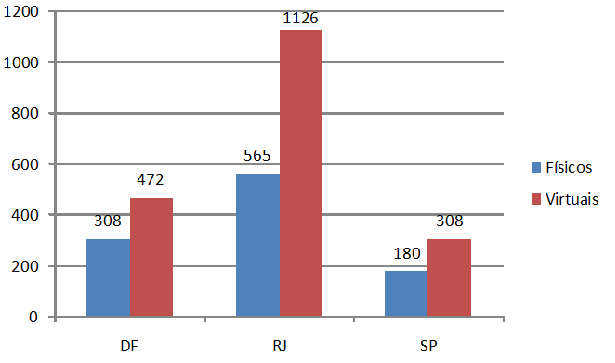

---
date: 20 de junho de 2014
tipo_artigo: Artigo técnico de Infraestrutura de TIC
title: A importância da conformidade para a qualidade da infraestrutura
abstract: Este artigo apresenta os principais conceitos relacionados a conformidade e qualidade de infraestrutura
author:
- affiliation: DEQI/DICI
  name: João Travessa
diretoria: 'Diretoria de Infraestrutura de TIC - DIT'
superintendencia: 'Superintendência de Planejamento e Suporte de TIC - SUPS'
departamento: 'Departamento de Qualidade da InfraEstrutura - DEQI'
tags:
- Qualidade
- Conformidade
- InfraEstrutura
...

Resumo
======

Atualmente, um tema em grande destaque no mercado é “Qualidade”. Gerenciar a qualidade da infraestrutura é extremamente importante em um ambiente em constante evolução, acompanhando o aumento das exigências dos clientes e a natural introdução de novas soluções no mercado.

Desafios
========

Atualmente a Dataprev possui um total de 1053 servidores físicos e 1906 servidores virtuais(1) em ambientes de plataforma baixa nos mais variados sistemas operacionais e configurações espalhados pelos três centros de processamento da empresa. Com  base nessa infraestrutura, a empresa fornece aos clientes externos grande quantidade de serviços, muitos de alta complexidade.

 1. Em 09/01/2014. Fonte: Apresentação Institucional Dataprev. Disponível em <http://www-dtpnet/content/apresentacao-institucional> - Acessado em 27/03/2014
  

Figura 1: Total de servidores – Ambiente de plataforma baixa
Fonte: Apresentação Institucional Dataprev.

Benefícios
==========

Manter a conformidade no parque tecnológico permite uma série de benefícios para a empresa, sendo traduzidos como valor para o cliente. Entre eles:

* Reduzir riscos e aumentar a performance, uma vez que os serviços são disponibilizados em plataformas com configurações testadas e homologadas pela empresa;
* Redução do custo de gerenciamento, já que o mesmo é diretamente proporcional às particularidades de cada ambiente;
* Aumento da efetividade do negócio, possível através da padronização da infraestrutura, facilitando o acesso à informações estratégicas do negócio e a tomada de decisão.

Introdução
==========
	
A Dataprev possui, dentre seus valores essenciais, a Inovação (priorização de soluções novas e criativas apoiadas em tecnologias atualizadas) e a Qualidade (busca permanente da excelência dos produtos e serviços). No âmbito da DIT, gerenciar os recursos de infraestrutura da empresa, se adaptando as evoluções do mercado é uma tarefa que demanda grande esforço e coordenação entre diversas áreas, para a entrega de um produto de qualidade.

A solução para tangibilizar o controle do parque tecnológico e garantir a entrega de um produto de qualidade ao cliente é a adoção de padrões. A análise da comparativa entre os padrões definidos pelas áreas competentes e a realidade encontrada na empresa permitirá o diagnóstico da conformidade do parque tecnológico.

CROSBY (1979)2 define qualidade como “conformidade com os requisitos”. Segundo ele, os problemas em uma organização seriam “bactérias da não-conformidade”. Sua ideia de trabalho com relação a qualidade é focado na prevenção, não inspeção. 
De acordo com GARVIN (1987)3 define a oito dimensões que podem ser utilizadas em nível estratégico para analisar as características da qualidade. São elas:

* Desempenho;
* Características;
* Confiabilidade;
* Durabilidade;
* Atendimento;
* Estética;
* Qualidade percebida;
* Conformidade.

Aqui, conformidade é definida como o grau em que o projeto e as características operacionais de um produto estão de acordo com padrões pré-estabelecidos.

2.Crosby, P. Quality is Free (1979). New York: McGraw-Hill

3.MONTEIRO, L. Fundamentos da Qualidade – INMETRO. Disponível em <http://www.inmetro.gov.br/qualidade/iaac/pdf/fundamentos-qualidade.pdf> - Acessado em 12/06/2014

Qualidade e Conformidade
========================

Nos Sistemas de Gestão da Qualidade, a conformidade é a característica de atendimento às especificações de produtos ou processos, que, indiretamente, reflete  no atendimento aos requisitos do cliente. Deste modo, o contrário (não-conformidade) é, então, simplesmente definido pela negativa: não atendimento ao requisito especificado. Entrando no campo de estudo da Auditoria, uma definição importante de se salientar é a evidência objetiva(4) — qualquer informação cuja veracidade pode ser comprovada com fatos, dados, medições, ensaios e documentos. 

Neste campo de estudo, muitas vezes conformidade é confundida com evidência objetiva, o que indica caminhos errados para a melhoria da qualidade. Por exemplo, caso um analista realizasse uma análise da conformidade de determinado serviço e, ao perceber diferenças entre a configuração planejada e a implantada, indicasse esta diferença como uma não-conformidade, levaria o ator da correção a atuar sobre cada diferença pontualmente, corrigindo cada sintoma, sem atuar na causa raiz. Já caso o funcionário fosse experiente, sua análise deveria apontar a não-conformidade como propriamente a causa raiz, se valendo das evidências objetivas, como provas da falha.

A identificação de uma causa raiz não é uma tarefa simples. Para realizar este diagnóstico, o analista da qualidade utiliza diversos métodos e ferramentas de análise, entre elas as clássicas “7 ferramentas da Qualidade”(5). Tanto a teoria Total Quality Managemenet (TQM) e Total Quality Control (TQC) mencionam tais ferramentas como básicas a serem utilizadas por todos os níveis de uma organização. A mais utilizada para casos similares ao exemplo citado é o Diagrama de Causa e Efeito, conhecido também como Diagrama de Ishikawa ou ainda Espinha de Peixe.

 4.A confusão entre evidência objetiva e não-conformidade pode ser o entrave para a melhoria contínua. Disponível em <http://vinhabranco.com.br/?p=1189> - Acessado em 09/04/2014

 5.As 7 Ferramentas da Qualidade foram criadas por Kaoru Ishikawa com o objetivo de ajudar as organizações a resolverem seus problemas. Segundo ele, 95% dos problemas enfrentados por uma organização podem ser resolvidos com tais ferramentes, já que as mesmas foram desenvolvidas para subsidiar a análise de informações. 7 ferramentas da Qualidade. Disponível em <http://www.citisystems.com.br/7-ferramentas-da-qualidade/> - Acessado em 09/04/2014
 
 
 
 
 
 
 
 
 
 
***Tabela 1: ***  As 7 ferramentas da Qualidade.
Fonte: Citisystems

Segundo SELEME e STADLER (2008, p.24) apud BLÖDORN e SOARES (2011), “método é 'a sequência lógica empregada para atingir o objetivo desejado, enquanto a ferramenta é o recurso utilizado no método.' O uso integrado do método e das ferramentas forma a soma sinérgica destes. Portanto, para as organizações seguirem um correto gerenciamento da qualidade é necessária a utilização conjunta de métodos e ferramentas, garantindo assim, maiores e melhores resultados”.

Deste modo, as análises da equipe da qualidade é responsável por levantar as causas geradoras de não conformidade, assim como em conjunto com as áreas operacionais, buscar a correção das mesmas, com o objetivo de se atingir um ambiente coerente aos padrões definidos. No entanto, a empresa deve não apenas identificar as falhas atuais, mas como tentar prevenir futuros “geradores de falhas”.

Processo de Conformidade
========================

No início de 2014, o Departamento de Qualidade de TIC (DEQI), em conjunto com outras áreas, definiu a primeira versão do Processo de Conformidade de Configuração. Seu objetivo é criar um processo de trabalho permanente de análise e estabelecimento da conformidade de configuração, proporcionando um trabalho pró-ativo de manutenção dos padrões definidos.

Em uma visão de Macroprocessos, ele está dividido em quatro etapas:

* Identificação das necessidades empresariais,
* Análise e identificação de não conformidades
* Implantação da conformidade
* Documentação das lições aprendidas

Sua estrutura pode ser observada no framework abaixo:

Figura 3: Framework de Manutenção da Conformidade
Fonte: O autor

Cada etapa do processo possui uma abrangência de atuação, sendo a atuação da área de Qualidade ao longo de todo o processo.

Inicialmente, a área de qualidade, de acordo com as necessidades estratégicas da empresa, definirá um escopo de análise da conformidade. A partir de então, o escopo será analisado, tanto com relação à configuração encontrada em produção, assim como em relação aos padrões estabelecidos, sendo estes resultados confrontados. Caso existam divergências, as áreas pertinentes serão informadas para, em conjunto com a operação, estabelecer a conformidade do escopo. Ao final do trabalho, todas as lições aprendidas no processo são documentadas para gestão do conhecimento e aprimoramento futuro.

Conclusão
=========

O tema Qualidade se encontra em evidência em todas as esferas de discussões das empresas atualmente. Entretanto, nem todos conseguem tangibilizar tal tema. De acordo com o objetivo que se deseja atingir ou o foco que se deseja colocar, a discussão deste tema pode ser simplista ou extremamente complexa.

Ao longo de todas as discussões realizadas durante a criação do processo de conformidade de configuração, a equipe de qualidade viu a importância real da documentação para a gestão do conhecimento na empresa. Por hora, vemos diversos sistemas legados sem nenhuma documentação, o que dificulta qualquer trabalho de melhoria voltado àquele produto. Da mesma forma, o tratamento de erros e desvios não pode sofrer melhorias, pois não se sabe o que já foi testado com problemas anteriores e seus resultados. É importante se remover a ideia de que a documentação é uma burocratização do processo de trabalho. O excesso de documentação é. A documentação em si é um artefato mínimo para a criação de uma base de conhecimento.

Referências
===========

Apresentação Institucional Dataprev – Novembro e Dezembro 2013. Disponível em <http://www-dtpnet/content/apresentacao-institucional> - Acessado em 27/03/2014

A confusão entre evidência objetiva e não-conformidade pode ser o entrave para a melhoria contínua. Disponível em <http://vinhabranco.com.br/?p=1189> - Acessado em 09/04/2014

7 ferramentas da Qualidade. Disponível em <http://www.citisystems.com.br/7-ferramentas-da-qualidade/> - Acessado em 09/04/2014

A função do gerenciamento de identidades e acesso para obter conformidade contínua. Disponível em <http://www.ca.com/~/media/Files/whitepapers/latam/CS1933_ContinuanceCompliance_WP_0212_PTB.pdf> - Acessado em 09/04/2014

BLÖDORN, M.; SOARES, M. Qualidade: Uma questão de sobrevivência para as organizações. Disponível em <http://www.bancodedadoszonasul.com.br/htmlarea/midia/artigos/68922112011112554.pdf> - Acessado em 14/04/2014

GODOY, L.; BELINAZO, D.; PEDRAZZI, F. Gestão da qualidade e as contribuições do programa 5s. Disponível em <http://www.abepro.org.br/biblioteca/ENEGEP2001_TR21_0144.pdf> - Acessado em 14/04/2014

MONTEIRO, L. Fundamentos da Qualidade – INMETRO. Disponível em <http://www.inmetro.gov.br/qualidade/iaac/pdf/fundamentos-qualidade.pdf> - Acessado em 12/06/2014
