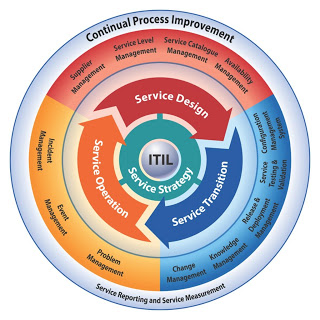
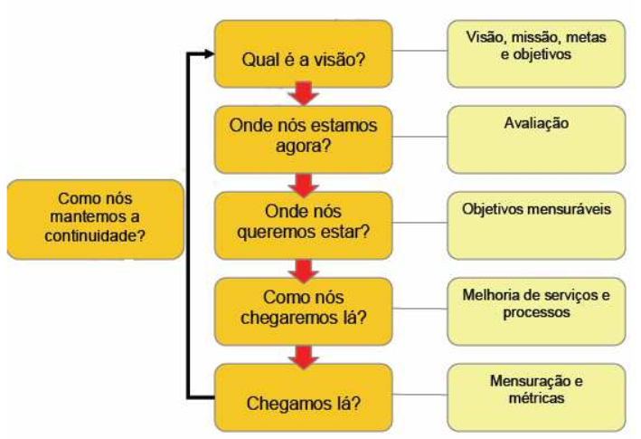
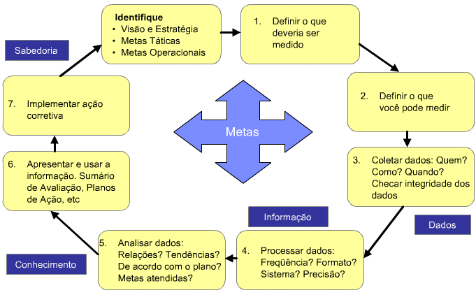

Introdução
===
Mercados corporativos com cenários cada vez mais complexos com alta competitividade, em que vários fatores são determinantes para o sucesso ou o fracasso das empresas, a utilização de ferramentas, técnicas e metodologias  para auxiliar na gestão dos sistemas de informação tornaram-se imprescindíveis para a sobrevivência destas corporações.   

Desafios
===
Vários aspectos da gestão empresarial são abordados em diversas metodologias  e frameworks, e com a dependência cada vez maior das empresas em sistemas de informações, os serviços de TI que os sustentam, são essenciais. Gerenciar tais serviços, buscando um maior alinhamento da TI com as necessidades de negócio,  pode ser melhor conduzido com a utilização destes frameworks.
A adoção de uma ou mais metodologias deve passar por criteriosa avaliação, verificando o que se pretende, quais as metas e objetivos a serem alcançados pela empresa.

Benefícios e/ou recomendações
===
A Dataprev deve caminhar nesta direção, desenhar seus processos e aplicar metodologias para melhoria dos mesmos. Sob pena, caso isso não seja feito, depreciar sua força produtiva e a qualidade de seus serviços.
      

ITIL V3
===
Um dos frameworks mais respeitados e sendo um consenso a sua utilização, é o ITIL que se encontra na sua terceira versão.  Não pretendo abranger todo aspecto desta biblioteca de boas práticas que não caberia neste pequeno artigo, são cinco volumes, percorrendo de forma concisa e pontual, todo ciclo de vida do serviço.

**Figura  1 – Ciclo de vida do serviço ITIL v3**

Consideraremos para uma análise um pouco mais verticalizada o estágio de  Melhoria Contínua de Serviço .
Independente de como esteja a organização em seu nível de maturidade, os processos deste estágio, aplicados nos serviços da empresa; podem, de uma forma sistemática, verificar como  estão , mensurá-los qualitativamente e otimizá-los.

Melhoria de Serviço Continuada (MSC)
===
A Melhoria de Serviço Continuada, MSC, tem por objetivo aumentar a eficiência, maximizar a efetividade e otimizar o custo dos processos de Serviço de TI. Esta fase do ciclo de vida não pode ser vista como uma fase separada. As atividades de melhoria continuada devem ser executadas em todo o ciclo de vida.

**Figura  2 – Melhoria de Serviço Continuada**

Este estágio do ciclo de vida do serviço na documentação oficial  ITIL V3, conta com três processos:  Mensuração de Serviço, Processo de Melhoria em 7 Etapas e Relatório de Serviço. 
Na minha opinião  os processos de Relatório de Serviço e Mensuração de Serviço  são no máximo subprocessos que poderiam esta contidos respectivamente  aos passos 4 e 5  do processo de Melhoria em 7 etapas.
 
 
Processo de Melhoria em 7 Etapas
===
Apesar de ser bem explícito que o processo contém 7 etapas, temos uma atividade gerencial predecessora de suma importância, onde deve-se identificar a visão e a estratégia da organização e, como consequência, as metas táticas e operacionais. Essas informações são importantes para orientar as outras etapas do processo.    

**Figura 3 – Fases do Processo Melhoria em 7 passos**

##Os 7 Passos

* Passo 1 – Definir o que deve ser medido – Este passo, baseado na MSC, identifica o que deveria ser medido a fim de verificar se o serviço está em uma situação ideal alinhado ao negócio e à TI. Deve-se conversar com o negócio, cliente e direção de TI. É interessante a utilização do catálogo de serviço.

* Passo 2 – Definir o que você pode medir – Se o passo anterior visa a situação ideal para o negócio e para TI, este passo delimita, dentro da realidade da empresa, o que de fato pode ser medido em relação ao que foi definido no passo 1. Compilar uma lista de quais serviços e o que neles podem ser medidos. 
 
* Passo 3 – Coletar os dados – Este passo define os meios que a organização utilizará para conseguir coletar as informações que serão utilizados para medir e comparar os resultados. Coletar dados requer alguma forma de monitoramento implantada seja automática ou manual.

* Passo 4 – Processar os dados – Este passo significa converter dados para o formato requerido e para o público interessado que permita uma perspectiva fim a fim do serviço e uma visão geral da performance alcançada pelo mesmo. São relatórios executivos, condensados a partir dos dados coletados no passo anterior. Questões chaves precisam ser feitas e respondidas neste estágio 

* Passo 5 – Analisar os dados – Este passo visa transformar a informação coletada e processada em conhecimento no que diz respeito à organização e seus serviços. Permitem identificar as tendências, as ações corretivas, as relações internas e externas entre outros. 

* Passo 6 – Apresentar e usar a informação, avaliação, sumário e planos de ação – Este passo significa pegar o conhecimento adquirido no passo anterior e transformá-lo em sabedoria, por meio da utilização de relatórios, planos de ação, revisões, avaliações e definição de oportunidades a serem exploradas, ou seja, é definir o que deve ser melhorado em relação ao serviço. 

* Passo 7 – Implementar as ações corretivas – O conhecimento ganho a partir dos passos anteriores é usado para otimizar, aperfeiçoar e corrigir os serviços. A MSC identifica muitas oportunidades para melhoria 

Conclusão
===
Otimização dos serviços de TI, é um trabalho constante e permanente , a cada novo ciclo de análise novos gargalos se apresentam. Fatores internos e externos modificam os serviços que devem estar sempre em consonância com as estratégias de negócio e com o que é esperado pelo cliente. Sistematizar esta análise, estabelecer indicadores de mensuração e melhorar os serviços é uma missão árdua que pode ser em muito minimizada adotando os processos aqui apresentados. 

Refêrencias
===

---
remark: referências usadas nesse artigo
references:

- id: ITIL V3
  title: ITIL V3 – Livro :  Melhoria Continuada do Serviço - Processos"
  author: 
  - family: OGC
  publisher: OGC
  type: book
  issued:
    year: 2011
- id: A melhoria de serviço continuada
  title: "A melhoria de serviço continuada"
  author: 
  - family: Breno O. Nunes
  URL: 'http://tiinteligente.blogspot.com.br'
  accessed:
    month: 6
    year: 2014
  publisher: Dataprev
  type: article
  issued:
    year: 2013
- id: Passos para iniciar a melhoria de serviços
  title: "Passos para iniciar a melhoria de serviços"
  author: 
  - family: Otávio Miller
  URL: 'http://www.portalgsti.com.br'
  accessed:
    month: 4
    year: 2014
  type: article
  issued:
    year: 2014 
- id: Melhoria de Serviço Continuada – ITIL Foundation V3
  title: " Melhoria de Serviço Continuada – ITIL Foundation V3"
  author: 
  - family: CARVALHO
  URL: 'http://www.pedrofcarvalho.com.br/PDF/ITIL_MELHORIA_DE_SERVICO_CONTINUADA.pdf'
  accessed:
    month: 6
    year: 2014
  type: article

---

