---
remark: metadados para ser usado pelo parser de conversão para pdf
date: 01 de julho de 2014
tipo_artigo: Artigo técnico de Infraestrutura de TIC
title: Descrição técnica do processo de alteração de estruturas em bancos de dados Oracle
abstract: Neste artigo, serão destacadas as etapas que compõem o processo de alteração de estruturas em bancos de dados Oracle nos ambientes de desenvolvimento, treinamento, teste integrado, teste automatizado, homologação, produção e sustentação da Dataprev.
author:
- affiliation: DEST/DSBD
  name: Darwin Bicalho Fernandes
responsibility:
- affiliation: DEST
  name: Diogo Costa Martins Pizaneschi
diretoria: 'Diretoria de Infraestrutura de TIC - DIT'
superintendencia: 'Superintendência de Planejamento e Suporte de TIC - SUPS'
departamento: 'Departamento de Suporte de TIC - DEST'
tags:
- Tech0xA
- SGBD
- Oracle
- Banco de Dados
- Alteração de Estruturas
...

Introdução
========
A crescente necessidade de desenvolvimento de novos sistemas e alteração dos sistemas já existentes têm exigido uma alta sinergia entre as equipes técnicas e gerencias para conseguir atender às expectativas dos clientes da Dataprev e cumprir os prazos acordados.

O desenvolvimento de novos sistemas e alteração dos sistemas já existentes acabam gerando modificações nas estruturas de bancos de dados que podem ocorrer tanto durante a fase de projeto, como na fase de desenvolvimento/manutenção do sistema. No primeiro caso, representa um refinamento da aplicação e/ou experimentação de novas percepções, uma vez que o esquema não está completamente definido. No segundo, retrata uma evolução da realidade considerada, como por exemplo, reformulação das necessidades dos usuários, correção de um erro de projeto, adaptação de novos componentes ou melhoria no desempenho da aplicação.

De acordo com Pascutti (2012), banco de dados é um conjunto de dados integrados que tem por objetivo atender a uma comunidade de usuários. É uma coleção lógica e coerente de dados com algum significado inerente.

Na Dataprev existem três áreas técnicas que trabalham no processo de alteração de estruturas de banco de dados, descritas abaixo:

- **COGD** (Coordenação de Gestão de Dados);
- **DPJS** (Divisão de Projeto da Solução);
- **DSBD** (Divisão de Suporte à Banco de Dados).

Cada uma destas três áreas possui um enfoque específico. Entretanto, o processo de alteração de estruturas em bancos de dados não estava bem organizado e isso acabava gerando dúvidas sobre a forma de atuação de cada equipe, além de poder comprometer os prazos previstos de entregas aos clientes.

Pensando nisso, foi criado um projeto na Dataprev, chamado “Implantação do processo de alteração de estruturas de banco de dados Oracle para o cliente MTE”, com o objetivo de organizar e agilizar os processos de alteração de estruturas em bancos de dados dos sistemas do cliente MTE (Ministério do Trabalho e Emprego) adequando-os à norma N/BD/001 que trata sobre o “Uso do ambiente de desenvolvimento de banco de dados corporativo Oracle”. O trabalho realizado no projeto foi estendido para atender aos demais clientes da Dataprev.

No artigo, primeiro serão apresentados conceitos importantes para o entendimento do texto e em seguida será descrito o novo processo de alteração de estruturas em bancos de dados Oracle utilizado pela Dataprev nos ambientes de desenvolvimento, treinamento, teste integrado, teste automatizado, homologação, produção e sustentação.

Desafios
========
O processo de alteração de estruturas em bancos de dados visa contornar problemas que podem afetar a qualidade dos sistemas desenvolvidos pela Dataprev. Entre os desafios que fazem parte deste processo, podemos citar:

- Envolvimento de várias áreas no processo de alteração de estruturas de banco;
- Complexidade dos sistemas;
- Análise de impacto da alteração de estruturas no banco;
- Elaboração do projeto físico do banco de dados;
- Preparação dos scripts para serem aplicados no banco.

Benefícios e/ou recomendações
=============================
Entre os benefícios do processo de alteração de estruturas em bancos de dados, podemos citar:

- Processo organizado de alteração de estruturas de dados nos ambientes de desenvolvimento, treinamento, teste integrado, teste automatizado, homologação, produção e sustentação;
- Utilização da ferramenta SDM (*Service Desk Manager*) no processo de alteração de estruturas de banco de dados;
- Agilidade no atendimento das alterações de estruturas de dados nos ambientes de desenvolvimento, treinamento, teste integrado e teste automatizado que antes demoravam até 5 dias úteis e agora são realizadas em até 1 dia útil;
- Maior autonomia dos administradores de dados.

Conceitos
========
Antes de começarmos a falar sobre o processo de alteração de estruturas em bancos de dados, é importante que sejam apresentados conceitos para facilitar o entendimento do artigo.

### Administrador de Dados (AD) ###
É o responsável por promover os padrões de administração de dados, políticas,  procedimentos, validação e homologação do  modelo de dados. São orientados às regras de negócio e uso dos dados. Na Dataprev, os administradores de dados pertencem à equipe COGD.

### Administrador de banco de dados – DBA Projetista ###
É o responsável por projetar fisicamente as estruturas de armazenamento de um banco de dados, tendo em vista o modelo de dados lógico e as características da aplicação. Também é responsável pela normatização das atividades que compõe a administração de banco de dados, além de serem responsáveis pela criação da versão inicial das bases de dados. Na Dataprev, os DBAs projetistas pertencem à equipe DPJS.

### Administrador de banco de dados – DBA de Suporte ###
É o responsável pela manutenção, monitoração, disponibilização do banco de dados e suporte aos seus usuários. A atuação é a de suporte do ambiente provendo performance e integridade do banco de dados. Na Dataprev, os DBAs de suporte pertencem à equipe DSBD.

### Ambiente de desenvolvimento de banco de dados ###
É o ambiente de banco de dados criado com o objetivo de armazenar os dados necessários para o desenvolvimento das funcionalidades das aplicações corporativas.

### Ambiente de teste automatizado de banco de dados ###
É o ambiente de banco de dados criado com o objetivo de testar e validar tecnicamente as funcionalidades de um sistema através do uso de software que irá controlar a execução do teste de software e comparar os resultados esperados com os resultados reais.

### Ambiente de teste integrado de banco de dados ###
É o ambiente de banco de dados criado com o objetivo de testar e validar tecnicamente as funcionalidades de um sistema, em fase de desenvolvimento,  de forma integrada.  Os pacotes desenvolvidos separadamente são agrupados nesta fase, de forma a gerar um único produto, antes da sua promoção para o ambiente de homologação de banco de dados.

### Ambiente de treinamento de banco de dados ###
É o ambiente de banco de dados criado com o objetivo de armazenar os dados necessários para o treinamento das funcionalidades das aplicações corporativas.

### Ambiente de homologação de banco de dados ###
É o ambiente de banco de dados criado com o objetivo de homologar as aplicações junto ao cliente. O banco de dados é criado de acordo com o projeto físico idealizado pela DPJS. Todos os processos neste ambiente devem estar preparados para o ambiente produtivo.

### Ambiente de produção de banco de dados ###
É o ambiente de banco de dados criado com o objetivo de ser utilizado, de fato, pelo sistemas que irão atender aos usuários finais. O banco de dados é criado de acordo com o projeto físico idealizado pela DPJS.

### Ambiente de sustentação de banco de dados ###
É o ambiente de banco de dados criado com o objetivo de corrigir os erros apresentados no ambiente de produção. O banco de dados é criado com o mesmo projeto físico do ambiente de produção.

### Estruturas de banco de dados ###
De acordo com a norma N/BD/001/00 (2010), as principais estruturas que compõem o banco de dados são:

- **Usuário** – usuário de conexão ao banco de dados;
- **Schema** – coleção de estruturas físicas de banco de dados, que pertencem a um usuário de banco de dados (owner). Estas estruturas são criadas e manipuladas por comandos SQL;
- **Tablespace** – conceito Oracle para unidade de armazenamento lógico. Uma tablespace consiste de um ou mais datafiles;
- **Datafile** – conceito Oracle para unidade de armazenamento físico (arquivo físico). O datafile está associado a uma e somente uma tablespace;
- **Tabela** – unidade de armazenamento de dados num banco de dados, que é definida por um nome e um conjunto de colunas. Para cada coluna é dado um nome, um datatype (varchar2, number, date, etc) e um tamanho. Uma tabela possui uma ou N linhas e um linha é composta por uma ou N colunas. Uma tabela está armazenada em tablespace;
- **Índices** – estruturas de banco de dados opcionais associadas as tabelas. Um índice pode ser criado em uma ou mais colunas de uma tabela para melhorar a performance de acesso aos dados. Um índice está armazenado em tablespace;
- **Constraints** – regras de integridade para uma coluna da tabela, definidas pelo desenvolvedor. Existem os seguintes tipos de constraints:
 - **Not Null** - constraint para uma regra associada a valores não nulos em uma coluna;
 - **Unique Key** - constraint para uma regra associada a valores únicos para uma coluna;
 - **Primary Key** - constraint para uma regra associada a valor de identificação único e não nulo (not null + unique) para uma coluna;
 - **Foreign Key** - constraints para uma regra associada a integridade referencial, isto é, integridade mantida por outra coluna (que é a primary key) em outra tabela;
 - **Check** - constraints para definir regras para o conteúdo de uma coluna. Também podem ser definidos domínios de informação, ou seja, valores que uma determinada coluna pode assumir.
- **Sequence** – objeto que é usado para gerar uma sequência de números únicos. Pode ser utilizada para implementar chave primária em tabelas;
- **Sinônimo** – objeto que permite referenciar outros objetos (tabelas, sequences, etc) através de um outro nome. Um sinônimo pode ser criado para acessar objetos sem a necessidade de referenciar seu owner;
- **Role** – conjunto de privilégios para execução de comandos DML sobre tabelas e sequences, atribuída a um ou mais usuários. 

### Fases de um projeto de Banco de Dados ###
No projeto de um banco de dados, geralmente são considerados 3 modelos, descritos abaixo:

- **Modelo Conceitual:** é uma descrição mais abstrata da base de dados. Essa modelagem preocupa-se em descrever quais dados serão armazenados na base de dados e quais dados se relacionam. Para fazer o modelo conceitual, é necessário entender o que o usuário final espera que o sistema armazene e que informações este usuário espera que o sistema disponibilize. Não contém detalhes de implementação e é independente do tipo de SGBD (Sistema de Gerenciamento de Banco de Dados) usado. É o ponto de partida para o projeto da base de dados;
- **Modelo Lógico:** é a descrição da base de dados conforme é vista pelos usuário do banco de dados (programadores e aplicações) gerada a partir do modelo conceitual, ou seja, é a representação dos dados em uma estrutura lógica de armazenamento. É dependente do tipo de banco escolhido, mas não contém detalhes da implementação;
- **Modelo Físico:** é a descrição de como a base de dados é armazenada internamente, ou seja, é o modelo onde estão definidas as características e recursos necessários para armazenamento e manipulação das estruturas de dados (estrutura de armazenamento, endereçamento, acesso e alocação física etc).

### Ferramenta de Modelagem de Dados – Oracle Designer ###
O Oracle Designer é uma ferramenta CASE (**C**omputer-**A**ided **S**oftware **E**ngineering), utilizada pela Dataprev, que auxilia as atividades de engenharia de software e facilita o trabalho em equipe no desenvolvimento de aplicações. 

Na Dataprev os modelos de dados conceitual, lógico e físico das aplicações ficam armazenados em repositório corporativo. Esses modelos podem ser compartilhados entre as diversas aplicações gerando um controle centralizado dos dados corporativos (N/BD/001/00, 2010).

De acordo com a norma N/BD/001/00 (2010), os principais objetos da ferramenta de modelagem de dados são:

- **Repositório** – local para armazenamento dos dados;
- **Workarea** – área de trabalho onde é possível visualizar parte dos dados do repositório, segundo critérios definidos. Os objetos do repositório só podem ser visualizados/manipulados através da workarea;
- **Baseline** – conjunto de versões específicas de determinados objetos que formam uma versão de um módulo (sistema).  Todo objeto precisa estar versionado para fazer parte de uma baseline. Apenas uma versão de cada objeto pode ser associada a uma baseline. Somente pode-se acessar o conteúdo de uma baseline através de uma workarea;
- **Container** – agrupamento lógico de objetos. Os containers podem ser application systems ou folders;
- **Application systems** – aplicações cadastradas na ferramenta de modelagem de dados;
- **Folders** –  armazenam diretórios e arquivos;
- **Database Design Transformer (transformer)** – utilitário da ferramenta de modelagem de dados para gerar o modelo lógico através da aplicação de regras de  derivação no modelo conceitual o qual fica armazenado no repositório. Cria as tabelas para gravar cada ocorrência de uma entidade, colunas para armazenar atributos e restrições para implementar os relacionamentos  entre entidades. Também cria restrições para garantir identificadores únicos necessários a aplicação e índices para as chaves estrangeiras;
- **Checkin** – o processo de checkin torna o objeto público (somente leitura) e um número de versão é associado ao objeto começando por 1.0. Os usuários podem consultar o objeto, mas não podem alterá-lo. Para tal é feito checkout no objeto;
- **Checkout** – para alterar um objeto versionado é feito obrigatoriamente o checkout do objeto na workarea de trabalho. O processo de checkout faz uma cópia do objeto existente no repositório para a workarea especificada. No repositório o objeto continua na versão original. As alterações no objeto podem ser desfeitas através do comando “undo checkout”. A confirmação da alteração é feita pelo comando **checkin**;
- **Designer Editor Database Administration (DB ADMIN)** – opção da ferramenta de modelagem de dados onde podem ser criados banco de dados, usuários, tablespaces, definições de parâmetros de armazenamento etc. No DB ADMIN são informados os parâmetros de armazenamento das tabelas e índices, as definições das sequences entre outros objetos de schema;
- **Volumetria** – neste campo deverá ser informado a previsão do volume de dados esperados para as tabelas. Esta informação é utilizada para a criação do projeto físico de banco de dados.

### Versão ###
Uma versão é a descrição de um objeto em um determinado período de tempo, ou sob um certo ponto de vista, cujo registro é importante para a aplicação considerada. Uma versão é um objeto de primeira classe, possui um identificador único (OID), podendo ser diretamente manipulada e consultada (GALANTE, 1998). 

As versões de uma entidade do mundo real ficam agrupadas formando um objeto versionado, que é também um objeto de primeira classe (possui um identificador único) que mantém informações a respeito de suas versões. Um objeto que possui versão é chamado objeto versionado, possui características próprias e apresenta propriedades que podem ser comuns a todas as versões.

Os objetos podem ser versionados através de uma configuração que associa uma versão para cada um dos objetos.

A utilização do conceito de versão no tratamento de evolução de esquemas permite o desenvolvimento de esquemas conceituais onde refinamentos são acrescentados gradualmente ao esquema sem causar danos às aplicações em execução, sendo de fundamental importância no desenvolvimento de projetos.

A utilização de versões para esquemas, classes e objetos permite manter o histórico das modificações e garantir a manipulação dos objetos em qualquer perspectiva de versões sob a qual são definidos, além de manter a transparência frente às alterações realizadas, pois aplicações antigas podem continuar funcionando e novas aplicações podem conhecer versões antigas de objetos.

Processo nos ambientes de Desenvolvimento, Treinamento, Teste Integrado e Teste Automatizado
=======================================================================
Os ambientes de Desenvolvimento, Treinamento, Teste Integrado e Teste Automatizado possuem o mesmo processo de alteração de estruturas em bancos de dados. Nestes ambientes não são utilizados projetos físicos, por isso não existe a intervenção da equipe de projetos físicos de banco de dados (DPJS).

As alterações são realizadas pelos administradores de dados das unidades de desenvolvimento, que pertencem à equipe COGD.

Na figura abaixo temos o fluxo do processo de alteração de estruturas de dados nos ambientes de desenvolvimento, treinamento, teste integrado e teste automatizado:

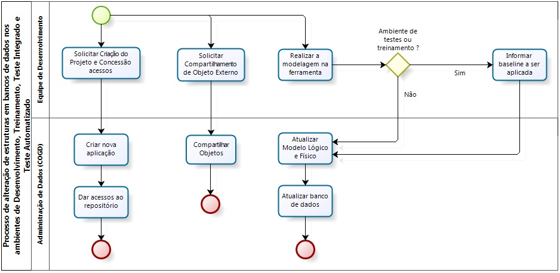

### Documentação do processo ###

**Solicitar criação do projeto e concessão de acessos**

Ao criar um novo projeto na Dataprev, a equipe de desenvolvimento solicita aos administradores de dados (COGD) a criação do projeto na ferramenta de modelagem de dados atualmente utilizada pela empresa, que se chama Oracle Designer.

Futuramente deverá ser utilizada uma nova ferramenta de modelagem de dados pela empresa, em substituição ao Oracle Designer.

A concessão de acessos consiste na criação de um usuário no banco de dados DCASE para cada desenvolvedor que irá trabalhar no projeto. Através deste usuário, o desenvolvedor poderá acessar a ferramenta Oracle Designer.

**Criar nova aplicação**
	
Após a solicitação de criação do projeto pela equipe de desenvolvimento, os administradores de dados (COGD) acessam a ferramenta Oracle Designer e efetuam a criação da nova aplicação.

**Dar acesso ao repositório**

Nesta etapa, os administradores de dados criam o usuário no banco de dados DCASE para cada desenvolvedor.

Através deste usuário o desenvolvedor poderá acessar a ferramenta de modelagem de dados Oracle Designer. O padrão utilizado é d<matricula>. Exemplo: d340685.

**Solicitar compartilhamento de objeto externo**

A equipe de desenvolvimento pode solicitar o compartilhamento de algum objeto externo à aplicação para ser utilizado no projeto.

**Compartilhar objetos**

Nesta etapa, os administradores de dados compartilham o objeto solicitado pela equipe de desenvolvimento na ferramenta de modelagem de dados para ser utilizado pela aplicação do projeto.

**Realizar a modelagem na ferramenta**

Nesta etapa, a equipe de desenvolvimento cadastra na ferramenta de modelagem de dados Oracle Designer os objetos que serão utilizados pelo sistema.

Se a equipe de desenvolvimento solicitar a aplicação no banco de dados do ambiente de desenvolvimento, a equipe de administradores de dados (COGD) primeiro atualiza o modelo lógico e físico antes de atualizar o banco de dados.

Caso a modelagem realizada pela equipe de desenvolvimento seja para aplicar nos ambientes de testes ou treinamento, primeiro é necessário gerar uma *baseline*, ou seja, criar uma configuração no Oracle Designer. As configurações são estáticas, ou seja, ao realizar alterações na modelagem é necessário que seja gerada uma nova configuração para refletir as alterações realizadas.

**Informar baseline a ser aplicada**

A equipe de desenvolvimento informa para os administradores de dados as alterações realizadas na ferramenta de modelagem que deseja aplicar no banco de dados. 

Em seguida, é realizada a criação da configuração pelos administradores de dados (COGD), onde irá constar todos os objetos modelados na ferramenta pela equipe de desenvolvimento.

A configuração possui um nome e é através deste nome que os administradores de dados conseguem efetuar o batimento da configuração com o banco de dados através da própria ferramenta de modelagem. Após o batimento, são geradas as diferenças que precisam ser aplicadas para atualizar as estruturas do banco.

**Atualizar modelo lógico e físico**

Esta etapa é realizada pelos administradores de dados e consiste em atualizar o modelo lógico e físico do banco de dados.

Na ferramenta de modelagem (Oracle Designer) são executadas as seguintes etapas:

- criação de *workarea* de trabalho;
- criação do banco de dados na opção *Oracle Databases* no *Designer Editor DB Admin Navigator*;
- criação do usuário da aplicação na opção *Users* no *Designer Editor DB Admin Navigator*;
- criação de *tablespaces* de 128k para os dados, índice de PK e índices secundários (FK, UK, performance) na opção *Storage* do *Designer Editor DB Admin*;
- criação do storage de 128k na opção *Storage Definitions* do *Designer Editor DB Admin*;
- criação das estruturas da aplicação com suas respectivas tablespaces previamente definidas no *Designer Editor* na opção *Table Implementations*.

**Atualizar banco de dados**

Após a etapa de atualização dos modelos, os administradores de dados efetuam o batimento do modelo que consta na ferramenta de modelagem com o banco de dados. Após o batimento, são geradas pela ferramenta de modelagem as diferenças que devem ser aplicadas no banco.

A próxima etapa consiste em preparar os scripts para aplicar no banco, onde deverá ser realizada uma análise dos scripts gerados pela ferramenta de modelagem e efetuar as modificações necessárias, além de conceder os privilégios e sinônimos caso precise. Em seguida, são executados os scripts no banco.

Processo nos ambientes de Homologação, Produção e Sustentação
================================================
Nos ambientes de homologação, produção e sustentação podem existir duas situações para o processo de alteração de estruturas de banco, descritas abaixo: 

- a primeira é quando existe a criação de novos objetos (tabelas, índices e sequências), onde é obrigatória a criação do projeto físico de banco de dados pela equipe DPJS antes de solicitar a alteração de estruturas no banco para a equipe DSBD;
- se as alterações de estruturas de banco não envolverem a criação de tabelas, índices e sequências, a solicitação deverá ser efetuada diretamente para a equipe DSBD, sem passar pela área de projeto físico de banco (DPJS).

Na figura abaixo temos o fluxo do processo de alteração de estruturas de dados nos ambientes de homologação, produção e sustentação:

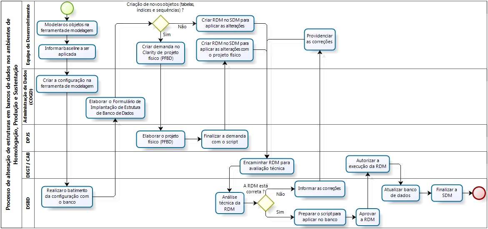

### Documentação do processo ###

**Modelar os objetos na ferramenta de modelagem**
	
A etapa de modelar os objetos na ferramenta de modelagem de dados (Oracle Designer) é realizada pela equipe de desenvolvimento e envolve a criação e/ou exclusão de objetos no modelo lógico do sistema.

Atualmente a ferramenta utilizada na empresa é o Oracle Designer, que deverá ser substituída gradualmente pela ferramenta *Infosphere Data Architect* (IDA) da IBM nos próximos meses. A figura abaixo mostra a tela inicial da ferramenta Oracle Designer.

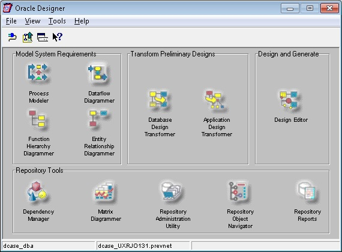

**Informar baseline a ser aplicada**
	
A equipe de desenvolvimento informa para os administradores de dados da sua respectiva UD (Unidade de Desenvolvimento) as alterações realizadas na ferramenta de modelagem de dados que deseja aplicar no banco de dados. 

**Criar a configuração na ferramenta de modelagem**
	
A criação de uma configuração na ferramenta de modelagem de dados é efetuada somente após as alterações de estruturas de dados já terem sido previamente cadastradas na ferramenta de modelagem.

Nesta etapa, o administrador de dados cria uma configuração (*baseline*) na ferramenta de modelagem para efetuar o batimento com o banco de dados.

Após a criação de uma configuração, não é possível fazer alterações nesta mesma configuração. As configurações são estáticas, ou seja, ao realizar alterações na modelagem é necessário que seja gerada uma nova configuração para refletir as alterações realizadas.

As configurações são criadas pelos administradores de dados (COGD) e ficam armazenadas em um repositório da ferramenta de modelagem.

**Realizar o batimento da configuração com o banco**
	
Após a criação da configuração na ferramenta de modelagem, a equipe de administradores de banco de dados da DSBD, comumente chamado de DBA (*Database Administrator*), realiza o batimento do banco de dados com a configuração do modelo através da ferramenta de modelagem.

Para realizar o batimento da configuração criada no Oracle Designer, é necessário que seja criada uma *workarea*, ou seja, criar uma área de trabalho que deverá ser associada com a configuração criada na ferramenta de modelagem Oracle Designer.

Antes de criar uma nova “*workarea*”, é necessário verificar se já existe alguma “*workarea*” com o mesmo nome e versão no repositório que é ilustrado na figura abaixo:

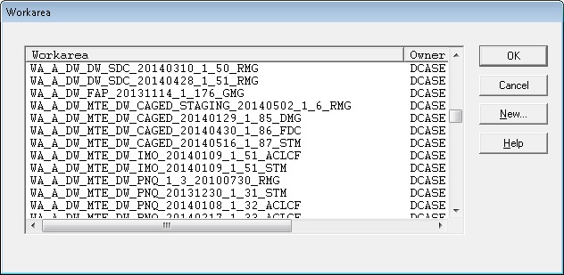

Caso não exista, para criar a “*workarea*” é necessário clicar em “*New...*”, conforme destacado em vermelho na próxima imagem:

Em seguida, irá abrir a tela para a criação da “*workarea*” para realizar o batimento com o banco, onde devemos cadastrar o nome da configuração.

Por exemplo, em uma configuração com o nome **A_MTE_CAGED_20130719{1.106}**, a área de banco de dados DSBD costuma cadastrar a workarea com o nome **WA_A_MTE_CAGED_20130719_1_106_DBF**, onde acrescenta a sigla **WA** no início do nome indicando “**workarea**”, substitui “{} e .” por “_” e nas três últimas letras “**DBF**” são indicadas as iniciais do nome da pessoa que criou a workarea, conforme a figura abaixo:

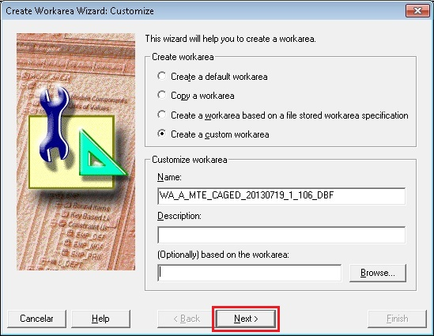

Entre as etapas da criação da criação da “workarea”, temos que associar o nome da configuração onde consta as alterações de estruturas de banco. No exemplo, a configuração se chama **A_MTE_CAGED_20130719{1.106}** e após a localização da configuração no repositório, usando o filtro, é necessário selecionar a configuração e clicar na seta para a direita, conforme indicado nas próximas imagens:

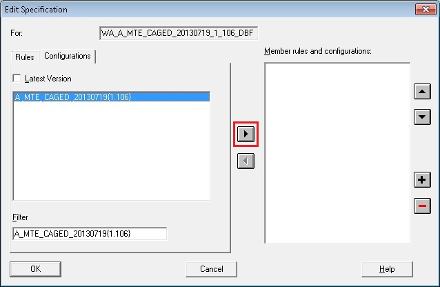

Clicar em OK para incluir a configuração na “*workarea*”:

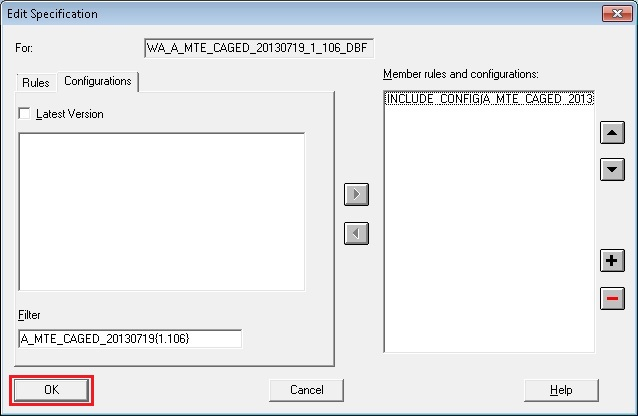

Para finalizar a criação da “*workarea*”, clicar em finish na tela abaixo:

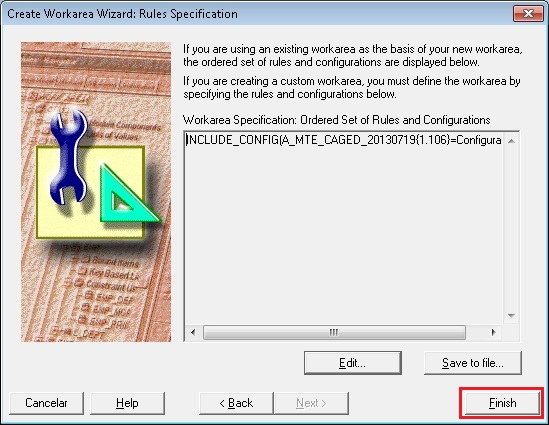

Ao término da criação da “*workarea*”, é necessário selecionar no repositório a “*workarea*” criada e clicar em OK:

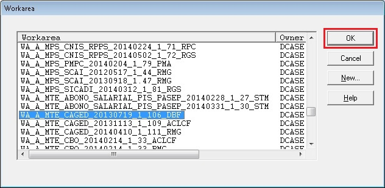

Clicar em *Design Editor* para abrir a “*workarea*” que contém a configuração do *Designer*:

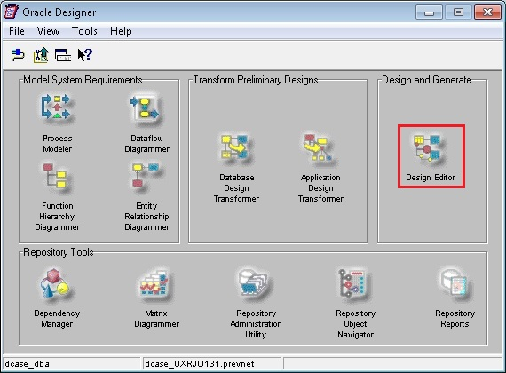

Expandir o repositório, selecionar o *schema* (no exemplo, o *schema* se chama **CAGED**), clicar em *Generate*, listado no menu, e depois em *Generate Database from Server Model...*

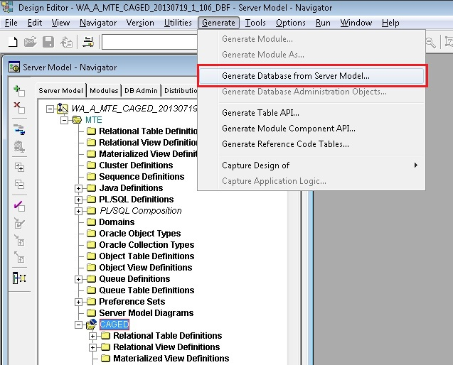

Na próxima tela é necessário informar os seguintes dados: usuário (*schema*), senha, em *connect* informar a entrada cadastrada do banco no arquivo “tnsnames.ora”, em *file prefix* o nome dos arquivos de diferença que serão gerados e em *directory* o local que os arquivos serão salvos, conforme exibido na próxima tela:

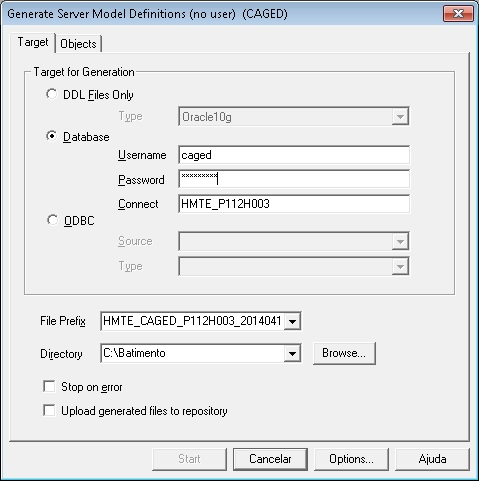

Após os dados preenchidos clicar na aba “*Objects*” e depois em “*Start*” para iniciar o batimento com o banco, conforme exibido na figura:

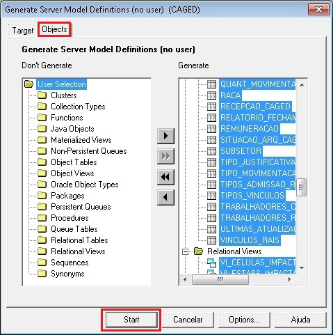

Durante o batimento das diferenças da configuração com o banco de dados é exibida a próxima tela:

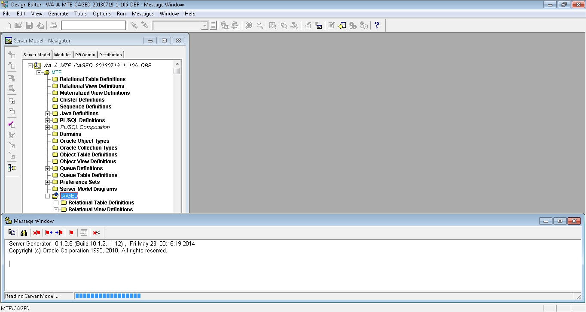
	
Por fim, ao término do batimento são gerados arquivos que contém as diferenças encontradas entre a configuração cadastrada na ferramenta de modelagem e o banco de dados. Estas diferenças são encaminhadas aos administradores de dados para que seja possível elaborar o formulário de implantação de estrutura de banco de dados.

**Elaborar o Formulário de Implantação de Estrutura de Banco de Dados**

O Formulário de Implantação de Estrutura de Banco de Dados é um documento utilizado pelas áreas DPJS, DSBD e COGD, onde são cadastradas todas as alterações que deverão ser executadas no banco de dados, além dos privilégios que deverão ser concedidos. Com base neste documento que é gerado o projeto físico de banco de dados (PFBD).

Este formulário informa se a aplicação da configuração criada na ferramenta de modelagem de dados será completa ou parcial. 

Caso a aplicação seja completa, serão descritas no formulário apenas as particularidades que a ferramenta de modelagem não consegue tratar automaticamente, onde será necessário o ajuste manual nos scripts gerados pela ferramenta de modelagem.

Caso a aplicação seja parcial, no formulário deverão constar apenas as alterações que podem ser aplicadas no banco de dados.

O documento deverá ser preenchido previamente pela equipe de desenvolvimento do sistema, em conjunto com o administrador de dados da unidade de desenvolvimento, antes da criação da base de dados e quando houver necessidade de realizar alguma alteração de estruturas de dados do banco.

**Criar demanda no Clarity de projeto físico (PFBD)**

Sempre que for feita a criação de novos objetos (tabelas, índices e sequências), a equipe de desenvolvimento deverá providenciar a abertura de uma demanda através da ferramenta Clarity (**www-dtpprojetos**) para que seja criado o projeto físico de banco de dados pela equipe DPJS.

Na demanda deverá constar o formulário de implantação de estrutura de banco de dados já preenchido. Através deste formulário a equipe DPJS poderá elaborar o projeto físico dos novos objetos e gerar os scripts necessários para aplicação no banco.

**Criar RDM no SDM para aplicar as alterações**

Nesta etapa, por não existir a criação de novos objetos (tabelas, índices e sequências), a equipe de desenvolvimento deverá efetuar a criação de uma RDM na ferramenta SDM (*Service Desk Manager*), através do link **www-sdm**, anexando apenas o formulário de implantação de estrutura de banco de dados.

**Elaborar o projeto físico (PFBD)**

Com base no formulário de implantação de estrutura de banco de dados, a equipe de projeto físico irá avaliar as alterações à serem realizadas e em seguida fará a elaboração do projeto físico de banco de dados.

Durante esta etapa, são avaliados vários quesitos, como previsão de crescimento da base (volumetria), espaço disponível no servidor, necessidade de particionamento de tabelas, preparação do script com o projeto físico, entre outras atividades.

**Finalizar a demanda com o script**

A equipe de projetos de banco (DPJS), ao fim da elaboração do PFBD, irá gerar os scripts e informar sobre a necessidade de criação e/ou alteração de *tablespaces* do banco. Ao finalizar a demanda, todos os scripts e informações sobre o projeto físico devem ser anexados.

*Tablespace* é um termo em língua inglesa que designa uma sub-divisão lógica de um banco de dados utilizado para agrupar estruturas lógicas relacionadas. As *tablespaces* apenas especificam a localização de armazenamento do banco de dados e são armazenadas fisicamente em *datafiles*, que alocam imediatamente o espaço especificado na sua criação. 

**Criar RDM no SDM para aplicar as alterações com o projeto físico**

Nesta etapa, a equipe de desenvolvimento deverá efetuar a criação de uma RDM na ferramenta SDM, através do link **www-sdm**, anexando o formulário de implantação de estrutura de banco de dados e o projeto físico elaborado pela DPJS.

**Encaminhar RDM para avaliação técnica**

Nesta etapa, a equipe de gestão de mudanças do DEGT ou o CAB encaminha para a área de suporte de banco de dados (DSBD) a RDM para ser avaliada tecnicamente.

**Análise técnica da RDM**

Nesta etapa, a equipe de suporte de banco de dados (DSBD) efetua a análise técnica da RDM de alteração de estruturas no banco. Na análise é verificado o impacto da mudança e, se for viável, a RDM é aprovada na ferramenta SDM.

**Informar as correções**

Na etapa de avaliação técnica da área de suporte de banco de dados (DSBD), se existir algum erro na RDM o solicitante é comunicado sobre as correções que devem ser efetuadas.

**Providenciar as correções**

Nesta etapa, a equipe de desenvolvimento deverá providenciar as correções solicitadas pela DSBD e, após a correção, reencaminhar a RDM para avaliação.

**Preparar os scripts para aplicar no banco**

Caso a RDM esteja correta, a equipe de banco de dados (DSBD) irá preparar os scripts necessários para que a mudança seja realizada no banco de dados.

Nesta etapa, a equipe DSBD irá preparar todos os scripts que devem ser aplicados no banco, originados do projeto físico e/ou do batimento com a ferramenta de modelagem (Oracle Designer). Em seguida, é verificado se os novos objetos estão com as “*tablespaces*” corretas e caso não esteja, o script é ajustado.

Depois são preparados os scripts de privilégios que deverão ser concedidos para os usuários. São criadas as *roles* de consulta (*select*) e de atualização (*insert*, *update* e *delete*) que devem ser atualizadas após a criação das novas estruturas no banco de dados.

Exemplo: Concessão de privilégios para as *roles* de consulta e atualização na tabela EMPRESAS, que está localizada no *schema* CAGED.

Comandos:  

     grant select on caged.EMPRESAS to r_con_caged;

     grant insert, update, delete on caged.EMPRESAS to r_atu_caged; 

Exemplo: Concessão de privilégios nas *roles* de consulta e atualização para o usuário CAGED_INTRANET.

Comandos:

    grant r_con_caged to  CAGED_INTRANET;
    
    grant r_atu_caged to  CAGED_INTRANET;

Após a preparação dos scripts de privilégios, são criados os sinônimos para os objetos do tipo tabela, sequência e visão.

Exemplo: Criação de sinônimo público para a tabela EMPRESAS, que está localizada no *schema* CAGED.

Comando: 

    create public synonym EMPRESAS for caged.EMPRESAS; 

Também é nesta etapa que definimos a melhor estratégia de “*rollback*” que será utilizada caso apresente algum problema durante a aplicação dos scripts no banco, ou seja, a estratégia para voltar ao estado anterior da aplicação dos scripts no banco. Existem algumas estratégias, como, por exemplo, utilização do *flashback* (através da criação de um *restore point*), criação de scripts de retorno e até mesmo a restauração do *backup* realizado antes da execução da mudança.

**Aprovar a RDM**

Após o término da preparação dos scripts de banco, a RDM será aprovada na ferramenta SDM, mas continuará aguardando a autorização da equipe de gestão de mudanças do DEGT ou o CAB para ser executada.

**Autorizar a execução da RDM**

A equipe de gestão de mudanças do DEGT ou o CAB fará a avaliação da RDM e caso não exista nenhum tipo de impedimento técnico ou gerencial, irá autorizar a execução da RDM.

**Atualizar banco de dados**

A etapa de atualização do banco de dados consiste na execução dos scripts de banco que foram previamente preparados pela DSBD.

O acesso ao banco de dados é realizado através de alguma ferramenta (exemplo: putty, SQL Developer, etc.) utilizando o próprio usuário “*owner*” do esquema do banco ou outro usuário com permissões para alteração de estruturas.

**Finalizar a SDM**

Após a execução da RDM, a equipe de suporte de banco (DSBD) finaliza a mudança através da ferramenta SDM.

Conclusão
=========
O processo de alteração de estruturas em bancos de dados Oracle possui várias etapas e envolve a atuação de várias equipes.
 
Antigamente, as alterações de estruturas em bancos de dados de todos os ambientes da Dataprev era realizada apenas pela DSBD e, muitas vezes, era necessário até 5 dias úteis para o atendimento de alterações de estruturas de banco devido à elevada quantidade de alterações que são realizadas em cada ambiente.

Com o novo processo, os administradores de dados (COGD) passaram a realizar os atendimentos nos ambientes de desenvolvimento, treinamento, teste integrado e teste automatizado. Nestes ambientes não são necessários projetos físicos de banco e a atuação dos administradores de dados foi fundamental para reduzir o tempo de atendimento das mudanças solicitadas pela equipe de desenvolvimento para apenas 1 dia útil, além de melhorar a qualidade dos sistemas na etapa de modelagem dos dados.

Por fim, o processo nos ambientes de homologação, produção e sustentação também obteve ganhos. Através do trabalho em conjunto das áreas de banco (COGD, DPJS e DSBD) foi possível melhorar os fluxos e insumos do processo de alteração de estruturas.

Referências
===========
GALANTE, Renata. *Um modelo de evolução de esquemas conceituais para bancos de dados orientados a objetos com o emprego de versões*. Porto Alegre: CPGCC da UFRGS, 1998. 93p. Dissertação de mestrado.

PASCUTTI, Márcia. *Administrador de Banco de Dados*. Disponível em: <http://200.17.98.44/pronatec/wp-content/uploads/2012/07/admbd.pdf>. Acesso em: 19 mai. 2014.

*Uso do Ambiente de Desenvolvimento de Banco de Dados Corporativo Oracle*. Norma N/BD/001/00 (2010). [S.l.]: Dataprev, [S.d.]. Disponível em: <http://www-dtpnet/sites/default/files/N_BD_001_00.pdf>. Acesso em: 15 mai. 2014.