---

remark: metadados para a ser usado pelo parser de conversão para pdf

date: 30 de setembro de 2014

tipo_artigo: Artigo técnico de Infraestrutura de TIC

title: Soluções de Replicação de Dados Oracle - Oracle Change Data Capture e Oracle Goldengate

abstract: Este artigo procura apresentar duas soluções Oracles para replicação de dados em tempo real, o Oracle Change Data Capture e o Oracle Goldengate. Será visto, numa visão menos técnica possível, o funcionamentos dessas soluções, benefícios e possíveis problemas. Também será apresentado um comparativo entre elas, permitindo uma melhor visualização das diferenças entre ambas.

author:

- affiliation: DEST/DSBD

name: Renato Gonçalves da Silva

responsibility:

- affiliation: DEST

name: Diogo Costa Martins Pizaneschi

diretoria: 'Diretoria de Infraestrutura de TIC - DIT'

superintendencia: 'Superintendência de Planejamento e Suporte de TIC - SUPS'

departamento: 'Departamento de Suporte de TIC - DEST'

tags:

- Tech0xA

- Oracle Change Data Capture

- Oracle Goldengate

- Replicação de Dados em Tempo Real

...

Introdução
==========

Oracle Change Data Capture (CDC) e Oracle Goldengate (GG) são duas soluções da Oracle para replicação de dados em tempo real entre banco de dados. O CDC é um recurso disponível desde a versão 9i e que teve seu fim na versão 11g, sendo não suportado pela versão 12c do Oracle. O GG é uma solução externa do banco de dados Oracle, com sua própria instalação, e atualmente encontra-se na versão 12c. Ela é uma evolução do Change Data Capture, pois permite, além de uma variedade maior de topologias para replicação de dados, a replicação entre banco de dados Oracle com banco de dados de outras plataformas, tais como Microsoft SQL Server, DB2, MySQ, etc.

Desafios
========

O desafios que podemos encontrar numa possível implementação dessas soluções é, para o caso do Oracle Change Data Capture, que o mesmo foi descontinuado. Basear a replicação de dados da organização em uma solução que não acompanhará as evoluções na tecnologia do sistema de gerenciamento de banco de dados é "engessar" a evolução do sistema, pois as novas funcionalidades que surgirão em futuras versões do banco de dados Oracle não poderão ser utilizadas. 
O desafio no caso do Oracle Goldengate, seria sua complexidade. por ser uma solução muito completa e flexível seriam necessários treinamentos para a implementação e manutenção dessa solução dentro da organização.

Benefícios e/ou recomendações
=============================

Os benefícios ao utilizar soluções de replicação de dados em tempo real seria, no contexto atual, na otimização das cargas de dados realizadas em ambientes de Datawarehousing (DW). 
Como em cada transação, dados seriam replicados do ambiente transacional para as áreas de tratamento de dados dos ambientes de DW, não seria mais necessário realizar grandes e complexas consultas no banco de dados transacional, reduzindo tempo e impactos no ambiente produtivo.

Replicação de dados
===================

Afinal, o que é replicaçao de dados? Autores definem replicação de dados entre banco de dados como sendo a transferência de informações e objetos de um banco de dados origem para um banco de dados destino, ou vice-versa, sempre mantendo atenção a consistência das informações.
Existem três tipos de replicação mais comuns:

* Replicação Instantânea – Também conhecido como replicação snapshot, nesse tipo de replicação uma “foto” é retirada do banco de dados origem em um dado momento. Periodicamente está “foto” é copiada e aplicada no destino, deixando os dois ambientes idênticos.
* Replicação Transacional – Toda transação efetuada no banco de dados de origem é registrada e enviada para o banco de dados destino, esse por sua vez pode aplicá-la ou não.
* Replicação Por Mesclagem – Os ambientes origem e destino são comparados e as diferenças entre ele são aplicadas em ambos os lados, deixando-os homogêneos.

A replicação de dados é muito utilizada para criação de ambiente de Datawarehousing (DW) já que o DW procurar consolidar em ambiente separado e de maneira otimizada as informações registradas nos ambientes transacionais.
Outra aplicação possível da replicação de dados é para criação de ambientes de contingência, o que permite que a organização possa recuperar-se mais rapidamente após um desastre que possa ocorrer em seu ambiente produtivo.

Oracle Change Data Capture
==========================

O CDC – Change Data Capture do banco Oracle automatiza o processo de extração de dados existentes em um banco de dados origem (source) e sua disponibilização em um banco de dados destino (staging). Basicamente, o recurso garante a transferência apenas do que foi modificado, otimizando todo o processo, já que o volume a ser extraído/transferido é menor se considerarmos todo o conjunto de dados existente. A captura ocorre apenas para os dados modificados (através dos comandos INSERT, UPDATE e DELETE).
Para tanto, implementa-se um modelo baseado em dois conceitos: 
* Publish (publicação) - captura e disponibilização dos dados modificados. Neste contexto é criado o perfil do usuário PUBLISHER, responsável por manter a configuração do ambiente CDC (através da criação de estruturas e packages de controle) e publicar os dados no ambiente staging; 
* Subscribe (assinatura) - disponibilização e acesso aos dados no ambiente Staging. Neste contexto é criado o perfil do usuário SUBSCRIBER, responsável por disponibilizar os dados (através das packages de controle da solução) no ambiente staging. 

O CDC oferece algumas opções de implementação quanto a sua forma de captura dos dados: Síncrona, Assíncrona HotLog, Assíncrona Distributed HotLog, Assíncrona AutoLog Online e Assíncrona AutoLog Archive. Cada uma delas será abordada por esse documento, e para facilitar seu entendimento a compreensão de alguns conceitos torna-se necessária: 

* Change Source – definição que estabelece a origem dos dados a serem capturados. 
* Change Set – agrupamento lógico de dados alterados, transacionalmente consistentes e que podem ser gerenciados como uma unidade. Um conjunto de alterações é membro de uma (e apenas uma) change source. 
* Change Table – tabela que armazena as alterações realizadas na tabela original através de comandos DML. Ela guarda a modificação dos dados em si e o metadado necessário para manter a própria tabela de alterações (colunas de controle). 

A parte da solução referente ao acesso aos dados (Assinatura), não apresenta variações quanto a sua implementação, porém ainda assim é relevante compreender alguns de seus componentes: 

* Subscription – definição lógica que estabelece a origem dos dados a serem acessados (o change set). 
* Subscriber View – similar a uma view de banco, ou seja, trata-se de um ponteiro para os dados seguindo uma formatação especificada. 
* Subscription Window – conjunto de dados capturados. 

Modos de Captura
----------------

### Sincrona

Através de triggers existentes no banco de origem, as modificações em dados realizadas através de comandos DML (INSERT, UPDATE e DELETE) são capturadas assim que o mesmo é executado, não havendo latência por ser um processo contínuo. Nesta modalidade a captura em si faz parte da transação de modificação do dado e se utiliza de tabela(s) locais de alteração, onde são armazenas as modificações realizadas na tabela original.

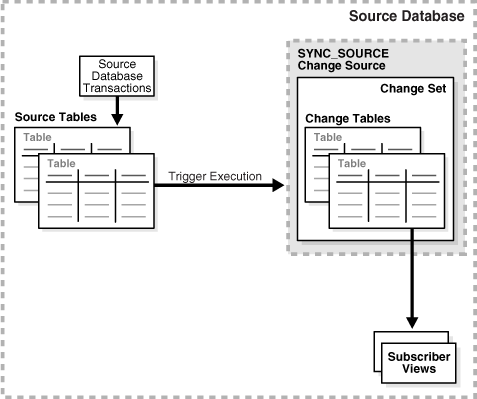

### Assincrona

Nesse modo o mecanismo de captura faz uso dos dados gravados nos redo logs, e a mesma é realizada assim que a transação é confirmada (commit). Dessa forma, por não fazer parte da transação, o processo de captura não gera impacto no ambiente. A captura assíncrona pode ser configurada de três formas: HotLog, Distributed HotLog e AutoLog. O tipo de captura assíncrona depende do tamanho de informações gravadas pelo recurso supplemental logging  gravados nos redos logs. Quanta mais informação o supplemental logging disponibilizar, maior impacto (overhead) no banco de origem, já que o mesmo deverá registrar tudo em seu redo.

#### Hotlog

Nessa modalidade, os dados modificados são capturados dos redo logs do banco de origem, gerando um pequeno tempo de latência entre a confirmação da transação na tabela original e a disponibilização no banco de staging. 

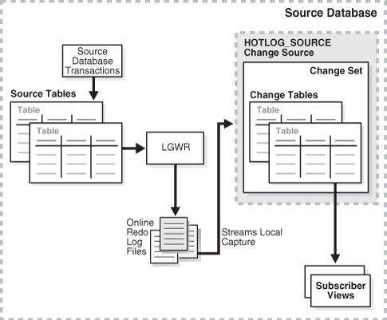

#### Distributed Hotlog

Nessa modalidade, os dados modificados também são capturados dos redo logs do banco de origem, porém as atividades e objetos envolvidos no processo são divididos entre os bancos de origem e staging. Estes bancos podem estar em diferentes plataformas de hardware e com sistemas operacionais distintos.

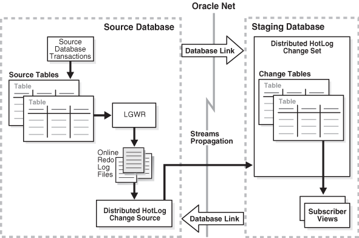

#### Autolog

A modalidade AutoLog captura os dados de um conjunto de arquivos de redo log através dos serviços de transporte de redo (Redo Transport Services). Esse mecanismo controla a transferência automática dos arquivos de redo do banco de origem para o de staging. Nessa modalidade, os dados modificados também são capturados dos redo logs do banco de origem, porém as atividades e objetos envolvidos no processo são divididos entre os bancos de origem e staging. Há dois tipos possíveis de configuração: AutoLog Online, que faz uso dos online redo logs do banco de origem e o AutoLog Archive, que utiliza os archives gerados também no banco de origem. Na primeira opção, AutoLog Online, os dados de redo log gerados no banco de origem serão copiados para standby redo logs do banco staging. Os conjuntos de alterações são preenchidos quando as transações forem confirmadas (commit). 

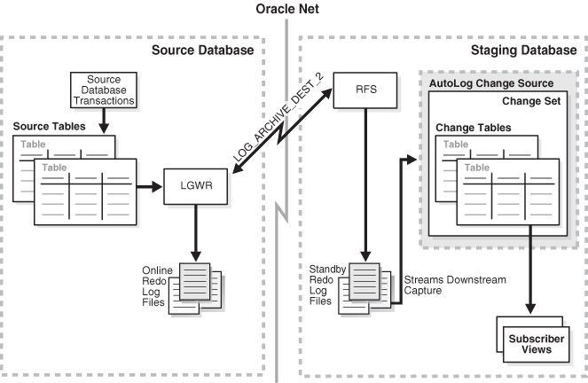

Na segunda, AutoLog Archive, archives são copiados da origem para o ambiente staging e os conjuntos de alterações são preenchidos a partir da chegada de um novo archive. Nesse caso, o grau de latência dependerá da frequência de trocas nos redos (ou seja, da geração de archives).

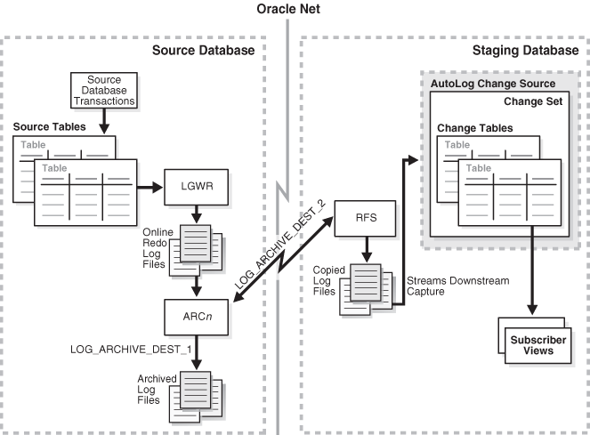

Oracle Goldengate
=================

O Oracle Goldengate (GG) foi uma solução adquirida pela Oracle por no ano de 2010 da GoldenGate Inc.. O GG permite a captura e replicação em tempo real de dados entre diversos bancos de dados através de variadas formas e topologias diferentes. Ele também consegue realizar a captura e replicação entre banco de dados de plataformas diferentes, tais como Microsoft SQL Server, DB2, MySQL, Oracle, Postgres, entre outros. Assim como o CDC, o GG captura apenas as informações confirmadas (commit) a partir dos logs, o que permite uma captura não intrusiva e que não onere o desempenho do ou dos bancos de dados origem.

O Oracle Goldengate funciona através de dois modelos de processos:

* Initial Load – Utiliza apenas os componentes Extract, Replicat e Manager do GG e é utilizado para a carga de dados inicial do ambiente origem no ambiente destino. Nela copias das tabelas origens são replicadas no ambiente destino, permitindo se necessário a transformação dos dados. A partir da execução do Initial Load que o ambiente do GG passa a utilizar o seu modelo de sincronização padrão.
* Change Synchronization – Cíclico e continuo é o modelo de sincronização padrão do GG e trata da captura e replicação das transações que ocorrem no ambiente de origem para o ambiente destino.

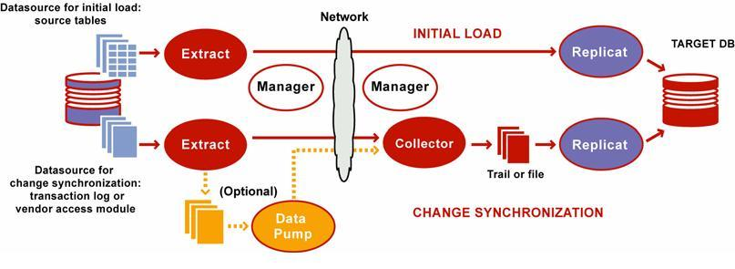

A arquitetura do GG é composta basicamente de sete componentes e dependendo da necessidade alguns deles acabam por nem serem utilizados.

### Extract/Capture
Esse componente funciona no ambiente origem da replicação e é responsável pela captura das informações confirmadas (commit) do log do banco. Com a criação de grupos de processamento, é possível definir paralelismo para a captura.

### Trails
É um agrupador de arquivos com as modificações capturadas que o GG armazena temporariamente em disco. Apenas os componentes Extract, Collector e Replicat podem ler e escrever nesses arquivos. A existência de trails no ambiente destino é obrigatória, mas opcional no ambiente origem. A trail origem é obrigatória apenas quando o componente Data Pump está configurado. O Oracle Goldengate permite a criação de mais de uma trail por ambiente, ou seja, os ambientes origem e destino podem ter quantas trails achem necessários.

### Data Pump
É um componente secundário e opcional de extração do GG. Quando configurado, o ambiente origem carregará as informações modificadas em uma trail local e enviar essa trail remotamente para o ambiente destino pela rede. Quando não configurado, o próprio extrator envia as informações alteradas na origem diretamente para a trail do ambiente destino, essas informações ficam carregadas em memória e em caso de falha na rede, o processo de envio pode ser cancelado e abandonado.
Outra vantagem para o uso do Data Pump é que o mesmo permite filtragem e transformação das informações capturadas ainda no ambiente origem, permitindo assim um uso menor da rede, mas, acarretando um maior uso de CPU pelo ambiente origem.

### Collector
Este componente se encontra no ambiente destino da replicação e tem a função de receber as informações enviadas pelo extrator do ambiente origem e gravá-las nas trails do ambiente destino. O Collector permite que possa existir mais de um ambiente de origem enviando informações, já que o mesmo pode centralizá-las.

### Replicat/Delivery
Funciona no ambiente destino e tem como atribuição ler os trails recebidos pelo Collector e aplicar as alterações informadas no banco de dados destino. Deve existir um Replicat para cada trail no ambiente destino. Uma característica interessante do Replicat é a possibilidade de permitir a especificação do tempo de atraso para aplicação das modificações recebidas, que podem ser segundos, minutos ou horas. Com a criação de grupos de processamento, é possível definir paralelismo para a replicação.

### Checkpoints
Serve para marcar a posição atual das informações capturadas e replicada. Seus principais propósitos são evitar que alguma informação seja captura ou replicada duas vezes e garantir que todas as informações capturadas foram replicadas.

### Manager
Componente existem em ambos os ambientes, origem e destino, que é responsável por manter diversas funcionalidades do GG, tais como:
* Monitorar e restartar os processos do Oracle Goldengate
* Gerenciar os trails e logs
* Alocar espaço em disco
* Reportar erros e eventos
* Receber e encaminhar solicitações feitas pelo usuário
* Informar saúde dos processos

Topologias
----------

O Oracle Goldengate (GG) permite trabalhar em diferentes topologias, o que lhe dá maior flexibilidade para atender os variados cenários das organizações.

### Unidirectional (Unidirecional)

A mais básica das configurações do Oracle Goldengate, nela existe apenas um banco de dados origem e um banco de dados destino sendo que a replicação ocorre em apenas uma direção, da origem para o destino. Alguma das utilidades para esse tipo de topologia é para criação de ambientes de relatório, migrações de bancos Oracle, migração de bancos não Oracle e replicação para ambientes de DW mais simples.

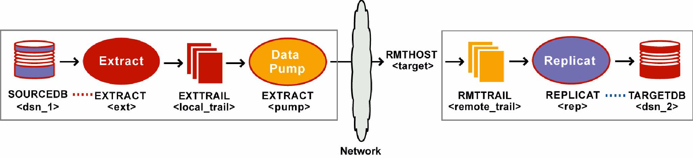

### Bidirectional (Bidirecional)

Muito similar com a topologia Unidirectional, essa topologia se caracteriza por manter no ambiente destino um componente Extract e Data Pump inativo, assim como, um componente Replicat inativo no ambiente origem. Ela permite que a organização possa manter um replica total do banco origem, assim como o Oracle Dataguard, e no caso de um desastre no ambiente origem (produtivo), que essa replica possa assumir as funções como banco de dados produtivo. Ao realizar a troca, os componentes inativos se tornam ativos, permitindo que as alterações realizadas no banco de dados replica possam ser retornadas para o banco de dados produtivo original assim que o mesmo estiver funcional, no caso de falha.

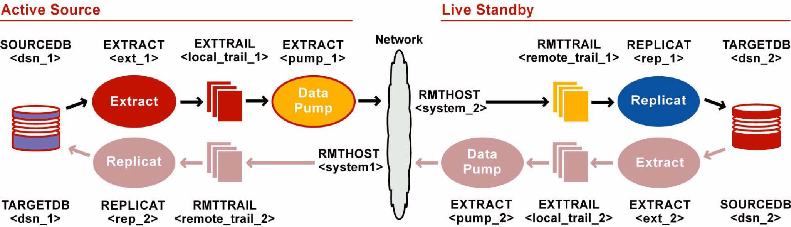

### Peer-to-Peer (Par a Par)

Assim como na topologia Bi-Directional, o Peer-to-Peer é uma topologia que contém em ambos os ambientes, origem e destino, componentes Extract, Replicat e Data Pump. Todavia, enquanto na topologia Bi-Directional alguns encontram-se inativos, no Peer-to-Peer todos estão ativos. Ao alterar informações em um ambiente primário, o secundário captura a informação e replica as modificações, o contrário também é verdade, ao alterar informações no ambiente secundário as mesmas são replicadas para o ambiente primário, mantendo assim ambos os ambientes sincronizados. O Peer-to-Peer pode ser utilizado como uma solução de alta disponibilidade já que aceita balanceamento de sessões e sincronia para banco de dados Oracle.

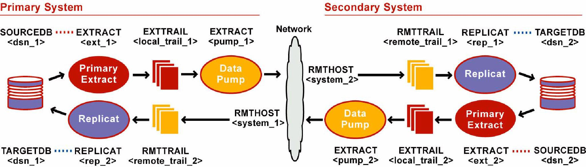

### Broadcast (Distribuído)

Nesse tipo de topologia existe um banco de dados origem e vários banco de dados destino. Nela o banco de dados origem manda informações para os diversos destinos que podem ser banco de dados de plataformas diferentes. A falha no envio para um dos destinos não impacta na replicação das informações para o todo, cada replicação pode ser configurada de forma a ser independente através da criação de um Data Pump para cada destino.

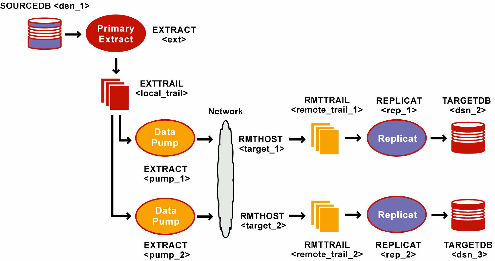

### Consolidation (Consolidado)

A consolidação é a topologia do Oracle Goldengate especialmente criada para ambientes de DW.  Nela existem diversos bancos de dados origem e apenas um banco de dados destino. Os bancos de dados origem podem ser de diferentes plataformas, o Goldengate consegue combinar as informações dessas diferentes fontes sem nenhum problema. Para alcançar esse tipo de topologia e a independência entre as diversas fontes de dados, deve ser criada no ambiente destino uma Trail e um Replicat para cada banco de dados origem.

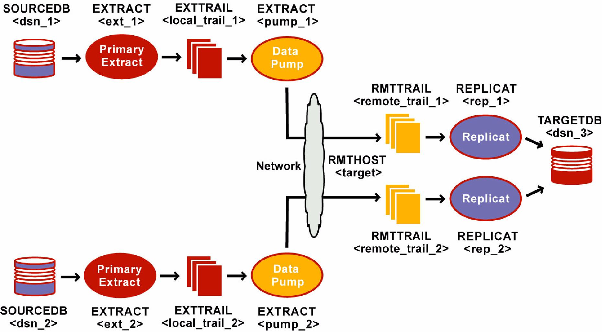

### Cascading (Cascateado)

Muito utilizada quando o ambiente destino não possui conexão direta com o ambiente de origem ou quando a distância entre os ambientes é muito grande, essa topologia se caracteriza por permitir que exista um ambiente intermediário de replicação, ou seja, as informações do banco de dados de origem são capturadas e replicadas para o ambiente intermediário e deste replicadas para o(s) ambiente(s) destino(s).

Sincronização
-------------

A sincronização do Oracle Goldengate pode ser realizada de duas formas, através do Online Change Synchronization e do Batchrun Change Synchronization. 
Ambas passam a operar apenas após a execução do Initial Load entre os ambientes.

### Online Change Synchronization

O Online Change Synchronization (OCS) captura e replica os dados assim que a transação é efetuada no banco de dados origem. Ela procura manter a menor quantidade de diferença possível entre o banco de dados origem e o destino. Nesse tipo de sincronização é obrigatório a utilização dos checkpoints para permitir que o Oracle Goldengate possa reconhecer o que já foi capturado e replicado entre os ambientes.

### Batchrun Change Synchronization

O Batchrun Change Synchronization (BCS), diferentemente do OCS, captura e replica as informações em lotes, ou seja, as informações não são transmitidas em tempo real, existe um atraso na sincronização entre as informações encontradas no banco de dados origem e o destino. O BCS permite configurar a transmissão das informações por tempo ou por número de transações. Esse tipo de sincronização torna-se interessante quando não é vital para o ambiente produtivo que a replicação da informação seja em tempo real, pois ao realizar a captura e replicação através de lotes, é utilizado menos recursos dos servidores, já que não é necessário a criação de checkpoints para cada transação.

Oracle Change Data Capture X Oracle Goldengate
==============================================

Para consolidação do conhecimento apresentado e verificarmos as diferenças e semelhanças encontradas entre as duas soluções, segue abaixo uma tabela que permite termos uma visão geral das mesmas:

|Oracle Change Data Capture|Oracle Goldengate|
|--------------------------|-----------------|
|Necessita modo de archive habilitado em ambos os ambientes (origem e destino).|Necessita modo de archive habilitado em ambos os ambientes (origem e destino).|
|Permite a utilização de 2 topologias: Um para um unidirecional e um para muitos unidirecional.|Permite a utilização de 6 topologias: Um para um unidirecional, um para muitos unidirecional, muitos para um unidirecional, um para um bidirecional, muitos para muitos bidirecional e cascata.|
|Captura e replicação a cada transação.|Permite a captura e replicação a cada transação e captura e replicação em lotes.|
|Funciona apenas de Oracle para Oracle.|Além de banco de dados Oracle, funciona em ambientes heterogêneos e com banco de dados de plataformas diferentes.|
|Sincronização de comandos DDL com várias restrições.|Apenas o comando TRUNCATE não consegue ser replicado.|
|Remoção de archives recebidos pelo destino do origem devem ser feitos manualmente em nível de Sistema Operacional.|Remoção de arquivos criados na trail do banco origem e recebidos pela trail do banco destino ocorre em nível de banco de dados com o comando PURGEOLDEXTRACTS.|
|Tecnologia descontinuado.|Tecnologia recente e com grande potencial de investimento. Sem previsão de descontinuidade.|
|Não possui ferramentas de monitoração.|Possui ferramentas de monitoração.|
|Fácil aprendizado devido sua simplicidade.|Difícil aprendizado devido a grande quantidade de possibilidades de uso.|
|Não permite o uso de paralelismo.|Permite uso de paralelismo.|

Conclusão
=========

Pode-se perceber que o Oracle Goldengate veio como uma evolução do Oracle Change Data Capture, permitindo não apenas a replicação de dados entre dois bancos de dados, mas também uma flexibilidade maior para o desenvolvimento do ambiente de banco de dados através de suas topologias que permitem que ele possa ser usado para migrações, criação de ambientes de contigência, alta disponibilidade, consolidador de dados, etc.
Não é atoa o seu amplo uso por países da Europa e Asiáticos. Se utilizado da forma correta e adequada o Oracle Goldengate será um grande ganho para qualquer organização.

Referências
===========

BURLESON, Donald Keith. Oracle CDC Tips. Disponível em:<http://www.dba-oracle.com/t_streams_change_data_capture.htm>. Acesso em 24 de setembro de 2014

DEVABHAKTUNI, Saibabu. What is Oracle GoldenGate? Disponível em:<http://sai-oracle.blogspot.com.br/2010/09/what-is-oracle-goldengate.html>. Acesso em 24 de setembro de 2014

Oracle Corporation. Oracle Change Data Capture. Disponível em:<http://docs.oracle.com/cd/B28359_01/server.111/b28313/cdc.htm>. Acesso em 24 de setembro de 2014

Oracle Corporation. Oracle Goldengate: Windows and Unix Administrator's Guide 11g Release 1 Patch Set 1 (11.1.1.1) E21513-01. Disponível em:<http://docs.oracle.com/cd/E22355_01/doc.11111/e21513.pdf>. Acesso em 24 de setembro de 2014

Oracle Corporation. Oracle Goldengate 12c: Real-Time Access to Real-Time Information. Disponível em:<http://www.oracle.com/us/products/middleware/data-integration/oracle-goldengate-realtime-access-2031152.pdf>. Acesso em 24 de setembro de 2014

PELOSINI, Rodrigo. Visão Conceitual de Replicação de Banco de Dados. Disponível em:<http://pelosini.com.br/visao-conceitual-de-replicacao-de-banco-de-dados>. Acesso em 24 de setembro de 2014

PÚBLIO, Angelo. Replicação de Dados em Tempo Real com Oracle GoldenGate. Disponível em:<http://blog.4partner.com.br/oracle-goldengate-replicacao-de-dados-em-tempo-real>. Acesso em 24 de setembro de 2014

---

...
