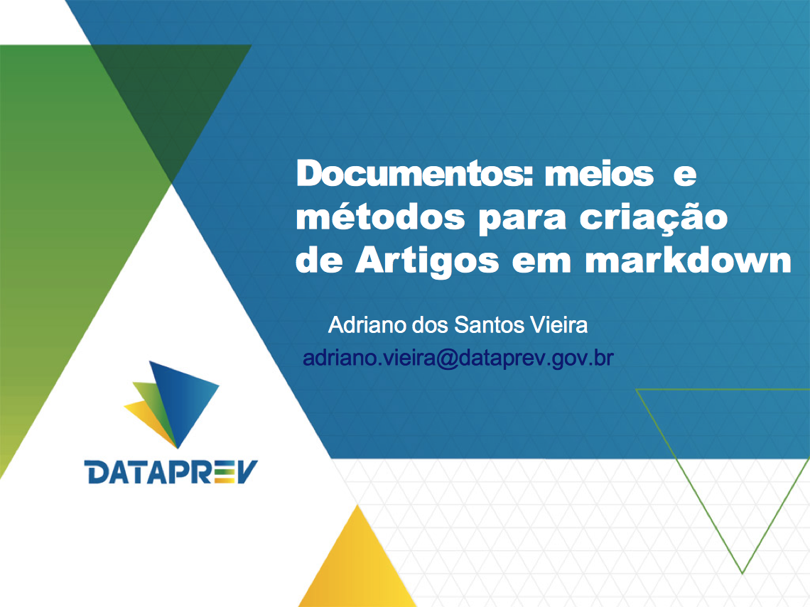

# Agenda

## Programação

- Markdown  
    Pandoc;
    Desafios e Benefícios;
    Estrutura padrão para criar artigos.

- Métodos para construção até a publicação  
    Markdown estendido;
    Git-SCM;
    Arte final em templates;
    publicação na Ond@.

- Próximos passos

# Markdown? ? ? 

## Pandoc 

Convertor de documentos

> - Diversos tipos e formatos
> - inclusive **de:** ```".md" =>``` **para:** ```"PDF"```

<div class="notes">
- As diversas extensões ou variações do *Markdown*
- A tentativa de unificação/padronização (CommonMark)
- Proposta geral de uso na SUPS
  - para uso também em documentações expostas no gitlab
</div>


## Desafios e Benefícios

<div class="notes">
Haver uma forma padronizada para a estrutura e leiaute dos artigos a serem publicados.

- a ser usado também em documentações expostas no gitlab
</div>

## Estrutura padrão para criar artigos

- Metadados de autor
- Estrutura base do artigo  
		*"```Introdução, Desafios, Benefícios, <tópicos específicos>, Conclusão, Referências```"*
- Metadados de referências bibliográficas

Mais detalhes em @ID-estruturaVieira

<div class="notes">
- Metadados de autor
- estrutura base (Introdução, desafios, benefícios, conclusão e referências)
- metadados de referências bibliográficas
- citações
</div>

>> - **hands-on**

# Métodos para construção até a publicação

## Use *Markdown* estendido

- Citações
	- ```@ID-pandocRefVieira``` (@ID-pandocRefVieira)
- Tabelas

		+----------------+--------------------------------+---------------------------+
		|**Cab 1**       |**Cab 2**                       |**Cab N**                  |
		+================+================================+===========================+
		|Conteúdo celula |Conteúdo celula                 |Conteúdo celula            |
		+----------------+--------------------------------+---------------------------+
		|Lorem ipsum     |Lorem ipsum dolor sit amet,     |Conetúdo celula            |
		|                |consectetur adipisicing elit,   |                           |
		|                |sed do eiusmod tempor incididunt|                           |
		|                |ut labore et dolore magna       |                           |
		|                |aliqua.                         |                           |
		+----------------+--------------------------------+---------------------------+

- Ferrementa de referência

> - ***Pandoc***

<div class="notes">
- O que é isso?
- Pandoc
- A linguagem sintática
- inclusão de imagens, tabelas e múltiplas linhas em células
- referências e citações
</div>

>> - **hands-on**

## Git-SCM

- ```mkdir -p documentos/artigos-tecnicos/nosql-big_data/imagens```
- ```cd documentos/artigos-tecnicos/nosql-big_data```
- ```git init```
- ```git remote add <upstream> http://www-git.prevnet/documentos/artigos.git```
- ```git checkout -b nosql-big_data```
- ```vim nosql-big_data.md```
- ```git add nosql-big_data.md```
- ```git commit -m "Atualiza conteúdo do tópico Desafios" nosql-big_data.md```
- ```vim nosql-big_data.md```
- ```git commit -m "Atualiza conteúdo do tópico Benefícios" nosql-big_data.md```
- ```vim nosql-big_data.md```
- ```git commit -m "Atualiza metadados Referências" nosql-big_data.md```
- ```vim nosql-big_data.md```
- ```git commit -m "Atualiza citações no conteúdo do tópico Benefícios" nosql-big_data.md```
- ```git push <upstream> nosql-big_data```

<div class="notes">
- O que é isso?
- Git e  gitlab (www-git)
- Comandos básicos (em linha de comando)
- Aplicações *desktop* (*SourceTree*)
- visualizações e operações no www-git (*merge request*)
</div>

>> - **hands-on**

## *Template* para a arte final

- ```make -f $TEMPLATE_DIR/makefile pdf artigo=nosql-big_data.md```

<div class="notes">
- O que é isso?
- o template LaTeX e a logomarca
- ```makefile``` & plataformas
- conversão para PDF
</div>

>> - **hands-on**

## Divulgar Artigos

Onda@ Rede Social Coporativa

- comunidade Portal de Tecnologia

<div class="notes">
- Divulgação na rede social coporativa (Ond@)
- Ond@ - referência de trabalhos publicados
- o documento PDF & artigo Ond@
</div>

>> - **hands-on**

# Próximos passos

## Ainda tem mais???

Servidor *hook* git para automatizar ações

- conversão para PDF

<div class="notes">
- hooks
- **webhooks**
- possível uso de referências bibliográficas externas comuns
</div>

>> - **hands-on**

# TAF

## TaF

### Meios e Métodos para criação de Documentos::Artigos em *Markdown*
- Adriano Vieira <adriano.vieira@dataprev.gov.br>

Disponível em [www-git/documentos/artigos](http://www-git/documentos/artigos/)

<div class="notes">
Isso é tudo, pessoal!
</div>

### Referências

---
remark: referências usadas nesse artigo
references:
- id: ID-estruturaVieira
  title: "Estrutura padrão para criar artigos técnicos"
  author:
  - family: Vieira
    given: Adriano dos Santos
  URL: 'https://onda.byyou.com/artigos?1=1&space=portaldetecnologia-community&app_ByYouSocialArticle_articleId=1608757133'
  accessed:
    month: 05
    year: 2014
  publisher: Dataprev
  type: webpage
  issued:
    year: 2014
    month: 02
- id: ID-pandocRefVieira
  title: "Crie Conteúdo, não leiaute; padrões sintáticos de formatação markdown estendido & Pandoc"
  author:
  - family: Vieira
    given: Adriano dos Santos
  URL: 'https://onda.byyou.com/artigos?app_ByYouSocialArticle_articleId=1644605620&space=portaldetecnologia-community'
  accessed:
    month: 5
    year: 2014
  publisher: Dataprev
  type: article
  issued:
    year: 2014
    month: 3
...
