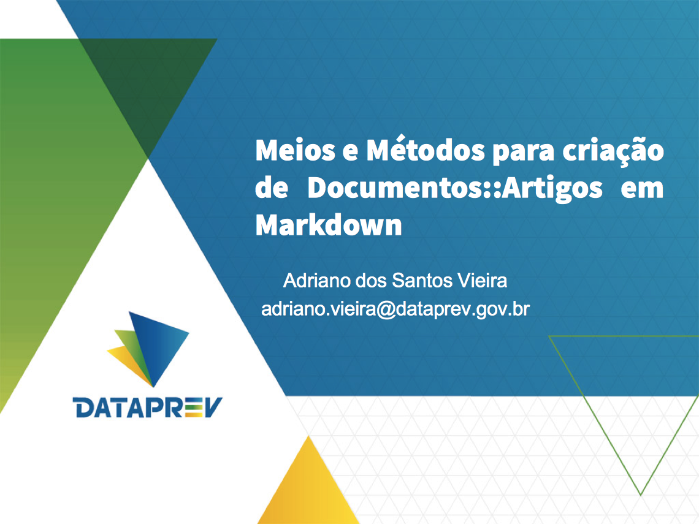

% Meios e Métodos para criação de Documentos::Artigos em *Markdown*  
% Adriano Vieira <adriano.vieira@dataprev.gov.br>  
% 18 de setembro de 2014

# Markdown? ? ? 

## Pandoc 

- As diversas extenções
- A tentativa de unificação/padronização (CommonMark)
- A linguagem sintática
- Proposta geral de uso na SUPS
  - para uso também em documentações expostas no gitlab

## Desafios e Benefícios

Haver uma forma padronizada para a estrutura e leiaute dos artigos a serem publicados.

- a ser usado também em documentações expostas no gitlab

## Estrutura padrão para criar artigos

> - hands-on

# Métodos para construção até a publicação

> - hands-on

## Use *Markdown* estendido

> - hands-on

## Git-SCM

> - hands-on

## *Template* para a arte final

> - hands-on

## Divulgar Artigos produzidos

> - hands-on

# TAF

Isso é tudo, pessoal!

- Meios e Métodos para criação de Documentos::Artigos em *Markdown*
- Adriano Vieira <adriano.vieira@dataprev.gov.br>
